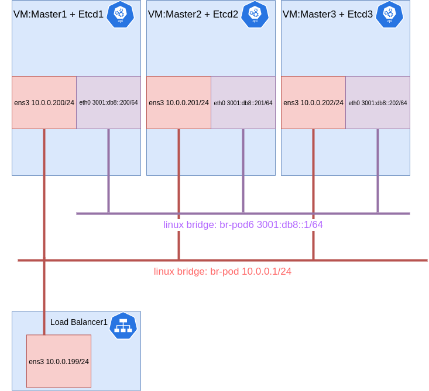

# kubeadm-calico-dual-stack-ha 实验

`kubeadm calico dual stack`义在使用单 `cni` 插件的情况下实现 `ipv4 和 ipv6 双栈(dual stack)` 的高可用集群验证性项目,实验过程多为手动执行脚本，请大家仔细看清每步操作,因为是实验性质的所以有一些不是很关键的步骤会不是非常的严谨，比如 load balance 只有1个、并没有使用dns类似这种情况，但不影响整体的实验能走通。

## 实验环境架构图



## 准备工作

1. 主机 ubuntu 19.10 linux bridge 设置

```console
$ cat /etc/netplan/01-network-manager-all.yaml
# output
network:
  ...网卡设置
  bridges:
    br-pod:
      dhcp6: no
      accept-ra: no
      addresses: [ "10.0.0.1/24" ]
    br-pod6:
      dhcp6: no
      accept-ra: no
      addresses: ["3001:db8::1/64"]
# 重启电脑或者 netplan apply
$ reboot
```

2. 创建虚拟机
    - 虚拟机镜像: CentOS-7-x86_64-Minimal-1810.iso
    - 创建`kvm guest`磁盘

    ```console
    # 创建负载均衡的虚拟磁盘
    $ qemu-img create -f qcow2 -o size=30G /mnt/diskB/lb1.qcow2
    # 创建负载均衡的虚拟机
    $ virt-install --name lb1 --ram 2048 --disk /mnt/diskB/lb1.qcow2,format=qcow2 --vcpus 1 --network bridge=br-pod --vnc --noautoconsole --os-type=linux -c /var/lib/libvirt/images/CentOS-7-x86_64-Minimal-1810.iso --cpu host-model

    # 创建 master 虚拟机
    $ qemu-img create -f qcow2 -o size=30G /mnt/diskB/kubeadm-master1.qcow2
    $ qemu-img create -f qcow2 -o size=30G /mnt/diskB/kubeadm-master2.qcow2
    $ qemu-img create -f qcow2 -o size=30G /mnt/diskB/kubeadm-master3.qcow2
    # 创建 master1,2,3 虚拟机
    $ virt-install --name master1 --ram 4096 --disk /mnt/diskB/kubeadm-master1.qcow2,format=qcow2 --vcpus 2 --network bridge=br-pod --network bridge=br-pod6,model=virtio --vnc --noautoconsole --os-type=linux -c /var/lib/libvirt/images/CentOS-7-x86_64-Minimal-1810.iso --cpu host-model
    $ virt-install --name master2 --ram 4096 --disk /mnt/diskB/kubeadm-master2.qcow2,format=qcow2 --vcpus 2 --network bridge=br-pod --network bridge=br-pod6,model=virtio --vnc --noautoconsole --os-type=linux -c /var/lib/libvirt/images/CentOS-7-x86_64-Minimal-1810.iso --cpu host-model
    $ virt-install --name master3 --ram 4096 --disk /mnt/diskB/kubeadm-master3.qcow2,format=qcow2 --vcpus 2 --network bridge=br-pod --network bridge=br-pod6,model=virtio --vnc --noautoconsole --os-type=linux -c /var/lib/libvirt/images/CentOS-7-x86_64-Minimal-1810.iso --cpu host-model

    # 打开 virt manager 可视化安装
    $ virt-manager
    ```

3. 配置虚拟机网卡

```console
# load balancer1 的 ens3 网卡配置
... 其他设置
BOOTPROTO=static
DEVICE=ens3
ONBOOT=yes
IPADDR=10.0.0.199
NETMASK=255.255.255.0
GATEWAY=10.0.0.1
DNS1=114.114.114.114

# master1 节点 ens3
$ cat /etc/sysconfig/network-scripts/ifcfg-ens3
... 其他设置
BOOTPROTO=static
DEVICE=ens3
ONBOOT=yes
IPADDR=10.0.0.200
NETMASK=255.255.255.0
GATEWAY=10.0.0.1
DNS1=114.114.114.114

# master1 节点 eth0
$ cat /etc/sysconfig/network-scripts/ifcfg-eth0
... 其他设置
BOOTPROTO=static
IPV6INIT=yes
IPV6_AUTOCONF=no
IPV6_DEFROUTE=yes
IPV6_FAILURE_FATAL=no
IPV6_ADDR_GEN_MODE=stable-privacy
DEVICE=eth0
ONBOOT=yes
IPV6ADDR="3001:db8::200/64"
IPV6_DEFAULTGW="3001:db8::1"

# master2 节点 ens3
$ cat /etc/sysconfig/network-scripts/ifcfg-ens3
... 其他设置
BOOTPROTO=static
DEVICE=ens3
ONBOOT=yes
IPADDR=10.0.0.201
NETMASK=255.255.255.0
GATEWAY=10.0.0.1
DNS1=114.114.114.114

# master2 节点 eth0
$ cat /etc/sysconfig/network-scripts/ifcfg-eth0
... 其他设置
BOOTPROTO=static
IPV6INIT=yes
IPV6_AUTOCONF=no
IPV6_DEFROUTE=yes
IPV6_FAILURE_FATAL=no
IPV6_ADDR_GEN_MODE=stable-privacy
DEVICE=eth0
ONBOOT=yes
IPV6ADDR="3001:db8::201/64"
IPV6_DEFAULTGW="3001:db8::1"

# master3 节点 ens3
$ cat /etc/sysconfig/network-scripts/ifcfg-ens3
... 其他设置
BOOTPROTO=static
DEVICE=ens3
ONBOOT=yes
IPADDR=10.0.0.202
NETMASK=255.255.255.0
GATEWAY=10.0.0.1
DNS1=114.114.114.114

# master3 节点 eth0
$ cat /etc/sysconfig/network-scripts/ifcfg-eth0
... 其他设置
BOOTPROTO=static
IPV6INIT=yes
IPV6_AUTOCONF=no
IPV6_DEFROUTE=yes
IPV6_FAILURE_FATAL=no
IPV6_ADDR_GEN_MODE=stable-privacy
DEVICE=eth0
ONBOOT=yes
IPV6ADDR="3001:db8::202/64"
IPV6_DEFAULTGW="3001:db8::1"
```

4. 重启虚拟机网络

```console
# 在3台 master 虚拟机上运行
$ systemctl restart network
```

5. 验证网络设置

```console
# 在 master 上检查网络
$ ip r
# output
default via 10.0.0.1 dev ens3 proto static metric 100
10.0.0.0/24 dev ens3 proto kernel scope link src 10.0.0.200 metric 100
$ ip -6 r
# output 请无视 unreachable 但必须要有 default gateway
unreachable ::/96 dev lo metric 1024 error -113 pref medium
unreachable ::ffff:0.0.0.0/96 dev lo metric 1024 error -113 pref medium
unreachable 2002:a00::/24 dev lo metric 1024 error -113 pref medium
unreachable 2002:7f00::/24 dev lo metric 1024 error -113 pref medium
unreachable 2002:a9fe::/32 dev lo metric 1024 error -113 pref medium
unreachable 2002:ac10::/28 dev lo metric 1024 error -113 pref medium
unreachable 2002:c0a8::/32 dev lo metric 1024 error -113 pref medium
unreachable 2002:e000::/19 dev lo metric 1024 error -113 pref medium
3001:db8::/64 dev eth0 proto kernel metric 101 pref medium
unreachable 3ffe:ffff::/32 dev lo metric 1024 error -113 pref medium
default via 3001:db8::1 dev eth0 proto static metric 101 pref medium

# 在所有节点上互相 ping 必须都要通
$ ping6 3001:db8::200
$ ping6 3001:db8::202
$ ping6 3001:db8::202
$ ping6 3001:db8::1
$ ping 10.0.0.199
$ ping 10.0.0.200
$ ping 10.0.0.201
$ ping 10.0.0.202
$ ping 10.0.0.1
```

6. 设置负载均衡

```console
# 在 load balancer 节点上(10.0.0.199)运行
$ yum install epel-release -y
$ yum update -y
# 安装 nginx
$ yum install nginx
$ systemctl enable nginx

# 配置负载均衡
cat <<EOF > /etc/nginx/nginx.conf
# For more information on configuration, see:
#   * Official English Documentation: http://nginx.org/en/docs/
#   * Official Russian Documentation: http://nginx.org/ru/docs/

user nginx;
worker_processes auto;
error_log /var/log/nginx/error.log;
pid /run/nginx.pid;

# Load dynamic modules. See /usr/share/doc/nginx/README.dynamic.
include /usr/share/nginx/modules/*.conf;

events {
    worker_connections 1024;
}

stream {
    upstream api-server {
        hash $remote_addr consistent;
        server master1.caas.com:6443;
        server master2.caas.com:6443;
        server master3.caas.com:6443;
    }
    server {
        listen 6443;
        proxy_pass api-server;
    }
}

http {
    log_format  main  '$remote_addr - $remote_user [$time_local] "$request" '
                      '$status $body_bytes_sent "$http_referer" '
                      '"$http_user_agent" "$http_x_forwarded_for"';

    access_log  /var/log/nginx/access.log  main;

    sendfile            on;
    tcp_nopush          on;
    tcp_nodelay         on;
    keepalive_timeout   65;
    types_hash_max_size 2048;

    include             /etc/nginx/mime.types;
    default_type        application/octet-stream;

    # Load modular configuration files from the /etc/nginx/conf.d directory.
    # See http://nginx.org/en/docs/ngx_core_module.html#include
    # for more information.
    include /etc/nginx/conf.d/*.conf;
}

EOF

# 重启 nginx 服务
$ systemctl restart nginx
```

7. 加载内核模块

```console
# 在所有的 master 的虚拟机上运行
$ modprobe br_netfilter

# 检查内核模块的加载成功,没有输出表示有问题
$ lsmod | grep br_netfilter
# output
br_netfilter           22256  0
bridge                151336  1 br_netfilter
```

8. 开启依赖网络功能

```console
# 在所有的 master 的虚拟机上运行
$ cat <<EOF > /etc/sysctl.d/k8s.conf
net.bridge.bridge-nf-call-ip6tables = 1
net.bridge.bridge-nf-call-iptables = 1
EOF

$ cat <<EOF >> /etc/sysctl.conf
net.ipv6.conf.all.forwarding=1
EOF

$ sysctl --system
```

9. 关闭 firewalld 和 selinux 并修改 hostname

```console
# 在所有的节点上运行命令
$ systemctl disable firealld
$ ^disable^stop
# 修改 /etc/selinux/config 将 SELINUX=disabled

# 修改 master1 的 hostname
# 修改 /etc/hostname 设为 master1.caas.com
# 修改 master2 的 hostname
# 修改 /etc/hostname 设为 master2.caas.com
# 修改 master3 的 hostname
# 修改 /etc/hostname 设为 master1.caas.com

# 修改所有 master 虚拟机的 /etc/hosts
$ cat <<EOF >> /etc/hosts

10.0.0.200	master1.caas.com
10.0.0.201	master2.caas.com
10.0.0.202	master3.caas.com

3001:db8::200	master1.caas.com
3001:db8::201	master2.caas.com
3001:db8::202	master3.caas.com
EOF

# 修改所有 load balancer 虚拟机的 /etc/hosts
$ cat <<EOF >> /etc/hosts

10.0.0.200	master1.caas.com
10.0.0.201	master2.caas.com
10.0.0.202	master3.caas.com
EOF

# 重启所有 master 节点虚拟机
$ reboot
```

10. 检验通过主机名访问

```console
# 在所有的节点上运行，需要默认解析到 ipv4 地址
$ ping master1.caas.com
$ ping master2.caas.com
$ ping master3.caas.com
```

11. 关闭 swap

```console
# 在所有的 master 的虚拟机上运行
$ swapoff -a
# 注释 /etc/fstab 下的 swap
# 比如 #/dev/mapper/centos-swap swap                    swap    defaults        0 0
```

## 安装依赖软件

1. 安装 docker

```console
# 在所有的 master 的虚拟机上运行
# 安装 yum-utils
$ yum install -y yum-utils
$ yum-config-manager \
    --add-repo \
    https://download.docker.com/linux/centos/docker-ce.repo
$ yum install docker-ce

# 安装 docker-ce
$ yum install docker-ce -y

# 开机启动 docker
$ systemctl enable docker
$ ^enable^start
```

2. 安装 kube 相关工具(翻墙 is required)

```console
# 在所有的 master 的虚拟机上运行
# 设置 repo(需要翻墙)
$ cat <<EOF > /etc/yum.repos.d/kubernetes.repo
[kubernetes]
name=Kubernetes
baseurl=https://packages.cloud.google.com/yum/repos/kubernetes-el7-x86_64
enabled=1
gpgcheck=1
repo_gpgcheck=1
gpgkey=https://packages.cloud.google.com/yum/doc/yum-key.gpg https://packages.cloud.google.com/yum/doc/rpm-package-key.gpg
exclude=kubelet kubeadm kubectl
EOF

# 安装 kubelet kubeadm kubectl
$ yum install -y kubelet kubeadm kubectl --disableexcludes=kubernetes

# 开机启动 kubelet
$ systemctl enable --now kubelet
```

3. 下载依赖的容器镜像(翻墙 is required)

```console
# 在所有的 master 的虚拟机上运行,这里根据网络会等比较久
$ kubeadm config images pull

# 下载 calico 依赖镜像
$ docker pull calico/cni:v3.11.2
$ docker pull calico/pod2daemon-flexvol:v3.11.2
$ docker pull calico/node:v3.11.2
$ docker pull calico/kube-controllers:v3.11.2
```

## 安装集群

1. 启动第一个 master 节点

```console
# 在 master1 节点上运行命令
# 你可以自行修改网段，但不要和主机网络冲突
$ kubeadm init --control-plane-endpoint "10.0.0.199:6443" --feature-gates IPv6DualStack=true --pod-network-cidr=172.25.0.0/16,fd05::/120 --service-cidr=10.96.0.0/16,fd03::/112  --upload-certs

# output
......其他 output
# 加入 master 集群的自动生成的命令，请复制这段输出
kubeadm join 10.0.0.199:6443 --token iye7bn.4qw3cy1x4pe82h83 \
    --discovery-token-ca-cert-hash sha256:fc721de6afbac22758fe4bda98483bd0d1b8975ec7f59d16c9c80299c4e59a4e \
    --control-plane --certificate-key 8bd176dbf60880cbf83ff462654fef7b451433f72a2ac40837bb2f4ddce5bd8a
```

2. 配置 master1 的 kubeconfig

```console
# 在 master1 节点上运行命令
$ mkdir -p $HOME/.kube
$ cp -i /etc/kubernetes/admin.conf $HOME/.kube/config
```

3. 启动 calico 网络插件

```console
# 在 master1 节点上运行命令
$ vi calico.yaml
# 并输入以下内容,注意如果你之前修改了`--pod-network-cidr`请相应修改`CALICO_IPV4POOL_CIDR 和 CALICO_IPV4POOL_CIDR`
```

```yaml
---
# Source: calico/templates/calico-config.yaml
# This ConfigMap is used to configure a self-hosted Calico installation.
kind: ConfigMap
apiVersion: v1
metadata:
  name: calico-config
  namespace: kube-system
data:
  # Typha is disabled.
  typha_service_name: "none"
  # Configure the backend to use.
  calico_backend: "bird"

  # Configure the MTU to use
  veth_mtu: "1440"

  # The CNI network configuration to install on each node.  The special
  # values in this config will be automatically populated.
  cni_network_config: |-
    {
      "name": "k8s-pod-network",
      "cniVersion": "0.3.1",
      "plugins": [
        {
          "type": "calico",
          "log_level": "info",
          "datastore_type": "kubernetes",
          "nodename": "__KUBERNETES_NODE_NAME__",
          "mtu": __CNI_MTU__,
          "ipam": {
              "type": "calico-ipam",
              "assign_ipv4": "true",
              "assign_ipv6": "true"
          },
          "policy": {
              "type": "k8s"
          },
          "kubernetes": {
              "kubeconfig": "__KUBECONFIG_FILEPATH__"
          }
        },
        {
          "type": "portmap",
          "snat": true,
          "capabilities": {"portMappings": true}
        }
      ]
    }

---
# Source: calico/templates/kdd-crds.yaml
apiVersion: apiextensions.k8s.io/v1beta1
kind: CustomResourceDefinition
metadata:
  name: felixconfigurations.crd.projectcalico.org
spec:
  scope: Cluster
  group: crd.projectcalico.org
  version: v1
  names:
    kind: FelixConfiguration
    plural: felixconfigurations
    singular: felixconfiguration
---

apiVersion: apiextensions.k8s.io/v1beta1
kind: CustomResourceDefinition
metadata:
  name: ipamblocks.crd.projectcalico.org
spec:
  scope: Cluster
  group: crd.projectcalico.org
  version: v1
  names:
    kind: IPAMBlock
    plural: ipamblocks
    singular: ipamblock

---

apiVersion: apiextensions.k8s.io/v1beta1
kind: CustomResourceDefinition
metadata:
  name: blockaffinities.crd.projectcalico.org
spec:
  scope: Cluster
  group: crd.projectcalico.org
  version: v1
  names:
    kind: BlockAffinity
    plural: blockaffinities
    singular: blockaffinity

---

apiVersion: apiextensions.k8s.io/v1beta1
kind: CustomResourceDefinition
metadata:
  name: ipamhandles.crd.projectcalico.org
spec:
  scope: Cluster
  group: crd.projectcalico.org
  version: v1
  names:
    kind: IPAMHandle
    plural: ipamhandles
    singular: ipamhandle

---

apiVersion: apiextensions.k8s.io/v1beta1
kind: CustomResourceDefinition
metadata:
  name: ipamconfigs.crd.projectcalico.org
spec:
  scope: Cluster
  group: crd.projectcalico.org
  version: v1
  names:
    kind: IPAMConfig
    plural: ipamconfigs
    singular: ipamconfig

---

apiVersion: apiextensions.k8s.io/v1beta1
kind: CustomResourceDefinition
metadata:
  name: bgppeers.crd.projectcalico.org
spec:
  scope: Cluster
  group: crd.projectcalico.org
  version: v1
  names:
    kind: BGPPeer
    plural: bgppeers
    singular: bgppeer

---

apiVersion: apiextensions.k8s.io/v1beta1
kind: CustomResourceDefinition
metadata:
  name: bgpconfigurations.crd.projectcalico.org
spec:
  scope: Cluster
  group: crd.projectcalico.org
  version: v1
  names:
    kind: BGPConfiguration
    plural: bgpconfigurations
    singular: bgpconfiguration

---

apiVersion: apiextensions.k8s.io/v1beta1
kind: CustomResourceDefinition
metadata:
  name: ippools.crd.projectcalico.org
spec:
  scope: Cluster
  group: crd.projectcalico.org
  version: v1
  names:
    kind: IPPool
    plural: ippools
    singular: ippool

---

apiVersion: apiextensions.k8s.io/v1beta1
kind: CustomResourceDefinition
metadata:
  name: hostendpoints.crd.projectcalico.org
spec:
  scope: Cluster
  group: crd.projectcalico.org
  version: v1
  names:
    kind: HostEndpoint
    plural: hostendpoints
    singular: hostendpoint

---

apiVersion: apiextensions.k8s.io/v1beta1
kind: CustomResourceDefinition
metadata:
  name: clusterinformations.crd.projectcalico.org
spec:
  scope: Cluster
  group: crd.projectcalico.org
  version: v1
  names:
    kind: ClusterInformation
    plural: clusterinformations
    singular: clusterinformation

---

apiVersion: apiextensions.k8s.io/v1beta1
kind: CustomResourceDefinition
metadata:
  name: globalnetworkpolicies.crd.projectcalico.org
spec:
  scope: Cluster
  group: crd.projectcalico.org
  version: v1
  names:
    kind: GlobalNetworkPolicy
    plural: globalnetworkpolicies
    singular: globalnetworkpolicy

---

apiVersion: apiextensions.k8s.io/v1beta1
kind: CustomResourceDefinition
metadata:
  name: globalnetworksets.crd.projectcalico.org
spec:
  scope: Cluster
  group: crd.projectcalico.org
  version: v1
  names:
    kind: GlobalNetworkSet
    plural: globalnetworksets
    singular: globalnetworkset

---

apiVersion: apiextensions.k8s.io/v1beta1
kind: CustomResourceDefinition
metadata:
  name: networkpolicies.crd.projectcalico.org
spec:
  scope: Namespaced
  group: crd.projectcalico.org
  version: v1
  names:
    kind: NetworkPolicy
    plural: networkpolicies
    singular: networkpolicy

---

apiVersion: apiextensions.k8s.io/v1beta1
kind: CustomResourceDefinition
metadata:
  name: networksets.crd.projectcalico.org
spec:
  scope: Namespaced
  group: crd.projectcalico.org
  version: v1
  names:
    kind: NetworkSet
    plural: networksets
    singular: networkset
---
# Source: calico/templates/rbac.yaml

# Include a clusterrole for the kube-controllers component,
# and bind it to the calico-kube-controllers serviceaccount.
kind: ClusterRole
apiVersion: rbac.authorization.k8s.io/v1
metadata:
  name: calico-kube-controllers
rules:
  # Nodes are watched to monitor for deletions.
  - apiGroups: [""]
    resources:
      - nodes
    verbs:
      - watch
      - list
      - get
  # Pods are queried to check for existence.
  - apiGroups: [""]
    resources:
      - pods
    verbs:
      - get
  # IPAM resources are manipulated when nodes are deleted.
  - apiGroups: ["crd.projectcalico.org"]
    resources:
      - ippools
    verbs:
      - list
  - apiGroups: ["crd.projectcalico.org"]
    resources:
      - blockaffinities
      - ipamblocks
      - ipamhandles
    verbs:
      - get
      - list
      - create
      - update
      - delete
  # Needs access to update clusterinformations.
  - apiGroups: ["crd.projectcalico.org"]
    resources:
      - clusterinformations
    verbs:
      - get
      - create
      - update
---
kind: ClusterRoleBinding
apiVersion: rbac.authorization.k8s.io/v1
metadata:
  name: calico-kube-controllers
roleRef:
  apiGroup: rbac.authorization.k8s.io
  kind: ClusterRole
  name: calico-kube-controllers
subjects:
- kind: ServiceAccount
  name: calico-kube-controllers
  namespace: kube-system
---
# Include a clusterrole for the calico-node DaemonSet,
# and bind it to the calico-node serviceaccount.
kind: ClusterRole
apiVersion: rbac.authorization.k8s.io/v1
metadata:
  name: calico-node
rules:
  # The CNI plugin needs to get pods, nodes, and namespaces.
  - apiGroups: [""]
    resources:
      - pods
      - nodes
      - namespaces
    verbs:
      - get
  - apiGroups: [""]
    resources:
      - endpoints
      - services
    verbs:
      # Used to discover service IPs for advertisement.
      - watch
      - list
      # Used to discover Typhas.
      - get
  - apiGroups: [""]
    resources:
      - nodes/status
    verbs:
      # Needed for clearing NodeNetworkUnavailable flag.
      - patch
      # Calico stores some configuration information in node annotations.
      - update
  # Watch for changes to Kubernetes NetworkPolicies.
  - apiGroups: ["networking.k8s.io"]
    resources:
      - networkpolicies
    verbs:
      - watch
      - list
  # Used by Calico for policy information.
  - apiGroups: [""]
    resources:
      - pods
      - namespaces
      - serviceaccounts
    verbs:
      - list
      - watch
  # The CNI plugin patches pods/status.
  - apiGroups: [""]
    resources:
      - pods/status
    verbs:
      - patch
  # Calico monitors various CRDs for config.
  - apiGroups: ["crd.projectcalico.org"]
    resources:
      - globalfelixconfigs
      - felixconfigurations
      - bgppeers
      - globalbgpconfigs
      - bgpconfigurations
      - ippools
      - ipamblocks
      - globalnetworkpolicies
      - globalnetworksets
      - networkpolicies
      - networksets
      - clusterinformations
      - hostendpoints
      - blockaffinities
    verbs:
      - get
      - list
      - watch
  # Calico must create and update some CRDs on startup.
  - apiGroups: ["crd.projectcalico.org"]
    resources:
      - ippools
      - felixconfigurations
      - clusterinformations
    verbs:
      - create
      - update
  # Calico stores some configuration information on the node.
  - apiGroups: [""]
    resources:
      - nodes
    verbs:
      - get
      - list
      - watch
  # These permissions are only requried for upgrade from v2.6, and can
  # be removed after upgrade or on fresh installations.
  - apiGroups: ["crd.projectcalico.org"]
    resources:
      - bgpconfigurations
      - bgppeers
    verbs:
      - create
      - update
  # These permissions are required for Calico CNI to perform IPAM allocations.
  - apiGroups: ["crd.projectcalico.org"]
    resources:
      - blockaffinities
      - ipamblocks
      - ipamhandles
    verbs:
      - get
      - list
      - create
      - update
      - delete
  - apiGroups: ["crd.projectcalico.org"]
    resources:
      - ipamconfigs
    verbs:
      - get
  # Block affinities must also be watchable by confd for route aggregation.
  - apiGroups: ["crd.projectcalico.org"]
    resources:
      - blockaffinities
    verbs:
      - watch
  # The Calico IPAM migration needs to get daemonsets. These permissions can be
  # removed if not upgrading from an installation using host-local IPAM.
  - apiGroups: ["apps"]
    resources:
      - daemonsets
    verbs:
      - get
---
apiVersion: rbac.authorization.k8s.io/v1
kind: ClusterRoleBinding
metadata:
  name: calico-node
roleRef:
  apiGroup: rbac.authorization.k8s.io
  kind: ClusterRole
  name: calico-node
subjects:
- kind: ServiceAccount
  name: calico-node
  namespace: kube-system

---
# Source: calico/templates/calico-node.yaml
# This manifest installs the calico-node container, as well
# as the CNI plugins and network config on
# each master and worker node in a Kubernetes cluster.
kind: DaemonSet
apiVersion: apps/v1
metadata:
  name: calico-node
  namespace: kube-system
  labels:
    k8s-app: calico-node
spec:
  selector:
    matchLabels:
      k8s-app: calico-node
  updateStrategy:
    type: RollingUpdate
    rollingUpdate:
      maxUnavailable: 1
  template:
    metadata:
      labels:
        k8s-app: calico-node
      annotations:
        # This, along with the CriticalAddonsOnly toleration below,
        # marks the pod as a critical add-on, ensuring it gets
        # priority scheduling and that its resources are reserved
        # if it ever gets evicted.
        scheduler.alpha.kubernetes.io/critical-pod: ''
    spec:
      nodeSelector:
        beta.kubernetes.io/os: linux
      hostNetwork: true
      tolerations:
        # Make sure calico-node gets scheduled on all nodes.
        - effect: NoSchedule
          operator: Exists
        # Mark the pod as a critical add-on for rescheduling.
        - key: CriticalAddonsOnly
          operator: Exists
        - effect: NoExecute
          operator: Exists
      serviceAccountName: calico-node
      # Minimize downtime during a rolling upgrade or deletion; tell Kubernetes to do a "force
      # deletion": https://kubernetes.io/docs/concepts/workloads/pods/pod/#termination-of-pods.
      terminationGracePeriodSeconds: 0
      priorityClassName: system-node-critical
      initContainers:
        # This container performs upgrade from host-local IPAM to calico-ipam.
        # It can be deleted if this is a fresh installation, or if you have already
        # upgraded to use calico-ipam.
        - name: upgrade-ipam
          image: calico/cni:v3.11.2
          command: ["/opt/cni/bin/calico-ipam", "-upgrade"]
          env:
            - name: KUBERNETES_NODE_NAME
              valueFrom:
                fieldRef:
                  fieldPath: spec.nodeName
            - name: CALICO_NETWORKING_BACKEND
              valueFrom:
                configMapKeyRef:
                  name: calico-config
                  key: calico_backend
          volumeMounts:
            - mountPath: /var/lib/cni/networks
              name: host-local-net-dir
            - mountPath: /host/opt/cni/bin
              name: cni-bin-dir
          securityContext:
            privileged: true
        # This container installs the CNI binaries
        # and CNI network config file on each node.
        - name: install-cni
          image: calico/cni:v3.11.2
          command: ["/install-cni.sh"]
          env:
            # Name of the CNI config file to create.
            - name: CNI_CONF_NAME
              value: "10-calico.conflist"
            # The CNI network config to install on each node.
            - name: CNI_NETWORK_CONFIG
              valueFrom:
                configMapKeyRef:
                  name: calico-config
                  key: cni_network_config
            # Set the hostname based on the k8s node name.
            - name: KUBERNETES_NODE_NAME
              valueFrom:
                fieldRef:
                  fieldPath: spec.nodeName
            # CNI MTU Config variable
            - name: CNI_MTU
              valueFrom:
                configMapKeyRef:
                  name: calico-config
                  key: veth_mtu
            # Prevents the container from sleeping forever.
            - name: SLEEP
              value: "false"
          volumeMounts:
            - mountPath: /host/opt/cni/bin
              name: cni-bin-dir
            - mountPath: /host/etc/cni/net.d
              name: cni-net-dir
          securityContext:
            privileged: true
        # Adds a Flex Volume Driver that creates a per-pod Unix Domain Socket to allow Dikastes
        # to communicate with Felix over the Policy Sync API.
        - name: flexvol-driver
          image: calico/pod2daemon-flexvol:v3.11.2
          volumeMounts:
          - name: flexvol-driver-host
            mountPath: /host/driver
          securityContext:
            privileged: true
      containers:
        # Runs calico-node container on each Kubernetes node.  This
        # container programs network policy and routes on each
        # host.
        - name: calico-node
          image: calico/node:v3.11.2
          env:
            # Use Kubernetes API as the backing datastore.
            - name: DATASTORE_TYPE
              value: "kubernetes"
            # Wait for the datastore.
            - name: WAIT_FOR_DATASTORE
              value: "true"
            # Set based on the k8s node name.
            - name: NODENAME
              valueFrom:
                fieldRef:
                  fieldPath: spec.nodeName
            # Choose the backend to use.
            - name: CALICO_NETWORKING_BACKEND
              valueFrom:
                configMapKeyRef:
                  name: calico-config
                  key: calico_backend
            # Cluster type to identify the deployment type
            - name: CLUSTER_TYPE
              value: "k8s,bgp"
            # Auto-detect the BGP IP address.
            - name: IP
              value: "autodetect"
            - name: IP6
              value: "autodetect"
            # Enable IPIP
            - name: CALICO_IPV4POOL_IPIP
              value: "Always"
            # Set MTU for tunnel device used if ipip is enabled
            - name: FELIX_IPINIPMTU
              valueFrom:
                configMapKeyRef:
                  name: calico-config
                  key: veth_mtu
            # The default IPv4 pool to create on startup if none exists. Pod IPs will be
            # chosen from this range. Changing this value after installation will have
            # no effect. This should fall within `--cluster-cidr`.
            - name: CALICO_IPV4POOL_CIDR
              value: "172.25.0.0/16"
            - name: CALICO_IPV6POOL_CIDR
              value: "fd05::/112"
            # Disable file logging so `kubectl logs` works.
            - name: CALICO_DISABLE_FILE_LOGGING
              value: "true"
            # Set Felix endpoint to host default action to ACCEPT.
            - name: FELIX_DEFAULTENDPOINTTOHOSTACTION
              value: "ACCEPT"
            # Disable IPv6 on Kubernetes.
            - name: FELIX_IPV6SUPPORT
              value: "true"
            # Set Felix logging to "info"
            - name: FELIX_LOGSEVERITYSCREEN
              value: "info"
            - name: FELIX_HEALTHENABLED
              value: "true"
          securityContext:
            privileged: true
          resources:
            requests:
              cpu: 250m
          livenessProbe:
            exec:
              command:
              - /bin/calico-node
              - -felix-live
              - -bird-live
            periodSeconds: 10
            initialDelaySeconds: 10
            failureThreshold: 6
          readinessProbe:
            exec:
              command:
              - /bin/calico-node
              - -felix-ready
              - -bird-ready
            periodSeconds: 10
          volumeMounts:
            - mountPath: /lib/modules
              name: lib-modules
              readOnly: true
            - mountPath: /run/xtables.lock
              name: xtables-lock
              readOnly: false
            - mountPath: /var/run/calico
              name: var-run-calico
              readOnly: false
            - mountPath: /var/lib/calico
              name: var-lib-calico
              readOnly: false
            - name: policysync
              mountPath: /var/run/nodeagent
      volumes:
        # Used by calico-node.
        - name: lib-modules
          hostPath:
            path: /lib/modules
        - name: var-run-calico
          hostPath:
            path: /var/run/calico
        - name: var-lib-calico
          hostPath:
            path: /var/lib/calico
        - name: xtables-lock
          hostPath:
            path: /run/xtables.lock
            type: FileOrCreate
        # Used to install CNI.
        - name: cni-bin-dir
          hostPath:
            path: /opt/cni/bin
        - name: cni-net-dir
          hostPath:
            path: /etc/cni/net.d
        # Mount in the directory for host-local IPAM allocations. This is
        # used when upgrading from host-local to calico-ipam, and can be removed
        # if not using the upgrade-ipam init container.
        - name: host-local-net-dir
          hostPath:
            path: /var/lib/cni/networks
        # Used to create per-pod Unix Domain Sockets
        - name: policysync
          hostPath:
            type: DirectoryOrCreate
            path: /var/run/nodeagent
        # Used to install Flex Volume Driver
        - name: flexvol-driver-host
          hostPath:
            type: DirectoryOrCreate
            path: /usr/libexec/kubernetes/kubelet-plugins/volume/exec/nodeagent~uds
---

apiVersion: v1
kind: ServiceAccount
metadata:
  name: calico-node
  namespace: kube-system

---
# Source: calico/templates/calico-kube-controllers.yaml

# See https://github.com/projectcalico/kube-controllers
apiVersion: apps/v1
kind: Deployment
metadata:
  name: calico-kube-controllers
  namespace: kube-system
  labels:
    k8s-app: calico-kube-controllers
spec:
  # The controllers can only have a single active instance.
  replicas: 1
  selector:
    matchLabels:
      k8s-app: calico-kube-controllers
  strategy:
    type: Recreate
  template:
    metadata:
      name: calico-kube-controllers
      namespace: kube-system
      labels:
        k8s-app: calico-kube-controllers
      annotations:
        scheduler.alpha.kubernetes.io/critical-pod: ''
    spec:
      nodeSelector:
        beta.kubernetes.io/os: linux
      tolerations:
        # Mark the pod as a critical add-on for rescheduling.
        - key: CriticalAddonsOnly
          operator: Exists
        - key: node-role.kubernetes.io/master
          effect: NoSchedule
      serviceAccountName: calico-kube-controllers
      priorityClassName: system-cluster-critical
      containers:
        - name: calico-kube-controllers
          image: calico/kube-controllers:v3.11.2
          env:
            # Choose which controllers to run.
            - name: ENABLED_CONTROLLERS
              value: node
            - name: DATASTORE_TYPE
              value: kubernetes
          readinessProbe:
            exec:
              command:
              - /usr/bin/check-status
              - -r

---

apiVersion: v1
kind: ServiceAccount
metadata:
  name: calico-kube-controllers
  namespace: kube-system
---
# Source: calico/templates/calico-etcd-secrets.yaml

---
# Source: calico/templates/calico-typha.yaml

---
# Source: calico/templates/configure-canal.yaml
```

```console
# 在 master1 上运行命令
$ kubectl create -f calico.yaml
```

4. 检查集群状态

```cosnole
# 在 master1 节点上运行命令，因该看到是 ready 状态
$ kubectl get node
# output
NAME               STATUS   ROLES    AGE   VERSION
master1.caas.com   Ready    master   11m   v1.18.2
```

5. 将其他 master 加入集群

```cosnole
# 在 master2 和 master3 节点上运行之前保存下来的命令
$ kubeadm join 10.0.0.199:6443 --token iye7bn.4qw3cy1x4pe82h83 \
    --discovery-token-ca-cert-hash sha256:fc721de6afbac22758fe4bda98483bd0d1b8975ec7f59d16c9c80299c4e59a4e \
    --control-plane --certificate-key 8bd176dbf60880cbf83ff462654fef7b451433f72a2ac40837bb2f4ddce5bd8a
```

6. 检查集群状态

```cosnole
# 在 master1 节点上运行命令，因该看到是 ready 状态
$ kubectl get node
# output
NAME               STATUS   ROLES    AGE   VERSION
master1.caas.com   Ready    master   5m   v1.18.2
master2.caas.com   Ready    master   1m   v1.18.2
master3.caas.com   Ready    master   1m   v1.18.2
```

## 检验隧道是否打通

1. 启动 apache 用来测试:

```cosnole
# 去除 taint 标签，在 master1 节点上运行命令
$ kubectl taint node --all node-role.kubernetes.io/master:NoSchedule-

# 在 master1 节点上运行命令
$ cat <<EOF | kubectl create -f  -
apiVersion: v1
kind: Pod
metadata:
  name: apache
  labels:
    app: apache
spec:
  containers:
  - name: myapp-container
    image: httpd
EOF

# 检查运行结果
$ kubectl get pod
# output
NAME     READY   STATUS    RESTARTS   AGE
apache   1/1     Running   4          1m

# 获取 pod 的双栈 ip 地址
$ kubectl describe pod apache | grep -i podips
# output
cni.projectcalico.org/podIPs: 172.25.233.3/32,fd05::e902/128

# 检验 ipv4 和 ipv6 跨节点可访问呢
# 在所有 master 节点上运行命令，都应该可以 ping 到
$ ping 172.25.233.3
$ ping6 fd05::e902
```

2. 启动 service

```cosnole
# 在 master1 节点上运行命令
# 创建 ipv6 的服务
$ cat <<EOF | kubectl create -f  -
apiVersion: v1
kind: Service
metadata:
  name: my-service
spec:
  ipFamily: IPv6
  selector:
    app: apache
  ports:
    - protocol: TCP
      port: 80
EOF

# 创建 ipv4
$ cat <<EOF | kubectl create -f  -
apiVersion: v1
kind: Service
metadata:
  name: my-service-v4
spec:
  selector:
    app: apache
  ports:
    - protocol: TCP
      port: 80
EOF

# 获取 service
$ kubectl get svc
# output
NAME            TYPE        CLUSTER-IP    EXTERNAL-IP   PORT(S)   AGE
my-service      ClusterIP   fd03::9f      <none>        80/TCP    2m
my-service-v4   ClusterIP   10.96.5.204   <none>        80/TCP    2m
```

## 验证 iptables 是否配置正确

```cosnole
# 在所有的 master 节点上运行命令
$ telnet fd03::9f 80
# output
Trying fd03::9f...
Connected to fd03::9f.
Escape character is '^]'

$ telnet 10.96.5.204 80
# output
Trying 10.96.5.204...
Connected to 10.96.5.204.
Escape character is '^]'.
```

## 验证 service 的 dns 解析

```cosnole
# 在所有 master 节点上运行命令
$ nslookup my-service-v4.default.svc.cluster.local 10.96.0.10
# output
Server:		10.96.0.10
Address:	10.96.0.10#53

Name:	my-service-v4.default.svc.cluster.local
Address: 10.96.5.204

$ nslookup my-service.default.svc.cluster.local 10.96.0.10
# output
Server:		10.96.0.10
Address:	10.96.0.10#53

Name:	my-service.default.svc.cluster.local
Address: fd03::9f
```

## Trouble Shooting

1. 跨节点的 ip 地址无法访问

```console
# 在所有 master 节点上安装 calicoctl 工具
$ curl -O -L  https://github.com/projectcalico/calicoctl/releases/download/v3.13.2/calicoctl
$ chmod +x calicoctl
$ move calicoctl /usr/bin/

# 设置 calicoctl 的配置文件
$ mkdir /etc/calico/
$ cat <<EOF > /etc/calico/calicoctl.cfg
apiVersion: projectcalico.org/v3
kind: CalicoAPIConfig
metadata:
spec:
  etcdEndpoints: https://localhost:2379
  etcdKeyFile: /etc/kubernetes/pki/apiserver-etcd-client.key
  etcdCertFile: /etc/kubernetes/pki/apiserver-etcd-client.crt
  etcdCACertFile: /etc/kubernetes/pki/etcd/ca.crt
EOF

$ calicoctl node status
# maste1 正确的输出
Calico process is running.

IPv4 BGP status
+--------------+-------------------+-------+----------+-------------+
| PEER ADDRESS |     PEER TYPE     | STATE |  SINCE   |    INFO     |
+--------------+-------------------+-------+----------+-------------+
| 10.0.0.201   | node-to-node mesh | up    | 00:59:38 | Established |
| 10.0.0.202   | node-to-node mesh | up    | 00:59:40 | Established |
+--------------+-------------------+-------+----------+-------------+

IPv6 BGP status
+---------------+-------------------+-------+----------+-------------+
| PEER ADDRESS  |     PEER TYPE     | STATE |  SINCE   |    INFO     |
+---------------+-------------------+-------+----------+-------------+
| 3001:db8::201 | node-to-node mesh | up    | 00:59:38 | Established |
| 3001:db8::202 | node-to-node mesh | up    | 00:59:40 | Established |
+---------------+-------------------+-------+----------+-------------+

# maste2 正确的输出
Calico process is running.

IPv4 BGP status
+--------------+-------------------+-------+----------+-------------+
| PEER ADDRESS |     PEER TYPE     | STATE |  SINCE   |    INFO     |
+--------------+-------------------+-------+----------+-------------+
| 10.0.0.200   | node-to-node mesh | up    | 00:59:38 | Established |
| 10.0.0.202   | node-to-node mesh | up    | 00:59:40 | Established |
+--------------+-------------------+-------+----------+-------------+

IPv6 BGP status
+---------------+-------------------+-------+----------+-------------+
| PEER ADDRESS  |     PEER TYPE     | STATE |  SINCE   |    INFO     |
+---------------+-------------------+-------+----------+-------------+
| 3001:db8::200 | node-to-node mesh | up    | 00:59:38 | Established |
| 3001:db8::202 | node-to-node mesh | up    | 00:59:40 | Established |
+---------------+-------------------+-------+----------+-------------+

# maste3 正确的输出
Calico process is running.

IPv4 BGP status
+--------------+-------------------+-------+----------+-------------+
| PEER ADDRESS |     PEER TYPE     | STATE |  SINCE   |    INFO     |
+--------------+-------------------+-------+----------+-------------+
| 10.0.0.200   | node-to-node mesh | up    | 00:59:38 | Established |
| 10.0.0.201   | node-to-node mesh | up    | 00:59:40 | Established |
+--------------+-------------------+-------+----------+-------------+

IPv6 BGP status
+---------------+-------------------+-------+----------+-------------+
| PEER ADDRESS  |     PEER TYPE     | STATE |  SINCE   |    INFO     |
+---------------+-------------------+-------+----------+-------------+
| 3001:db8::200 | node-to-node mesh | up    | 00:59:38 | Established |
| 3001:db8::201 | node-to-node mesh | up    | 00:59:40 | Established |
+---------------+-------------------+-------+----------+-------------+

# 如果没有 ipv4 和 ipv6 的 status 请检查你的 ipv4 和 ipv6 的默认网管都有没有
# 再检查 /etc/sysctl.conf 中有没有设置 net.ipv6.conf.all.forwarding=1
```

## Have Fun :)
