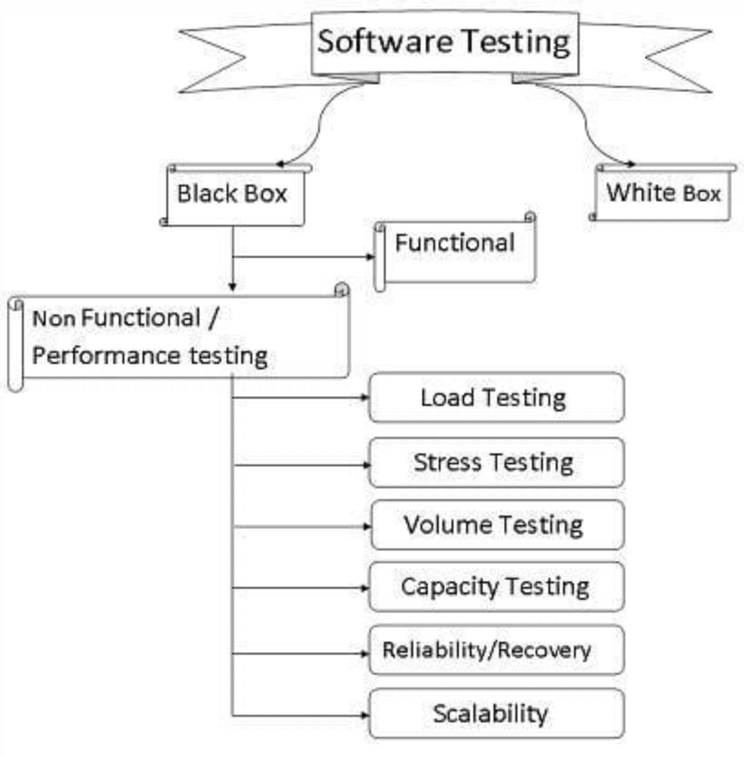
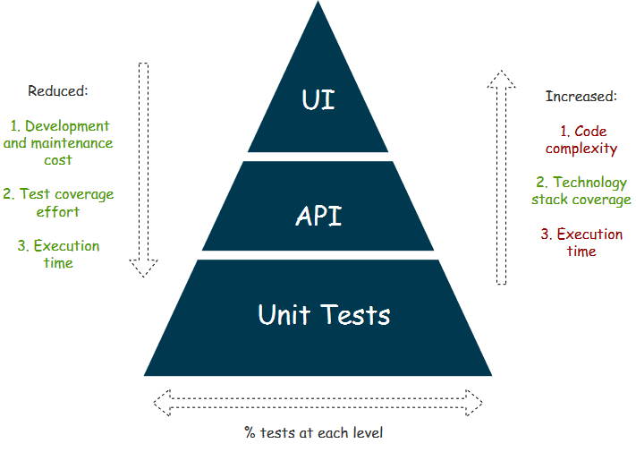

# Kubernetes-Development

## 1. Prefix

- 授课时长：
    - 上午：9:00 至 12:00
    - 下午：13:30 至 17:30
- Prerequisite
    - 有计算机语言编程基础
    - 已经掌握了一种常见编程语言（Python/C/Java/Golang）的基本语法
    - 已经掌握了容器和 K8S 基本概念
    - 了解 API 测试的基本概念

## 2. API 自动化测试普适规范

- 敏捷开发 Fullstack Test 为什么不够？[功能覆盖最小测试](https://www.softwaretestinghelp.com/maximizing-quality-beyond-full-stack-testing/)
- Fullstack 之外的测试应从何时介入？

    

- API 自动化测试主要针对什么类型的测试？功能测试。[非功能测试还有哪些？](https://www.softwaretestinghelp.com/what-is-non-functional-testing/)
- [性能测试有哪些类型？应如何展开？](https://www.softwaretestinghelp.com/introduction-to-performance-testing-loadrunner-training-tutorial-part-1/)

    

- 自动化测试分几类？[各自针对什么测试场景？](http://quality-spectrum.com/what-is-api-testing/)

    

- Restful API 和 GRPC 接口的自动化测试有哪些异同？[gRPC 提供了许多优势，但它有一个主要障碍：浏览器兼容性低。因此，gRPC 的用例一般局限在内部/私有系统](https://www.infoq.cn/article/i71VNujceL09ebukak59)

    

- 常用的 API 测试辅助工具有哪些？各自用于什么场景？
    - Netmon / Wireshark / tcpdump
    - Fiddler
    - Postman
- 常见的 Python API 测试框架有哪些？各有什么优劣？
    - Pytest & request
    - Tempest
- [什么是 Restful API 设计？](https://www.ics.uci.edu/~fielding/pubs/dissertation/rest_arch_style.htm)
    - 客户端-服务器约束：用户界面问题与数据存储分开
    - 无状态约束：会话状态完全保留在客户端
    - 缓存约束：响应数据需标记为可缓存或不可缓存
    - [统一接口约束](https://www.ics.uci.edu/~fielding/pubs/dissertation/rest_arch_style.htm#sec_5_2)
    - 分层约束
    - 按需代码：通过下载和执行小程序或脚本形式的代码来扩展客户端功能
- [如何判断服务是否以正确的值响应？](https://restfulapi.net/http-status-codes/)
- 如何判断服务行为是否符合最终用户的预期要求？
- 如何判断服务的响应速度是否符合用户的预期？
- 如何检测服务是否可以处理预期和意外的用户负载？
- 如何检测服务是否可以处理无效和错误数据导致的异常？
- 如何以黑盒思维看待和分析服务接口是否合理？
- 如何设计针对服务认证、鉴权、准入的测试用例？

## 3. 有哪些是不能容忍的 Restful API 设计？

- JSON 数据格式处理中常见的陷阱有哪些？
- YAML 数据格式处理中常见的陷阱有哪些？
- 怎么合理区分服务中的数据和配置？
- 针对无状态服务的 API 测试应做哪些事？不应做哪些事？
- 针对有状态服务的 API 测试要注意哪些测试点？
- 基于关系型数据库的服务，API 测试应着重注意哪些问题？
- 基于对象数据库的服务，API 测试应着重注意哪些问题？
- 怎么针对服务本身的状态管理进行测试？
- 针对时间日期接口的 API 测试有哪些常见陷阱？
- 针对数据类型的 API 测试有哪些常见陷阱？
- 如何检测字符串注入问题？
- 如何设计针对并发逻辑的 API 测试用例？
- 如何“恰好地”设计回归测试？

## 4. 基于容器和非容器的服务有哪些异同？

- 如何快速推出和回收基于 K8S 的服务测试环境？
- 如何理解 K8S 中无状态服务发布的原理？
- 如何理解 K8S 中有状态服务发布的原理和注意事项？
- 如何理解 K8S 中的配置管理模块？
- 如何测试 K8S 对集群内发布的服务？
- 如何测试 K8S 对集群外发布的服务？
- API 测试用例如何结合服务网格进行可视化流量分析？
- API 测试用例在 K8S 环境中一般需要做哪些小调整？
