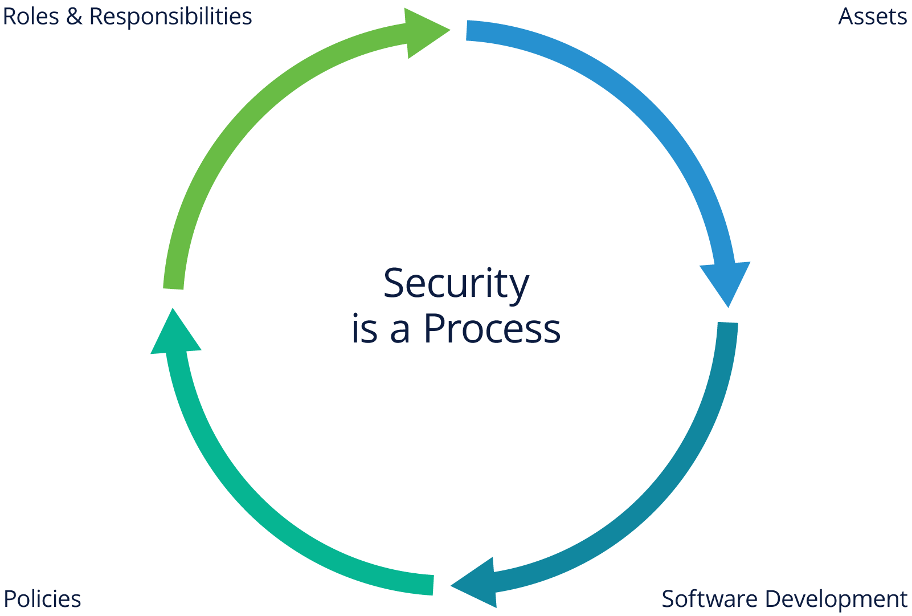
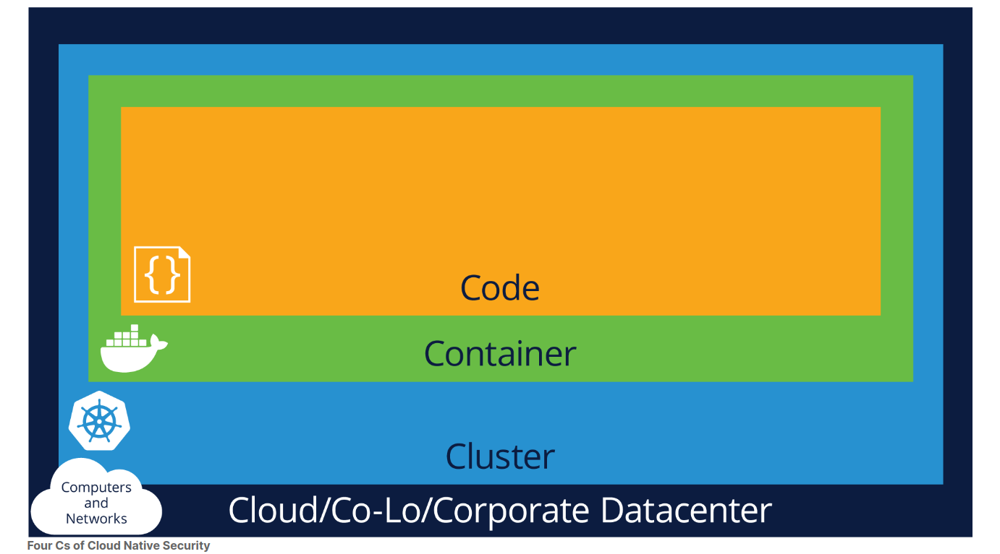
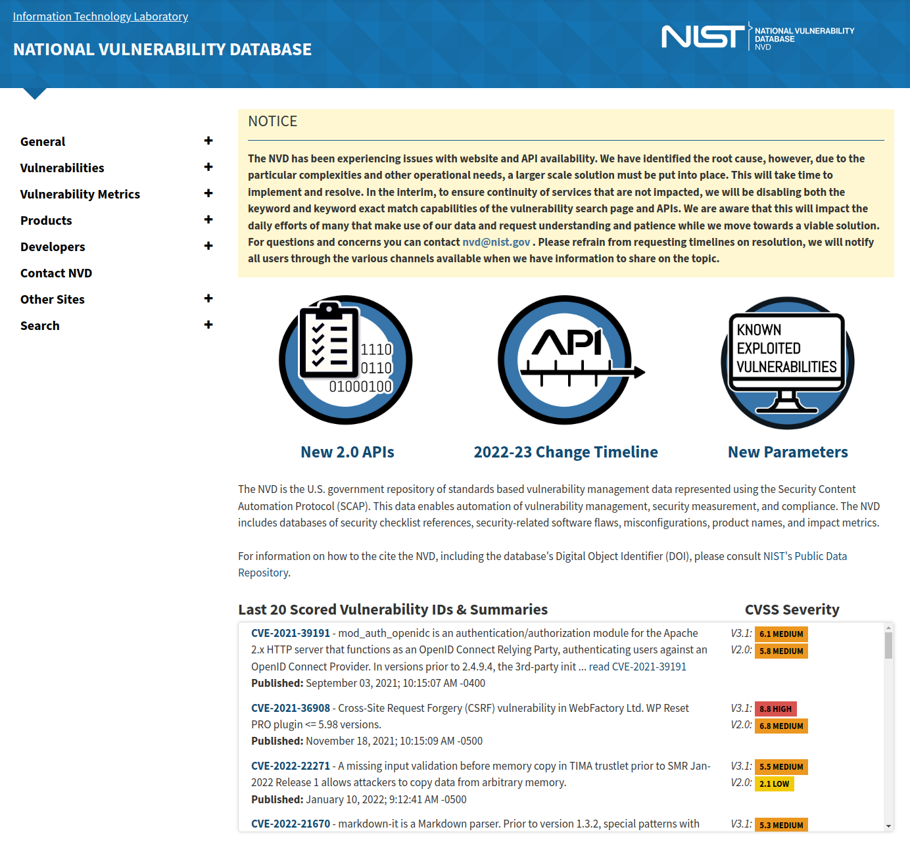
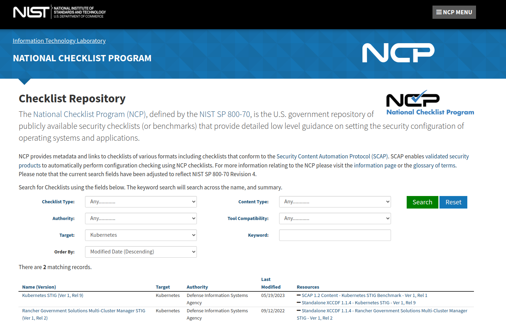
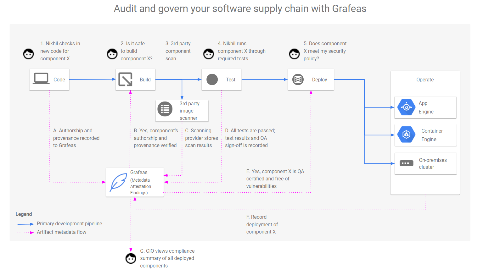
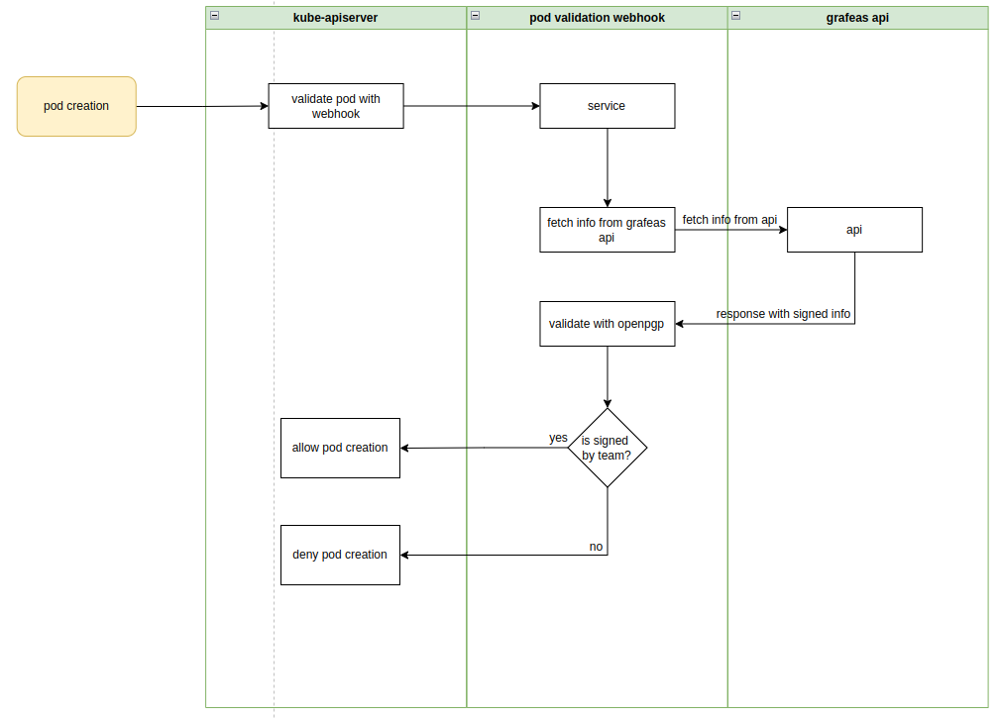
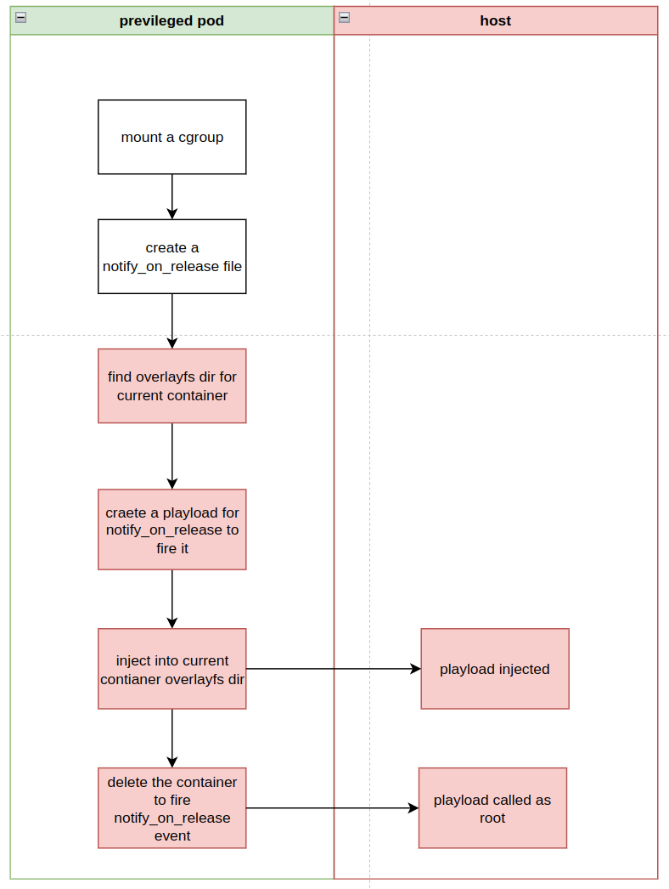
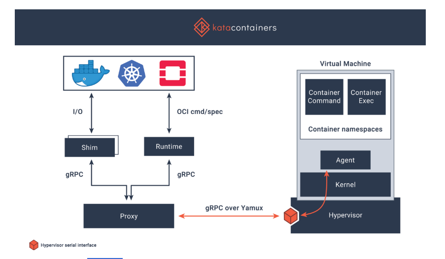
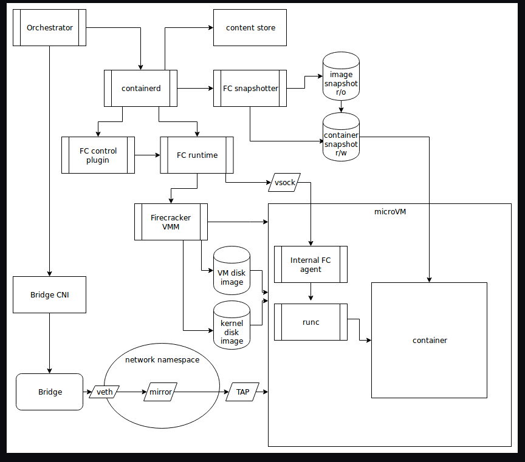
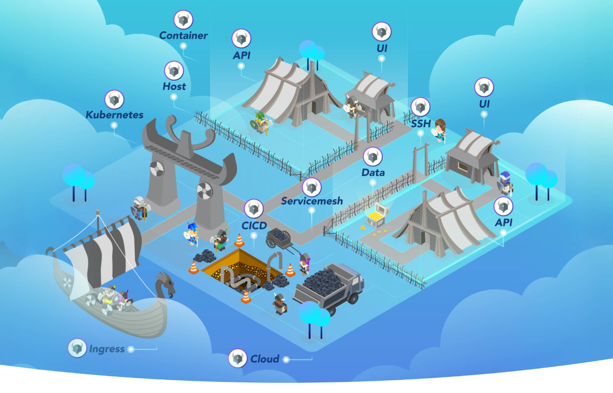

# Kubernetes 安全纪要和最佳实践（Kubernetes Security Specialist）

## 注意 ⚠️

- **未经允许，禁止转载**

## Prefix

- 授课时长：
    - 上午：9:30 至 12:00
    - 下午：13:30 至 16:00
- Prerequisite
    - [CKA](class-01-Kubernetes-Administration.md)

## Catalog

| Date | Time | Title | Content |
| ---- | ---- | ----- | ------- |

* kubernetes 安全/cks
  * 概述
  * 课程概述
  * 什么是安全
  * 云安全
    * cncf 项目安全相关
    * 安全考量原则
    * 理解攻击面
    * 攻击类别
    * 攻击源
    * 主动/被动 攻击
    * 安全方面的网上资源
      * NIST Cybersecurity Framework
      * High Value Asset Protection
      * National Checklist Program
      * CIS Benchmarks
      * kube-bench
    * 企业安全文化
      * 开发组安全文化
      * 安全组文化
  * k8s 风险面
    * 来自镜像的风险
      * 私有镜像仓库 -- 愤怒的员工
      * 公网镜像的风险 -- 理解镜像的供应链
      * 应对策略
    * 运行镜像引擎的风险考量 -- container runtime
      * gvisor
      * kata
      * firecrack
    * 来自于软件安装包的风险考量
      * 应对策略
        * The Update Framework (TUF)
        * Notary
  * 搭建 k8s 集群前的安全事考量
    * 找到内核的风险点 CVE
    * 利用内核功能抵御攻击
    * 搭建多节点集群
  * 加固集群访问安全
    * 加固 kube-apiserver
    * 开启审计日志
    * 合理使用 RBAC
    * 使用 Pod Security Policies
    * etcd 的安全
    * 加密 secret 数据
    * 合理使用 admission controller
    * 使用 serviceaccount
  * 加固 k8s 集群网络安全
    * 网络漏洞扫描
    * 阻止 pod 跨 namespace 访问
    * 服务网格的产品的考量
    * 尽可能的使用  mTLS
  * k8s 工作负载的安全加固和考量
    * 下载一个镜像前的考量
    * 运行一个容器前的考量
    * 保护容器 container layer 的安全
    * 容器运行后的安全分析
    * crd 和 operator 的安全考量
    * 容器运行中安全工具介绍
      * seccomp
      * selinux
      * apparmor
  * 问题风险发现
    * 理解攻击的生命周期
      * 理解 kill chain
    * 风险管控的 checklist
    * 被攻击后的应对策略
      * 被攻击后的应对策略 -- 报告机制
      * 涉及违法的应对策略
      * 建立紧急应对小组
      * 完善的故障报告
    * 入侵检测
      * 主机入侵检查
      * 网络入侵检查

## 1. 课程介绍

云安全是一个演进的过程，不是一朝一夕，而是需要经历持续的、无数的积累和实践，才能构建出让人放心的云环境。

本课程旨在介绍：

1. 如何解决云生产环境的安全问题
2. 安全容器供应链
3. K8S 集群持续安全和敏捷使用
4. 在哪里可以找到持续的安全和漏洞信息

该课程包括：

1. 用于构建和保护 Kubernetes 集群的动手实验
2. 监控和记录安全事件的动手实验

在本课程结束时，您将学到以下内容：

1. 了解云生产环境的安全问题
2. 了解如何强化系统和集群
3. 讨论围绕容器供应链的安全主题
4. 了解如何监控和记录安全事件等等

## 2. 云安全概述

### 2.1 章节梗概

- 理解安全问题的发生和防止是一个持续的过程
- 讨论安全问题的发生和应对方法
- 讨论攻击的类型
- 4C 安全层级：code / container / cluster / cloud
- 了解安全机制和安全资源

### 2.2 什么是计算机安全？



计算机安全是对计算机或计算机系统有用资产（Asset）的保护。资产包括：硬件、软件、数据、流程、人员或其他们的组合。

- **资产的生命周期**：安全始于获取资产。重要的是，实物资产有一个保管链，直到资产上电。
- **软件开发的生命周期**：包括设计、开发、测试和部署的过程。在项目的设计阶段考虑安全性是至关重要的。
- **制定组织政策和程序**：制定政策和程序可以降低意外或故意伤害的风险。
- **定义角色和职责**：建立事件响应的层次结构非常重要。由于工作的艰巨性，需要有一个明确的领导者或分配领导者的预案。

安全从来不是一朝一夕的事情，他需要经历持续的、无数的积累和实践才能构建出让人放心的云环境。因为工具手段不停的在更新和演进，所以我们也需要不停的学习和实践，才能保证我们的云平台安全。

### 2.3 攻击面

每个云平台中的组件都是一个可能被攻击的点，每个组件都由代码构成，都会存在风险。最安全的做法是不让这些数据通过网络暴露出来（锁在安全级别高的房间里），但是这样我们也不能对外正常提供服务了，也就失去了存在的意义，所以控制好平衡很有必要。

#### 2.3.1 ETCD 数据库安全

k8s 中存放最核心数据的是 etcd 数据库，一但数据文件被恶意摧毁，如果没有备份，就很难恢复。

- 默认 kubeadm 会将 etcd 和 controller 部署在一起，etcd 数据目录上挂载到 /var/lib/etcd，如果攻击者删除这个目录话，就会对集群造成致命影响。
- **从安全角度来说一个分离部署的 etcd 数据库集群是更理想**，你可以参照 [集群数据库分离](https://github.com/justmeandopensource/kubernetes/blob/master/kubeadm-external-etcd/3%20setup-kubernetes-with-external-etcd.md) 来搭建数据库和 k8s 集群分离的场景

```yaml
# default kubeadm etcd static pod
$ cat /etc/kubernetes/manifests/etcd.yaml
# output
    volumeMounts:
  - mountPath: /var/lib/etcd
    name: etcd-data
 ...
volumes:
...
- hostPath:
    path: /var/lib/etcd
    type: DirectoryOrCreate
  name: etcd-data

# separete etcd cluster config
$ kubectl get cm -nkube-system kubeadm-config -o yaml
apiVersion: v1
data:
  ClusterConfiguration: |
    apiServer:
      certSANs:
      - kubernetes
      - kubernetes.default
      - kubernetes.default.svc
      - kubernetes.default.svc.mec01.com
      - localhost
      - 127.0.0.1
      - vip.mec01.com
      - 172.xx.xx.100
      - master-1
      - master-1.mec01.com
      - 172.xx.xx.207
      - master-2
      - master-2.mec01.com
      - 172.xx.xx.228
      - master-3
      - master-3.mec01.com
      - 172.xx.xx.225
      - 10.xx.xx.1
      extraArgs:
        authorization-mode: Node,RBAC
        bind-address: 0.0.0.0
        feature-gates: CSIStorageCapacity=true,ReadWriteOncePod=true,RotateKubeletServerCertificate=true
      timeoutForControlPlane: 4m0s
    apiVersion: kubeadm.k8s.io/v1beta3
    certificatesDir: /etc/kubernetes/pki
    clusterName: mec01.com
    controlPlaneEndpoint: vip.mec01.com:6443
    controllerManager:
      extraArgs:
        bind-address: 0.0.0.0
        cluster-signing-duration: 87600h
        feature-gates: RotateKubeletServerCertificate=true,CSIStorageCapacity=true,ReadWriteOncePod=true
        node-cidr-mask-size: "24"
      extraVolumes:
      - hostPath: /etc/localtime
        mountPath: /etc/localtime
        name: host-time
        readOnly: true
    dns:
      imageRepository: registry-1.ict-mec.net:18443/coredns
      imageTag: 1.9.3
    etcd:
      external:
        caFile: /etc/ssl/etcd/ssl/ca.pem
        certFile: /etc/ssl/etcd/ssl/node-master-1.pem
        endpoints:
        - https://xx.xx.xx.xx:2379
        - https://xx.xx.xx.xx:2379
        - https://xx.xx.xx.xx:2379
        keyFile: /etc/ssl/etcd/ssl/node-master-1-key.pem
    imageRepository: registry-1.ict-mec.net:18443/kubesphere
    kind: ClusterConfiguration
    kubernetesVersion: v1.27.2
    networking:
      dnsDomain: mec01.com
      podSubnet: 10.xx.xx.0/18
      serviceSubnet: 10.xx.xx.0/18
    scheduler:
      extraArgs:
        bind-address: 0.0.0.0
        feature-gates: CSIStorageCapacity=true,ReadWriteOncePod=true,RotateKubeletServerCertificate=true
kind: ConfigMap
metadata:
  creationTimestamp: "2023-08-23T05:47:44Z"
  name: kubeadm-config
  namespace: kube-system
  resourceVersion: "233"
  uid: fd244790-167b-4024-b465-60caaf9c04ea
```

#### 2.3.2 网络安全

网络也需要额外注意，我们期望正常访问不受影响，同时阻拦非正常的访问。可以配置防火墙白名单，比如我们对 kube-apiserver 的可访问地址段做配置，只能从 172.25.0.0/24 这个网段来访问 kube-apiserver。

- k8s 近期的版本所有的请求基本都是 zero trust 所有通讯都用 mTls (双向 tls) 认证的方式来访问，但是如果由于处于某原因，比如贪图方便直接通过 `kubectl proxy"` 来开放 kube-apiserver 访问方式就增加不安全风险
- 更糟的情况 `kubectl proxy --address="0.0.0.0"` 如果你的集群有配置 san 名比如 abc.com ，前面的命令会造成更大的安全问题，攻击者很容易就通过配置 .kube/config 配合 /etc/hosts 中伪装 abc.com 指向，就可以通过其他节点攻击 kube-apiserver 了

```console
# 查看访问路径
$ kubectl get node -v=10 2>&1 | tee output
$ cat output | grep -i "GET https:"
# output
I1009 10:05:38.708661   36252 round_trippers.go:553] GET https://xx.xx.xx.xx:6443/api/v1/nodes?limit=500 200 OK in 8 milliseconds
$ kubectl proxy
# 无证书直接访问 api-server
$ curl http://127.0.0.1:8001/api/v1/nodes?limit=500 
```

k8s 中的 kube-proxy、kubelet 都需要和 kube-apiserver 安全通讯机制。不能为了方便妥协。

#### 2.3.3 其它安全考量

云平台通常是有很多个项目组合而成的，项目越多自然攻击平面就越广泛，我们应该选择 cncf 的**毕业项目**，这些项目应该已经充分考虑的安全因素，**孕育中的项目** 则会多多少少欠缺一点安全性，比如：CNI, CRI-O, Linkerd, OpenTracing, Thanos 等。**Sandbox 项目**则会比会”孕育中的项目“安全情况可能更严峻一些，比如 Artifact Hub，k3s，in-toto，Keylime，Parsec。**Archived 项目**则是已经停止维护的项目，用户如果使用这些项目，则要自己面对安全风险。

k8s 有专门的 sig 负责安全方面的工作 [Kubernetes Security Profiles Operator SIG](https://github.com/kubernetes-sigs/security-profiles-operator), 并且 cncf 有专门的小组负责所有项目的安全 [CNCF Special Interest Group for Security](https://github.com/cncf/sig-security)

#### 2.3.4 风险的来源、类别和应对

资源的分配 -- 可能会造成各种风险的提升比如

- SSO 单点登陆的方案看似很好管理，但是他提高的安全的风险，如果 sso 服务出现的了问题，则所有的平台都不可登录。
- 每多增加一个安全管理成员就多一份安全风险，这是从人事任命角度的观点。因为人有很多不可控的因素比如情绪、生活压力等，当然只有一个安全管理也是一个安全风险。
- 耦合度过高服务应用 -- 比如将很多关键服务部署在了没有灾备方案的主机群或者平台上，如果平台或者主机群出现的断电则这些服务都将停止服务。

应对策略

- Prevention / 防止机制 -- 我们需要经可能的防止使安全风险上升的事情发生，我们可以通过硬件或者软件的手段来达成这样的目标。
    - 通过安全登录软件来控制 `人/应用` 对特定的 `软件/硬件` 的访问
    - 增加管理流程，比如 `appA` 需要访问 `数据库A` 需要填写必要的申请并等待审核通过
    - 根据安全等级，我们甚至可以将物理设备离线管理，唯一能够登录的地方可以设置在一间带有密码锁，或者需要授权的员工卡才能打开的房间里
- Detection/检测机制 -- 当然光靠 `Prevention/防止机制` 是不可能完全屏蔽安全风险的，一旦有影响安全事件发生时，我们需要能够通过各种手段检测到， 在我们称之为 `Intrusion Detection and Prevention Systems/入侵检测和防止系统(IDPS)` 中的 `Prevention Systems/防止系统` 就是我们上面讨论的问题。 `Intrusion Detection/入侵检测` 对我们来说比较直观的方法是 `静态数据监控` 即通过 `监控/日志` 收集的方式来实现比如我们可以在 k8s 上安装 `Prometheus`
    - Reaction/应对机制 -- 应对总是被动的，但是我们可以把应对变的尽可能不这么被动， 比如当 k8s 彻底宕机了，但如果我们在每天定时做了 etcd 数据库全量备份或者使用 velero 做了对象备份，那么可能我们至少能将集群回复到一个最接近宕机前的状态

攻击者的类别

- White Hat/白帽 -- 通常就职于安全公司，他们会遵守法律将发现的漏洞通知对应的机构
- Black Hat/黑帽 -- 也是我们常说的黑客他们会入侵计算机 窃取 或者 摧毁 宝贵的数据，用于他们自己的目的
- Script Kiddie/脚本小子 -- 不是高手只是懂点皮毛，他们拿着别人写好的脚本或者工具来进行攻击
- Hacktivist/有黑客行为者 -- 这些人一般带有宣传目的来攻击，他们一般攻击网页篡改首页显示的文字来达到他们的目的
- Nation State/国家组织 -- 这些攻击者隶属于一个国家的机构
- Organized Crime/有组织的犯罪 -- 处于某些利益，有组织的攻击计算机
- Bots/机器人 -- 被攻击这控制的电脑或者终端，被控制后用来攻击计算机

攻击来源

- 内部 -- 内部攻击一般来自于内部员工，最常见的比如窃取了他们本身有权访问的源码或者设计图纸，但是将这些信息贩卖给了竞争对手
- 外部 -- 通过网络的手段作为非法的用户登录的计算机上窃取信息

攻击类别

- Active Attacks/主动 -- 主动攻击类型，主要目的是摧毁正常工作的应用和服务，通常的手段有 拒绝、泛洪攻击等即通过增加应用的负载或者贷款来让服务变得几乎不可用
  - Denial of service/拒绝服务 -- 通常通过让客户端负载超负荷，比如疯狂发起对 kube-apiserver 请求导致 kube-apiserver 无法相应正常的请求，导致 k8s 平台不可用
  - Spoofing attacks/欺骗攻击 -- 或者收茂名顶替的攻击通常发生在 ARP、DNS、IP地址和MAC容易受到欺骗，比如服务 ```appA``` 使用 ip 为 10.0.0.100 身份认证 api ```apiA``` ，如果攻击者假装成为 10.0.0.100 上的 ```apiA``` 并授权所有从 ```appA``` 请求的用户那么 ```appA``` 怎完全失去了认证授权的保护了
  - Port scanning/端口扫描 -- 攻击者通过使用 nmap 来扫描主机上的端口，返回的结果可以给攻击者充分的服务应用列表正在运行在目标节点之上
- Passive Attacks/被动 -- 被动攻击者通常不会修改任何东西，他们只是查看一些敏感的数据，并拍照或者复制下来，很难被察觉。

4c 安全层级--我们的安全实现的思路是尽可能不让 code 层的风险外溢到 container 外面。

- code -- 代码层级位于最内层
- container -- 容器层级位于第二层
- Cluster -- 集群层级位于第三层
- Cloud -- 云平台层级位于最外层



硬件方面安全演进 -- 在硬件层面安全软件也在蓬勃发展中比如 [Platform AbstRaction for SECurity (PARSEC)](https://github.com/parallaxsecond/parsec) 为硬件提供通用的安全的 api

Federal Information Processing Standard (FIPS)/联邦信息安全处理标准 -- 是美国关于计算机安全的一个标准，大家有兴趣的话可以查看 [Computer Security Resource Center Publications web page](https://csrc.nist.gov/publications) 长篇大论，总结核心内容如下：

- Asset Management/资产管理
- Business Environment/商业环境
- Governance/政府相关决策
- Risk Assessment/风险把控
- Risk Management Strategy/风险管理机制
- Supply Chain Risk Management/供应链安全管理

High Value Asset Protection/高价值资产保护 -- 一些非常敏感的业务做好服务与安全的平衡非常重要，比如银行信用卡信息查询的接口，如果过度保护起来则他将不再有能为大家提供必要的查询服务，所以我们需要走出妥协，在美国我们可以向 ```Cybersecurity and Infrastructure Security Agency (CISA)``` 协会申请对应用进行必要的风险评估，以确认他的安全机制是有能力抵御安全风险的

National Checklist Program/国家安全检查程序列表 -- 是一个网站在他背后有数据库(National Vulnerability Database (NVD))记录着大量的软件或者云平台各个版本中存在的漏洞或者风险,大家可以访问 [NATIONAL VULNERABILITY DATABASE](https://nvd.nist.gov/) 来查看一个全局的信息，或者直接通过查询页面来查询 k8s 特定版本存在的问题  [NIST 查询页面](https://nvd.nist.gov/ncp/repository)

[National Vulnerability Database](https://nvd.nist.gov/)



[NIST 查询页面](https://nvd.nist.gov/ncp/repository)



CIS Benchmarks/cis 安全压力测试 -- [Center for Internet Security, Inc. (CIS®)](https://www.cisecurity.org/) 是一个 ```非盈利性组织``` 他提供一些免费的最佳实践信息以及一些免费安全压力测试组件，有兴趣的同学可以自行了解下

kube-bench -- [kube-bench](https://github.com/aquasecurity/kube-bench) 是一个工具用来做 k8s 的安全测试工具来自于一家安全公司 ```Aqua Security``` 它提供的测试可能并没有 ```CIS Benchmarks``` 来的那么全面但是还是值得一用的

More on High Value Asset Protection/更多高价值资源防护信息 -- 你可以访问 ```Homeland Security/国土安全``` 的页面 [Cybersecurity Directives/安全漏洞目录](https://www.cisa.gov/news-events/directives) 来查看目前存在的安全漏洞，以及查看 [Securing High Value Assets page](https://cyber.dhs.gov/bod/18-02/) 页面来了解来自 ```Homeland Security/国土安全``` 部门对高价值资产保护的建议

Improve Security Team Culture/安全部门的文化建设 -- 经常在研发团队内，大家谈到安全都会略有反感，可能觉得一些安全考量会影响我们的开发工作觉得很麻烦，这种抵触的情绪应该通过培训和学习来装便这样的观念，安全团队应该尽可能的介入每个项目的开发生命周期中，同时安全团队需要建设良好的协助机制，来协助研发完成开发工作并同时兼顾安全，比如当研发团队提出的功能实现设计安全风险时，安全团队不应该立刻拒绝这个功能的实现，而是帮助研发如何实现这个功能并且兼顾安全。

Limit Access/访问限制 -- 通过限制各个访问关键的节点也是有效的提高安全的一种的方法

- 节点与节点之间的网络安全 -- ```工作节点``` 到 ```工作节点``` 之间的网络应有 ```软件/硬件``` 的防火墙存在，包括 ```工作节点``` 到 ```infa node/基础节点(通常在 k8s 中是南北向网络出入的节点即 k8s 外部访问 k8s 内部的节点)``` 之间也应该有 ```软件/硬件``` 的防火墙
- ci/cd 环境--经常会因为代码的更新不停的迭代，我们也不应该忽视风险的存在，比如 ci/cd 的环境应该拒绝从公网被访问，因为这些代码刚被写出来可能存在者安全的风险，同时我们应该增加安全扫描软件在整个 pipeline 的构建过程。
- 非容器化的安全工具 -- 比如 SELinux, Kerberos, SAML ,这里 SELinux 比较有争议 软件/平台 都会建议大家关闭他，我们的态度是如果 软件/平台 没有显式的提出需要关闭它，那么我们建议就开着 SELinux

### 2.4 lab

### 2.4.1 lab: install aio k8s

参考 [实验：k8s 的部署](class-01-Kubernetes-Administration.md#27-实验k8s-的部署)

## 3. 安装准备

### 3.1 章节梗概

- 理解镜像构建链和安全保障工具
- 了解其它用于容器隔离的运行时沙盒
- 考虑基于策略的访问和权限控制
- 使用镜像前先扫描

### 3.2 镜像的安全风险

  * 理解镜像供应链 -- 我们可以简单的理解为我们部署的来自于镜像的应用就是一道上台面的菜，在太背后有很多的食材供应商，我们需要保证这些食材的安全性，比如我们的镜像来自于哪里，我们的镜像是如何构建的，我们的镜像中是否存在安全漏洞，我们的镜像中是否存在恶意代码等等，所以良好管理方式是很重要的环节之一，幸运的是我们有这样的软件帮助我们完全这个过程，比如 [grafeas](https://github.com/grafeas/grafeas)
    * grafeas -- 现在让我们来谈谈 Grafeas 以及它的功能。Grafeas 也是首先以开源方式开发的，如果您想查看，所有的提交历史记录都在 Github 上。它在软件供应链中的位置在哪里？它代表了所有不同的步骤。它专门用于存储有关它的信息，源代码，部署它的人以及谁何时提交的代码，测试结果等。在软件供应链中的每个阶段，它都能够表示。
      * CICD -- 主线可以将所有镜像的保存的相关源数据都保存在 Grafeas 里，包括扫描的结果之类信息，同时他还是支持存放自己定义签发的安全镜像签名证书，可以用来结合 cicd 来做实现没有通过证书的镜像不允许在 k8s 中启动的安全机制，通常配合 Kritis 一起来使用

      * intergate with kubernetes -- 配合 pod 的 validation webhook 我们可以拒绝所有没有通过镜像签名的镜像启动的请求
 
  * 来自镜像仓库的风险
    * 从公共仓库拉取的镜像 -- 一般官方的镜像比如 nginx 等都是经过过安全扫描的会相对比较安全，但也不排除有安全漏洞的版本
      * 应对策略1--所以一旦有安全漏洞的版本被告知后，作为安全团队应该及时的通知研发团队升级到最新的版本。
    * 从私有仓库拉取的镜像 -- 一般私有仓库的镜像都是自己团队构建的，或者是用作离线的仓库，这里容易被 ```内部攻击```  比如一位受到不公待遇的即将离职的员工他替换了 etcd 数据库的镜像为自己编译的镜像并且在镜像中植入的恶意的删库代码 ```etcdctl del "" --prefix```

      ```bash
      # 一个恶意替换原本二进制文件的镜像的恶意 Dockerfile
      # Dockerfile
      FROM orgin
      RUN update-ca-trust
      RUN mv /usr/bin/org-binary /usr/bin/org-binary-renamed
      COPY hack-binary /usr/bin/org-binary

      # 一个恶意删除 etcd 数据库的数据文件的 Dockerfile 制作镜像代码片段
      # 由于 kubeadm 在启动时会自用超级权限模式来运行，所以攻击者只要替换 CMD 指令就可以轻易删除之前 etcd 数据库目录下的所有相关文件
      # Dockerfile
      ...
      CMD [ "sh", "-c", "rm -rf /var/lib/etcd/*" ]
      ```

      * 应对策略1--这种情况下我们需要自己来保证镜像的安全性，加强镜像的 md5sum 等镜像校对工作
      * 应对策略2--我们可以通过 ```镜像签名``` 来保证镜像的安全性，比如我们可以使用 ```cosign``` 来对镜像进行签名，这样我们就可以保证镜像的安全性了
      * 应对策略3--避免使用不需要认证就能推送镜像的私有镜像仓库，所有的镜像仓库至少需要认证才能推送镜像，比如使用 ```harbor``` 时我们应该开启镜像仓库的认证功能

### 3.3 镜像中软件的安全

* 运行镜像的软件的安全 -- 我们的容器技术使用的是 kernel 的 namespace 技术用来做隔离的，根本上来说它是通过软件隔离，所以存在 ```越狱``` 等风险，所以一款良好的容器运行时是很重要的，比如我们可以使用 ```gvisor``` 来做容器运行时，当然我们有很多的选择
  * 应对策略1--使用 [gvisor](https://github.com/google/gvisor) 来做容器运行时 -- 容器运行时是运行所需应用程序的二进制入口点，位于沙箱内部，同时每个容器都会有2个进程来负责， Sentry 负责容器内调用内核的功能处理，你可以理解为模拟了一个 kernel 只给这个容器内的应用来用，而 ```Gofer``` 负责文件系统的访问，运行在一个受限制的 ```seccomp`` 容器中
  * 应对策略2--使用 [kata](https://katacontainers.io/) 来做容器运行时 -- 最早是诞生在 openstack 社区的项目，用来做轻量级的 vm，后来被容器社区接受并且成为了 CNCF 的项目，它的原理是通过 ```kvm``` 来做隔离，每个容器都是一个轻量级的 vm，所以它的隔离性是非常好的，但是它的缺点是启动速度比较慢，因为它需要启动一个 vm，换句话说每个容器都会有一个内核互相隔离运行，这样的好处是非常的安全。
  * 应对策略3--使用 [firecracker](https://github.com/firecracker-microvm/firecracker-containerd) 来做容器运行时 -- firecracker 实现方式类似于 kata 的方式
  * 错误 mount 越狱 -- 通过挂载 host 的文件系统到容器中来达到越狱的目的，比如我们可以挂载 host 的 ```/var/run/docker.sock``` 文件到容器中，这样容器就可以通过 api 来访问 docker 的容器了，这样就可以通过 docker 的容器来攻击 host 了

```bash
# 一个最简单的 docker 容器越狱的例子
$ docker run -v /var/run/docker.sock:/var/run/docker.sock -p 8080:8080 -it centos /bin/bash
$ [root@40611890a749 /]#  curl -s --unix-socket /var/run/docker.sock http://172.17.0.2:8080/containers/json
# output
[{"Id":"40611890a74960d37455c19f252ada510b50db35110e7a7780297c698ab76b34","Names":["/wizardly_moser"],"Image":"centos","ImageID":"sha256:5d0da3dc976460b72c77d94c8a1ad043720b0416bfc16c52c45d4847e53fadb6","Command":"/bin/bash","Created":1696676011,"Ports":[{"IP":"0.0.0.0","PrivatePort":8080,"PublicPort":8080,"Type":"tcp"},{"IP":"::","PrivatePort":8080,"PublicPort":8080,"Type":"tcp"}],"Labels":{"org.label-schema.build-date":"20210915","org.label-schema.license":"GPLv2","org.label-schema.name":"CentOS Base Image","org.label-schema.schema-version":"1.0","org.label-schema.vendor":"CentOS"},"State":"running","Status":"Up About a minute","HostConfig":{"NetworkMode":"default"},"NetworkSettings":{"Networks":{"bridge":{"IPAMConfig":null,"Links":null,"Aliases":null,"NetworkID":"01be86c752174fbf8436b6974f78802f52ceaa6e2b91f96c934032f6ca8fa589","EndpointID":"3728c585e295bfedf81adb39b02c147ce6512e60ec79413ba539face73816f1a","Gateway":"172.17.0.1","IPAddress":"172.17.0.2","IPPrefixLen":16,"IPv6Gateway":"","GlobalIPv6Address":"","GlobalIPv6PrefixLen":0,"MacAddress":"02:42:ac:11:00:02","DriverOpts":null}}},"Mounts":[{"Type":"bind","Source":"/var/run/docker.sock","Destination":"/var/run/docker.sock","Mode":"","RW":true,"Propagation":"rprivate"}]}]

# think this way 
# 既然我们能够通过 api 去访问 docker 的容器，那么curl -s --unix-socket /var/run/docker.sock "http://172.17.0.2:8080/containers/create" -X POST -H "Content-Type: application/json" -d  {...} 也能创建任意用来攻击的恶意容器 
```

### 3.4 容器运行时的安全

* notify_on_release 攻击--利用 cgroup v1 的 notif_on_release 来攻击，这个攻击的原理是利用 cgroup v1 的 notif_on_release 功能，这个功能是用来在 cgroup 释放时通知父 cgroup 的，这个功能是为了让父 cgroup 可以做一些清理工作，比如释放一些资源，但是这个功能也可以被利用来做攻击。简单的讲被用来清理的方法的函数被变为了一个攻击点


* k8s runtime class -- 用于指定容器的运行时，比如我们可以指定 pod 使用 kata 来运行，也可以指定 pod 使用 gvisor 来运行，这样我们就可以保证 pod 的安全性了





```yaml
apiVersion: node.k8s.io/v1beta1
kind: RuntimeClass
metadata:
  name: gvisor
handler: runsc

# pod 制定 runtime
apiVersion: v1
kind: Pod
metadata:
  name: mypod
spec:
  runtimeClassName: myclass
```

### 3.5 软件包的安全

* 软件包的安全 -- 考虑到 BIOS，操作系统，Kubernetes 和其他软件以及容器化的应用程序，每个软件都有定期更新，攻击者可以利用这些软件中的任何一个更新过程中下载的软件包来进行攻击。每个软件都应该来自可信的来源，并且应该检查以确保它们在创建后没有更改。如果开发人员下载了恶意的软件包里的代码，黑客攻击也会删除这些恶意代码，因此开发人员从未知道。ci pipeline 的其余部分都假设一切都是安全的。
  * 应对策略1--利用基于 [The Update Framework(TUF)](https://theupdateframework.io/) 安全库的软件 比如 [Notary](https://github.com/theupdateframework/notary)

### 3.6 中心化的策略管理工具

  * [Open Policy Agent(OPA)](https://www.openpolicyagent.org/) 他可以从各个方面去为 k8s 定制规则(policy)，比如可以拒绝所有用非 ```linux.com/``` 为开头的镜像的容器启动请求，或者可以拒绝所有的容器使用 ```latest``` 为 tag 的镜像，或者可以拒绝所有的容器使用 ```root``` 用户启动等等，这样我们就可以保证容器的安全性了
  * [gatekeeper](https://github.com/open-policy-agent/gatekeeper-library/tree/c7bd62bf6a2694106519ad4c52dec99c05c2d29b/library) -- gatekeeper 利用 [OPA Constraint Framework](https://github.com/open-policy-agent/frameworks/tree/master/constraint) 做为行为控制(admission controller),所有我们要定义的规则(policy) 都已一个 crd 实例来定义

```yaml
# 一个简单的例子，限制所有的 pod 必须有 label 才能运行
# 规则则通过 rego 语言来编写
apiVersion: templates.gatekeeper.sh/v1beta1
kind: ConstraintTemplate
metadata:
  name: k8srequiredlabels
spec:
  crd:
    spec:
      names:
        kind: K8sRequiredLabels
        listKind: K8sRequiredLabelsList
        plural: k8srequiredlabels
        singular: k8srequiredlabels
      validation:
        # Schema for the `parameters` field
        openAPIV3Schema:
          properties:
            labels:
              type: array
              items: string
  targets:
    - target: admission.k8s.gatekeeper.sh
      rego: |
        package k8srequiredlabels

        deny[{"msg": msg, "details": {"missing_labels": missing}}] {
          provided := {label | input.review.object.metadata.labels[label]}
          required := {label | label := input.parameters.labels[_]}
          missing := required - provided
          count(missing) > 0
          msg := sprintf("you must provide labels: %v", [missing])
        }

# 一旦 template 创建好了之后就可以使用
# rule-label1.yaml
apiVersion: constraints.gatekeeper.sh/v1beta1
kind: K8sRequiredLabels
metadata:
  name: ns-require-label
spec:
  match:
    kinds:
 - apiGroups: [""]
        kinds: ["Namespace"]
  parameters:
    labels: ["gk-ns"]
```

```bash
# 那么将他作用在某个 namespace 下就可以限制这个 ns 下的所有 api 对象都必须要有 label
$ kubectl create -f rule-label1.yaml -n label-required-ns
```



### 3.7 lab

#### 3.7.1 调查安全组件

- [Trow](https://trow.io/)
- [Prisma Cloud](https://www.paloaltonetworks.com/prisma/cloud)
- [NeuVector](https://neuvector.com/)
- [Clair](https://github.com/quay/clair)
- [Trivy](https://github.com/aquasecurity/trivy)
- [Aqua](https://www.aquasec.com/)
- [Notary](https://github.com/theupdateframework/notary)

#### 3.7.2 体验 Trivy

```bash
sudo apt-get install wget apt-transport-https gnupg lsb-release
wget -qO - https://aquasecurity.github.io/trivy-repo/deb/public.key | gpg --dearmor | sudo tee /usr/share/keyrings/trivy.gpg > /dev/null
echo "deb [signed-by=/usr/share/keyrings/trivy.gpg] https://aquasecurity.github.io/trivy-repo/deb $(lsb_release -sc) main" | sudo tee -a /etc/apt/sources.list.d/trivy.list
sudo apt-get update
sudo apt-get install trivy
```

```bash
# 扫描镜像 knqyf263/vuln-image:1.2.3
trivy image knqyf263/vuln-image:1.2.3
```

```log
# output 
2023-07-27T00:33:44.811Z	INFO	Need to update DB
2023-07-27T00:33:44.811Z	INFO	DB Repository: ghcr.io/aquasecurity/trivy-db
2023-07-27T00:33:44.812Z	INFO	Downloading DB...
38.50 MiB / 38.50 MiB [--------------------------------------------------------------------------------------------------------------------------------------------------------------------------------------------------------------------------------------------------------------------------------------------------------------------------] 100.00% 14.70 MiB p/s 2.8s
2023-07-27T00:33:49.545Z	INFO	Vulnerability scanning is enabled
2023-07-27T00:33:49.546Z	INFO	Secret scanning is enabled
2023-07-27T00:33:49.546Z	INFO	If your scanning is slow, please try '--scanners vuln' to disable secret scanning
2023-07-27T00:33:49.546Z	INFO	Please see also https://aquasecurity.github.io/trivy/v0.43/docs/scanner/secret/#recommendation for faster secret detection
2023-07-27T00:33:56.692Z	INFO	Detected OS: alpine
2023-07-27T00:33:56.692Z	INFO	Detecting Alpine vulnerabilities...
2023-07-27T00:33:56.696Z	INFO	Number of language-specific files: 2
2023-07-27T00:33:56.696Z	INFO	Detecting composer vulnerabilities...
2023-07-27T00:33:56.697Z	INFO	Detecting cargo vulnerabilities...
2023-07-27T00:33:56.702Z	WARN	This OS version is no longer supported by the distribution: alpine 3.7.1
2023-07-27T00:33:56.703Z	WARN	The vulnerability detection may be insufficient because security updates are not provided

knqyf263/vuln-image:1.2.3 (alpine 3.7.1)

Total: 64 (UNKNOWN: 0, LOW: 1, MEDIUM: 25, HIGH: 19, CRITICAL: 19)

┌───────────────────────┬──────────────────┬──────────┬───────────────────┬───────────────┬──────────────────────────────────────────────────────────────┐
│        Library        │  Vulnerability   │ Severity │ Installed Version │ Fixed Version │                            Title                             │
├───────────────────────┼──────────────────┼──────────┼───────────────────┼───────────────┼──────────────────────────────────────────────────────────────┤
│ curl                  │ CVE-2018-14618   │ CRITICAL │ 7.61.0-r0         │ 7.61.1-r0     │ curl: NTLM password overflow via integer overflow            │
│                       │                  │          │                   │               │ https://avd.aquasec.com/nvd/cve-2018-14618                   │
│                       ├──────────────────┤          │                   ├───────────────┼──────────────────────────────────────────────────────────────┤
│                       │ CVE-2018-16839   │          │                   │ 7.61.1-r1     │ curl: Integer overflow leading to heap-based buffer overflow │
│                       │                  │          │                   │               │ in Curl_sasl_create_plain_message()                          │
│                       │                  │          │                   │               │ https://avd.aquasec.com/nvd/cve-2018-16839                   │
│                       ├──────────────────┤          │                   │               ├──────────────────────────────────────────────────────────────┤
│                       │ CVE-2018-16840   │          │                   │               │ curl: Use-after-free when closing "easy" handle in           │
│                       │                  │          │                   │               │ Curl_close()                                                 │
│                       │                  │          │                   │               │ https://avd.aquasec.com/nvd/cve-2018-16840                   │
│                       ├──────────────────┤          │                   │               ├──────────────────────────────────────────────────────────────┤
│                       │ CVE-2018-16842   │          │                   │               │ curl: Heap-based buffer over-read in the curl tool warning   │
│                       │                  │          │                   │               │ formatting                                                   │
│                       │                  │          │                   │               │ https://avd.aquasec.com/nvd/cve-2018-16842                   │
│                       ├──────────────────┤          │                   ├───────────────┼──────────────────────────────────────────────────────────────┤
│                       │ CVE-2019-3822    │          │                   │ 7.61.1-r2     │ curl: NTLMv2 type-3 header stack buffer overflow             │
│                       │                  │          │                   │               │ https://avd.aquasec.com/nvd/cve-2019-3822                    │
│                       ├──────────────────┤          │                   ├───────────────┼──────────────────────────────────────────────────────────────┤
│                       │ CVE-2019-5481    │          │                   │ 7.61.1-r3     │ curl: double free due to subsequent call of realloc()        │
│                       │                  │          │                   │               │ https://avd.aquasec.com/nvd/cve-2019-5481                    │
│                       ├──────────────────┤          │                   │               ├──────────────────────────────────────────────────────────────┤
│                       │ CVE-2019-5482    │          │                   │               │ curl: heap buffer overflow in function tftp_receive_packet() │
│                       │                  │          │                   │               │ https://avd.aquasec.com/nvd/cve-2019-5482                    │
│                       ├──────────────────┼──────────┤                   ├───────────────┼──────────────────────────────────────────────────────────────┤
│                       │ CVE-2018-16890   │ HIGH     │                   │ 7.61.1-r2     │ curl: NTLM type-2 heap out-of-bounds buffer read             │
│                       │                  │          │                   │               │ https://avd.aquasec.com/nvd/cve-2018-16890                   │
│                       ├──────────────────┤          │                   │               ├──────────────────────────────────────────────────────────────┤
│                       │ CVE-2019-3823    │          │                   │               │ curl: SMTP end-of-response out-of-bounds read                │
│                       │                  │          │                   │               │ https://avd.aquasec.com/nvd/cve-2019-3823                    │
├───────────────────────┼──────────────────┤          ├───────────────────┼───────────────┼──────────────────────────────────────────────────────────────┤
│ expat                 │ CVE-2018-20843   │          │ 2.2.5-r0          │ 2.2.7-r0      │ expat: large number of colons in input makes parser consume  │
│                       │                  │          │                   │               │ high amount...                                               │
│                       │                  │          │                   │               │ https://avd.aquasec.com/nvd/cve-2018-20843                   │
│                       ├──────────────────┤          │                   ├───────────────┼──────────────────────────────────────────────────────────────┤
│                       │ CVE-2019-15903   │          │                   │ 2.2.7-r1      │ expat: heap-based buffer over-read via crafted XML input     │
│                       │                  │          │                   │               │ https://avd.aquasec.com/nvd/cve-2019-15903                   │
├───────────────────────┼──────────────────┼──────────┼───────────────────┼───────────────┼──────────────────────────────────────────────────────────────┤
│ git                   │ CVE-2018-17456   │ CRITICAL │ 2.15.2-r0         │ 2.15.3-r0     │ git: arbitrary code execution via .gitmodules                │
│                       │                  │          │                   │               │ https://avd.aquasec.com/nvd/cve-2018-17456                   │
│                       ├──────────────────┤          │                   ├───────────────┼──────────────────────────────────────────────────────────────┤
│                       │ CVE-2019-1353    │          │                   │ 2.15.4-r0     │ git: NTFS protections inactive when running Git in the       │
│                       │                  │          │                   │               │ Windows Subsystem for...                                     │
│                       │                  │          │                   │               │ https://avd.aquasec.com/nvd/cve-2019-1353                    │
│                       ├──────────────────┼──────────┤                   │               ├──────────────────────────────────────────────────────────────┤
│                       │ CVE-2019-1349    │ HIGH     │                   │               │ git: Recursive submodule cloning allows using git directory  │
│                       │                  │          │                   │               │ twice with synonymous directory...                           │
│                       │                  │          │                   │               │ https://avd.aquasec.com/nvd/cve-2019-1349                    │
│                       ├──────────────────┤          │                   │               ├──────────────────────────────────────────────────────────────┤
│                       │ CVE-2019-1350    │          │                   │               │ git: Incorrect quoting of command-line arguments allowed     │
│                       │                  │          │                   │               │ remote code execution during a...                            │
│                       │                  │          │                   │               │ https://avd.aquasec.com/nvd/cve-2019-1350                    │
│                       ├──────────────────┤          │                   │               ├──────────────────────────────────────────────────────────────┤
│                       │ CVE-2019-1351    │          │                   │               │ git: Git mistakes some paths for relative paths allowing     │
│                       │                  │          │                   │               │ writing outside of...                                        │
│                       │                  │          │                   │               │ https://avd.aquasec.com/nvd/cve-2019-1351                    │
│                       ├──────────────────┤          │                   │               ├──────────────────────────────────────────────────────────────┤
│                       │ CVE-2019-1352    │          │                   │               │ git: Files inside the .git directory may be overwritten      │
│                       │                  │          │                   │               │ during cloning via...                                        │
│                       │                  │          │                   │               │ https://avd.aquasec.com/nvd/cve-2019-1352                    │
│                       ├──────────────────┤          │                   │               ├──────────────────────────────────────────────────────────────┤
│                       │ CVE-2019-1354    │          │                   │               │ git: Git does not refuse to write out tracked files with     │
│                       │                  │          │                   │               │ backlashes...                                                │
│                       │                  │          │                   │               │ https://avd.aquasec.com/nvd/cve-2019-1354                    │
│                       ├──────────────────┤          │                   │               ├──────────────────────────────────────────────────────────────┤
│                       │ CVE-2019-1387    │          │                   │               │ git: Remote code execution in recursive clones with nested   │
│                       │                  │          │                   │               │ submodules                                                   │
│                       │                  │          │                   │               │ https://avd.aquasec.com/nvd/cve-2019-1387                    │
│                       ├──────────────────┼──────────┤                   │               ├──────────────────────────────────────────────────────────────┤
│                       │ CVE-2019-1348    │ LOW      │                   │               │ git: Arbitrary path overwriting via export-marks in-stream   │
│                       │                  │          │                   │               │ command feature                                              │
│                       │                  │          │                   │               │ https://avd.aquasec.com/nvd/cve-2019-1348                    │
├───────────────────────┼──────────────────┼──────────┼───────────────────┼───────────────┼──────────────────────────────────────────────────────────────┤
│ libbz2                │ CVE-2019-12900   │ CRITICAL │ 1.0.6-r6          │ 1.0.6-r7      │ bzip2: out-of-bounds write in function BZ2_decompress        │
│                       │                  │          │                   │               │ https://avd.aquasec.com/nvd/cve-2019-12900                   │
├───────────────────────┼──────────────────┤          ├───────────────────┼───────────────┼──────────────────────────────────────────────────────────────┤
│ libcurl               │ CVE-2018-16839   │          │ 7.61.1-r0         │ 7.61.1-r1     │ curl: Integer overflow leading to heap-based buffer overflow │
│                       │                  │          │                   │               │ in Curl_sasl_create_plain_message()                          │
│                       │                  │          │                   │               │ https://avd.aquasec.com/nvd/cve-2018-16839                   │
│                       ├──────────────────┤          │                   │               ├──────────────────────────────────────────────────────────────┤
│                       │ CVE-2018-16840   │          │                   │               │ curl: Use-after-free when closing "easy" handle in           │
│                       │                  │          │                   │               │ Curl_close()                                                 │
│                       │                  │          │                   │               │ https://avd.aquasec.com/nvd/cve-2018-16840                   │
│                       ├──────────────────┤          │                   │               ├──────────────────────────────────────────────────────────────┤
│                       │ CVE-2018-16842   │          │                   │               │ curl: Heap-based buffer over-read in the curl tool warning   │
│                       │                  │          │                   │               │ formatting                                                   │
│                       │                  │          │                   │               │ https://avd.aquasec.com/nvd/cve-2018-16842                   │
│                       ├──────────────────┤          │                   ├───────────────┼──────────────────────────────────────────────────────────────┤
│                       │ CVE-2019-3822    │          │                   │ 7.61.1-r2     │ curl: NTLMv2 type-3 header stack buffer overflow             │
│                       │                  │          │                   │               │ https://avd.aquasec.com/nvd/cve-2019-3822                    │
│                       ├──────────────────┤          │                   ├───────────────┼──────────────────────────────────────────────────────────────┤
│                       │ CVE-2019-5481    │          │                   │ 7.61.1-r3     │ curl: double free due to subsequent call of realloc()        │
│                       │                  │          │                   │               │ https://avd.aquasec.com/nvd/cve-2019-5481                    │
│                       ├──────────────────┤          │                   │               ├──────────────────────────────────────────────────────────────┤
│                       │ CVE-2019-5482    │          │                   │               │ curl: heap buffer overflow in function tftp_receive_packet() │
│                       │                  │          │                   │               │ https://avd.aquasec.com/nvd/cve-2019-5482                    │
│                       ├──────────────────┼──────────┤                   ├───────────────┼──────────────────────────────────────────────────────────────┤
│                       │ CVE-2018-16890   │ HIGH     │                   │ 7.61.1-r2     │ curl: NTLM type-2 heap out-of-bounds buffer read             │
│                       │                  │          │                   │               │ https://avd.aquasec.com/nvd/cve-2018-16890                   │
│                       ├──────────────────┤          │                   │               ├──────────────────────────────────────────────────────────────┤
│                       │ CVE-2019-3823    │          │                   │               │ curl: SMTP end-of-response out-of-bounds read                │
│                       │                  │          │                   │               │ https://avd.aquasec.com/nvd/cve-2019-3823                    │
├───────────────────────┼──────────────────┤          ├───────────────────┼───────────────┼──────────────────────────────────────────────────────────────┤
│ libxml2               │ CVE-2018-14404   │          │ 2.9.7-r0          │ 2.9.8-r1      │ libxml2: NULL pointer dereference in xmlXPathCompOpEval()    │
│                       │                  │          │                   │               │ function in xpath.c                                          │
│                       │                  │          │                   │               │ https://avd.aquasec.com/nvd/cve-2018-14404                   │
│                       ├──────────────────┼──────────┤                   │               ├──────────────────────────────────────────────────────────────┤
│                       │ CVE-2018-14567   │ MEDIUM   │                   │               │ libxml2: Infinite loop caused by incorrect error detection   │
│                       │                  │          │                   │               │ during LZMA decompression                                    │
│                       │                  │          │                   │               │ https://avd.aquasec.com/nvd/cve-2018-14567                   │
│                       ├──────────────────┤          │                   │               ├──────────────────────────────────────────────────────────────┤
│                       │ CVE-2018-9251    │          │                   │               │ libxml2: infinite loop in xz_decomp function in xzlib.c      │
│                       │                  │          │                   │               │ https://avd.aquasec.com/nvd/cve-2018-9251                    │
├───────────────────────┼──────────────────┤          ├───────────────────┼───────────────┼──────────────────────────────────────────────────────────────┤
│ mercurial             │ CVE-2019-3902    │          │ 4.5.2-r0          │ 4.5.2-r1      │ mercurial: Path-checking logic bypass via symlinks and       │
│                       │                  │          │                   │               │ subrepositories                                              │
│                       │                  │          │                   │               │ https://avd.aquasec.com/nvd/cve-2019-3902                    │
├───────────────────────┼──────────────────┼──────────┼───────────────────┼───────────────┼──────────────────────────────────────────────────────────────┤
│ musl                  │ CVE-2019-14697   │ CRITICAL │ 1.1.18-r3         │ 1.1.18-r4     │ musl libc through 1.1.23 has an x87 floating-point stack     │
│                       │                  │          │                   │               │ adjustment im ......                                         │
│                       │                  │          │                   │               │ https://avd.aquasec.com/nvd/cve-2019-14697                   │
├───────────────────────┤                  │          │                   │               │                                                              │
│ musl-utils            │                  │          │                   │               │                                                              │
│                       │                  │          │                   │               │                                                              │
│                       │                  │          │                   │               │                                                              │
├───────────────────────┼──────────────────┼──────────┼───────────────────┼───────────────┼──────────────────────────────────────────────────────────────┤
│ openssh               │ CVE-2018-20685   │ MEDIUM   │ 7.5_p1-r9         │ 7.5_p1-r10    │ openssh: scp client improper directory name validation       │
│                       │                  │          │                   │               │ https://avd.aquasec.com/nvd/cve-2018-20685                   │
│                       ├──────────────────┤          │                   │               ├──────────────────────────────────────────────────────────────┤
│                       │ CVE-2019-6109    │          │                   │               │ openssh: Missing character encoding in progress display      │
│                       │                  │          │                   │               │ allows for spoofing of scp...                                │
│                       │                  │          │                   │               │ https://avd.aquasec.com/nvd/cve-2019-6109                    │
│                       ├──────────────────┤          │                   │               ├──────────────────────────────────────────────────────────────┤
│                       │ CVE-2019-6111    │          │                   │               │ openssh: Improper validation of object names allows          │
│                       │                  │          │                   │               │ malicious server to overwrite files...                       │
│                       │                  │          │                   │               │ https://avd.aquasec.com/nvd/cve-2019-6111                    │
├───────────────────────┼──────────────────┤          │                   │               ├──────────────────────────────────────────────────────────────┤
│ openssh-client        │ CVE-2018-20685   │          │                   │               │ openssh: scp client improper directory name validation       │
│                       │                  │          │                   │               │ https://avd.aquasec.com/nvd/cve-2018-20685                   │
│                       ├──────────────────┤          │                   │               ├──────────────────────────────────────────────────────────────┤
│                       │ CVE-2019-6109    │          │                   │               │ openssh: Missing character encoding in progress display      │
│                       │                  │          │                   │               │ allows for spoofing of scp...                                │
│                       │                  │          │                   │               │ https://avd.aquasec.com/nvd/cve-2019-6109                    │
│                       ├──────────────────┤          │                   │               ├──────────────────────────────────────────────────────────────┤
│                       │ CVE-2019-6111    │          │                   │               │ openssh: Improper validation of object names allows          │
│                       │                  │          │                   │               │ malicious server to overwrite files...                       │
│                       │                  │          │                   │               │ https://avd.aquasec.com/nvd/cve-2019-6111                    │
├───────────────────────┼──────────────────┤          │                   │               ├──────────────────────────────────────────────────────────────┤
│ openssh-keygen        │ CVE-2018-20685   │          │                   │               │ openssh: scp client improper directory name validation       │
│                       │                  │          │                   │               │ https://avd.aquasec.com/nvd/cve-2018-20685                   │
│                       ├──────────────────┤          │                   │               ├──────────────────────────────────────────────────────────────┤
│                       │ CVE-2019-6109    │          │                   │               │ openssh: Missing character encoding in progress display      │
│                       │                  │          │                   │               │ allows for spoofing of scp...                                │
│                       │                  │          │                   │               │ https://avd.aquasec.com/nvd/cve-2019-6109                    │
│                       ├──────────────────┤          │                   │               ├──────────────────────────────────────────────────────────────┤
│                       │ CVE-2019-6111    │          │                   │               │ openssh: Improper validation of object names allows          │
│                       │                  │          │                   │               │ malicious server to overwrite files...                       │
│                       │                  │          │                   │               │ https://avd.aquasec.com/nvd/cve-2019-6111                    │
├───────────────────────┼──────────────────┤          │                   │               ├──────────────────────────────────────────────────────────────┤
│ openssh-server        │ CVE-2018-20685   │          │                   │               │ openssh: scp client improper directory name validation       │
│                       │                  │          │                   │               │ https://avd.aquasec.com/nvd/cve-2018-20685                   │
│                       ├──────────────────┤          │                   │               ├──────────────────────────────────────────────────────────────┤
│                       │ CVE-2019-6109    │          │                   │               │ openssh: Missing character encoding in progress display      │
│                       │                  │          │                   │               │ allows for spoofing of scp...                                │
│                       │                  │          │                   │               │ https://avd.aquasec.com/nvd/cve-2019-6109                    │
│                       ├──────────────────┤          │                   │               ├──────────────────────────────────────────────────────────────┤
│                       │ CVE-2019-6111    │          │                   │               │ openssh: Improper validation of object names allows          │
│                       │                  │          │                   │               │ malicious server to overwrite files...                       │
│                       │                  │          │                   │               │ https://avd.aquasec.com/nvd/cve-2019-6111                    │
├───────────────────────┼──────────────────┤          │                   │               ├──────────────────────────────────────────────────────────────┤
│ openssh-server-common │ CVE-2018-20685   │          │                   │               │ openssh: scp client improper directory name validation       │
│                       │                  │          │                   │               │ https://avd.aquasec.com/nvd/cve-2018-20685                   │
│                       ├──────────────────┤          │                   │               ├──────────────────────────────────────────────────────────────┤
│                       │ CVE-2019-6109    │          │                   │               │ openssh: Missing character encoding in progress display      │
│                       │                  │          │                   │               │ allows for spoofing of scp...                                │
│                       │                  │          │                   │               │ https://avd.aquasec.com/nvd/cve-2019-6109                    │
│                       ├──────────────────┤          │                   │               ├──────────────────────────────────────────────────────────────┤
│                       │ CVE-2019-6111    │          │                   │               │ openssh: Improper validation of object names allows          │
│                       │                  │          │                   │               │ malicious server to overwrite files...                       │
│                       │                  │          │                   │               │ https://avd.aquasec.com/nvd/cve-2019-6111                    │
├───────────────────────┼──────────────────┤          │                   │               ├──────────────────────────────────────────────────────────────┤
│ openssh-sftp-server   │ CVE-2018-20685   │          │                   │               │ openssh: scp client improper directory name validation       │
│                       │                  │          │                   │               │ https://avd.aquasec.com/nvd/cve-2018-20685                   │
│                       ├──────────────────┤          │                   │               ├──────────────────────────────────────────────────────────────┤
│                       │ CVE-2019-6109    │          │                   │               │ openssh: Missing character encoding in progress display      │
│                       │                  │          │                   │               │ allows for spoofing of scp...                                │
│                       │                  │          │                   │               │ https://avd.aquasec.com/nvd/cve-2019-6109                    │
│                       ├──────────────────┤          │                   │               ├──────────────────────────────────────────────────────────────┤
│                       │ CVE-2019-6111    │          │                   │               │ openssh: Improper validation of object names allows          │
│                       │                  │          │                   │               │ malicious server to overwrite files...                       │
│                       │                  │          │                   │               │ https://avd.aquasec.com/nvd/cve-2019-6111                    │
├───────────────────────┼──────────────────┼──────────┼───────────────────┼───────────────┼──────────────────────────────────────────────────────────────┤
│ patch                 │ CVE-2018-1000156 │ HIGH     │ 2.7.5-r2          │ 2.7.6-r0      │ patch: Malicious patch files cause ed to execute arbitrary   │
│                       │                  │          │                   │               │ commands                                                     │
│                       │                  │          │                   │               │ https://avd.aquasec.com/nvd/cve-2018-1000156                 │
│                       ├──────────────────┤          │                   │               ├──────────────────────────────────────────────────────────────┤
│                       │ CVE-2018-6952    │          │                   │               │ patch: Double free of memory in pch.c:another_hunk() causes  │
│                       │                  │          │                   │               │ a crash                                                      │
│                       │                  │          │                   │               │ https://avd.aquasec.com/nvd/cve-2018-6952                    │
│                       ├──────────────────┤          │                   │               ├──────────────────────────────────────────────────────────────┤
│                       │ CVE-2019-13638   │          │                   │               │ patch: OS shell command injection when processing crafted    │
│                       │                  │          │                   │               │ patch files                                                  │
│                       │                  │          │                   │               │ https://avd.aquasec.com/nvd/cve-2019-13638                   │
│                       ├──────────────────┼──────────┤                   ├───────────────┼──────────────────────────────────────────────────────────────┤
│                       │ CVE-2019-13636   │ MEDIUM   │                   │ 2.7.5-r3      │ patch: the following of symlinks in inp.c and util.c is      │
│                       │                  │          │                   │               │ mishandled in...                                             │
│                       │                  │          │                   │               │ https://avd.aquasec.com/nvd/cve-2019-13636                   │
├───────────────────────┼──────────────────┼──────────┼───────────────────┼───────────────┼──────────────────────────────────────────────────────────────┤
│ sqlite-libs           │ CVE-2019-8457    │ CRITICAL │ 3.21.0-r1         │ 3.25.3-r1     │ sqlite: heap out-of-bound read in function rtreenode()       │
│                       │                  │          │                   │               │ https://avd.aquasec.com/nvd/cve-2019-8457                    │
│                       ├──────────────────┼──────────┤                   ├───────────────┼──────────────────────────────────────────────────────────────┤
│                       │ CVE-2018-20346   │ HIGH     │                   │ 3.25.3-r0     │ CVE-2018-20505 CVE-2018-20506 sqlite: Multiple flaws in      │
│                       │                  │          │                   │               │ sqlite which can be triggered via...                         │
│                       │                  │          │                   │               │ https://avd.aquasec.com/nvd/cve-2018-20346                   │
├───────────────────────┼──────────────────┤          ├───────────────────┼───────────────┼──────────────────────────────────────────────────────────────┤
│ subversion            │ CVE-2019-0203    │          │ 1.9.7-r0          │ 1.9.12-r0     │ subversion: NULL pointer dereference in svnserve leading to  │
│                       │                  │          │                   │               │ an unauthenticated remote DoS...                             │
│                       │                  │          │                   │               │ https://avd.aquasec.com/nvd/cve-2019-0203                    │
│                       ├──────────────────┼──────────┤                   │               ├──────────────────────────────────────────────────────────────┤
│                       │ CVE-2018-11782   │ MEDIUM   │                   │               │ subversion: remotely triggerable DoS vulnerability in        │
│                       │                  │          │                   │               │ svnserve 'get-deleted-rev'                                   │
│                       │                  │          │                   │               │ https://avd.aquasec.com/nvd/cve-2018-11782                   │
├───────────────────────┼──────────────────┼──────────┤                   │               ├──────────────────────────────────────────────────────────────┤
│ subversion-libs       │ CVE-2019-0203    │ HIGH     │                   │               │ subversion: NULL pointer dereference in svnserve leading to  │
│                       │                  │          │                   │               │ an unauthenticated remote DoS...                             │
│                       │                  │          │                   │               │ https://avd.aquasec.com/nvd/cve-2019-0203                    │
│                       ├──────────────────┼──────────┤                   │               ├──────────────────────────────────────────────────────────────┤
│                       │ CVE-2018-11782   │ MEDIUM   │                   │               │ subversion: remotely triggerable DoS vulnerability in        │
│                       │                  │          │                   │               │ svnserve 'get-deleted-rev'                                   │
│                       │                  │          │                   │               │ https://avd.aquasec.com/nvd/cve-2018-11782                   │
├───────────────────────┼──────────────────┤          ├───────────────────┼───────────────┼──────────────────────────────────────────────────────────────┤
│ tar                   │ CVE-2018-20482   │          │ 1.29-r1           │ 1.31-r0       │ tar: Infinite read loop in sparse_dump_region function in    │
│                       │                  │          │                   │               │ sparse.c                                                     │
│                       │                  │          │                   │               │ https://avd.aquasec.com/nvd/cve-2018-20482                   │
└───────────────────────┴──────────────────┴──────────┴───────────────────┴───────────────┴──────────────────────────────────────────────────────────────┘

php-app/composer.lock (composer)

Total: 8 (UNKNOWN: 0, LOW: 0, MEDIUM: 0, HIGH: 8, CRITICAL: 0)

┌───────────────────┬────────────────┬──────────┬───────────────────┬─────────────────────┬─────────────────────────────────────────────────────────────┐
│      Library      │ Vulnerability  │ Severity │ Installed Version │    Fixed Version    │                            Title                            │
├───────────────────┼────────────────┼──────────┼───────────────────┼─────────────────────┼─────────────────────────────────────────────────────────────┤
│ guzzlehttp/guzzle │ CVE-2016-5385  │ HIGH     │ 6.2.0             │ 6.2.1, 4.2.4, 5.3.1 │ PHP: sets environmental variable based on user supplied     │
│                   │                │          │                   │                     │ Proxy request header                                        │
│                   │                │          │                   │                     │ https://avd.aquasec.com/nvd/cve-2016-5385                   │
│                   ├────────────────┤          │                   ├─────────────────────┼─────────────────────────────────────────────────────────────┤
│                   │ CVE-2022-29248 │          │                   │ 7.4.3, 6.5.6        │ Guzzle is a PHP HTTP client. Guzzle prior to versions 6.5.6 │
│                   │                │          │                   │                     │ and...                                                      │
│                   │                │          │                   │                     │ https://avd.aquasec.com/nvd/cve-2022-29248                  │
│                   ├────────────────┤          │                   ├─────────────────────┼─────────────────────────────────────────────────────────────┤
│                   │ CVE-2022-31042 │          │                   │ 7.4.4, 6.5.7        │ Guzzle is an open source PHP HTTP client. In affected       │
│                   │                │          │                   │                     │ versions the...                                             │
│                   │                │          │                   │                     │ https://avd.aquasec.com/nvd/cve-2022-31042                  │
│                   ├────────────────┤          │                   │                     ├─────────────────────────────────────────────────────────────┤
│                   │ CVE-2022-31043 │          │                   │                     │ Guzzle is an open source PHP HTTP client. In affected       │
│                   │                │          │                   │                     │ versions `Author...                                         │
│                   │                │          │                   │                     │ https://avd.aquasec.com/nvd/cve-2022-31043                  │
│                   ├────────────────┤          │                   ├─────────────────────┼─────────────────────────────────────────────────────────────┤
│                   │ CVE-2022-31090 │          │                   │ 7.4.5, 6.5.8        │ Guzzle, an extensible PHP HTTP client. `Authorization`      │
│                   │                │          │                   │                     │ headers on requ ...                                         │
│                   │                │          │                   │                     │ https://avd.aquasec.com/nvd/cve-2022-31090                  │
│                   ├────────────────┤          │                   │                     ├─────────────────────────────────────────────────────────────┤
│                   │ CVE-2022-31091 │          │                   │                     │ Guzzle, an extensible PHP HTTP client. `Authorization` and  │
│                   │                │          │                   │                     │ `Cookie` he ...                                             │
│                   │                │          │                   │                     │ https://avd.aquasec.com/nvd/cve-2022-31091                  │
├───────────────────┼────────────────┤          ├───────────────────┼─────────────────────┼─────────────────────────────────────────────────────────────┤
│ guzzlehttp/psr7   │ CVE-2022-24775 │          │ 1.5.2             │ 2.1.1, 1.8.4        │ guzzlehttp/psr7 is a PSR-7 HTTP message library. Versions   │
│                   │                │          │                   │                     │ prior to 1.8 ......                                         │
│                   │                │          │                   │                     │ https://avd.aquasec.com/nvd/cve-2022-24775                  │
│                   ├────────────────┤          │                   ├─────────────────────┼─────────────────────────────────────────────────────────────┤
│                   │ CVE-2023-29197 │          │                   │ 1.9.1, 2.4.5        │ guzzlehttp/psr7 is a PSR-7 HTTP message library             │
│                   │                │          │                   │                     │ implementation in PHP. ...                                  │
│                   │                │          │                   │                     │ https://avd.aquasec.com/nvd/cve-2023-29197                  │
└───────────────────┴────────────────┴──────────┴───────────────────┴─────────────────────┴─────────────────────────────────────────────────────────────┘

rust-app/Cargo.lock (cargo)

Total: 10 (UNKNOWN: 0, LOW: 1, MEDIUM: 2, HIGH: 3, CRITICAL: 4)

┌────────────────┬─────────────────────┬──────────┬───────────────────┬───────────────┬─────────────────────────────────────────────────────────────┐
│    Library     │    Vulnerability    │ Severity │ Installed Version │ Fixed Version │                            Title                            │
├────────────────┼─────────────────────┼──────────┼───────────────────┼───────────────┼─────────────────────────────────────────────────────────────┤
│ ammonia        │ CVE-2019-15542      │ HIGH     │ 1.9.0             │ 2.1.0         │ Uncontrolled recursion in ammonia                           │
│                │                     │          │                   │               │ https://avd.aquasec.com/nvd/cve-2019-15542                  │
│                ├─────────────────────┼──────────┤                   ├───────────────┼─────────────────────────────────────────────────────────────┤
│                │ CVE-2021-38193      │ MEDIUM   │                   │ 2.1.3, 3.1.0  │ An issue was discovered in the ammonia crate before 3.1.0   │
│                │                     │          │                   │               │ for Rust....                                                │
│                │                     │          │                   │               │ https://avd.aquasec.com/nvd/cve-2021-38193                  │
├────────────────┼─────────────────────┼──────────┼───────────────────┼───────────────┼─────────────────────────────────────────────────────────────┤
│ openssl        │ CVE-2016-10931      │ HIGH     │ 0.8.3             │ 0.9.0         │ Improper Certificate Validation in openssl                  │
│                │                     │          │                   │               │ https://avd.aquasec.com/nvd/cve-2016-10931                  │
├────────────────┼─────────────────────┼──────────┼───────────────────┼───────────────┼─────────────────────────────────────────────────────────────┤
│ rand_core      │ CVE-2020-25576      │ CRITICAL │ 0.4.0             │ 0.3.1, 0.4.2  │ An issue was discovered in the rand_core crate before 0.4.2 │
│                │                     │          │                   │               │ for Rust....                                                │
│                │                     │          │                   │               │ https://avd.aquasec.com/nvd/cve-2020-25576                  │
├────────────────┼─────────────────────┼──────────┼───────────────────┼───────────────┼─────────────────────────────────────────────────────────────┤
│ remove_dir_all │ GHSA-mc8h-8q98-g5hr │ LOW      │ 0.5.1             │ 0.8.0         │ Race Condition Enabling Link Following and Time-of-check    │
│                │                     │          │                   │               │ Time-of-use (TOCTOU) Race Condition in...                   │
│                │                     │          │                   │               │ https://github.com/advisories/GHSA-mc8h-8q98-g5hr           │
├────────────────┼─────────────────────┼──────────┼───────────────────┼───────────────┼─────────────────────────────────────────────────────────────┤
│ smallvec       │ CVE-2019-15551      │ CRITICAL │ 0.6.9             │ 0.6.10        │ An issue was discovered in the smallvec crate before 0.6.10 │
│                │                     │          │                   │               │ for Rust....                                                │
│                │                     │          │                   │               │ https://avd.aquasec.com/nvd/cve-2019-15551                  │
│                ├─────────────────────┤          │                   │               ├─────────────────────────────────────────────────────────────┤
│                │ CVE-2019-15554      │          │                   │               │ An issue was discovered in the smallvec crate before 0.6.10 │
│                │                     │          │                   │               │ for Rust....                                                │
│                │                     │          │                   │               │ https://avd.aquasec.com/nvd/cve-2019-15554                  │
│                ├─────────────────────┤          │                   ├───────────────┼─────────────────────────────────────────────────────────────┤
│                │ CVE-2021-25900      │          │                   │ 1.6.1, 0.6.14 │ An issue was discovered in the smallvec crate before 0.6.14 │
│                │                     │          │                   │               │ and 1.x...                                                  │
│                │                     │          │                   │               │ https://avd.aquasec.com/nvd/cve-2021-25900                  │
│                ├─────────────────────┼──────────┤                   ├───────────────┼─────────────────────────────────────────────────────────────┤
│                │ CVE-2018-25023      │ HIGH     │                   │ 0.6.13        │ An issue was discovered in the smallvec crate before 0.6.13 │
│                │                     │          │                   │               │ for Rust....                                                │
│                │                     │          │                   │               │ https://avd.aquasec.com/nvd/cve-2018-25023                  │
│                ├─────────────────────┼──────────┤                   │               ├─────────────────────────────────────────────────────────────┤
│                │ GHSA-66p5-j55p-32r9 │ MEDIUM   │                   │               │ smallvec creates uninitialized value of any type            │
│                │                     │          │                   │               │ https://github.com/advisories/GHSA-66p5-j55p-32r9           │
└────────────────┴─────────────────────┴──────────┴───────────────────┴───────────────┴─────────────────────────────────────────────────────────────┘
```

```bash
# 检验下 nginx 镜像
trivy image nginx

# 检验下安全的镜像
trivy image alpine
```

## 4. 安装 K8S 集群

## 5. Kube-APIServer 的安全防护

## 6. 网络

## 7. 工作负载考虑事项

## 8. 问题检测

## 9. Domain 审查
