# 容器化技术与 K8S 详解及应用

- **课程定位**：2 天 × 6 小时，以夯实基础为主，面向应用实践。
- **适用对象**：熟悉 Linux 基本操作；了解 IP、端口、HTTP；能阅读 YAML 更佳；**容器 / K8S
  零基础可学**。
- **版本说明**：本讲义以 **Kubernetes 1.30+** 为基线，重点标注 **1.33（Octarine）**
  及之后的新特性；不涉及 dockershim、Pod Security Policy（PSP）等过时内容。

## 下载

VSCode IDE：

- [百度云盘下载](https://pan.baidu.com/s/1fOLxOiF1pfb78MywMJCflA) 提取码: h6au
- [官网下载](https://code.visualstudio.com/)
- [安装步骤](https://gitee.com/duicikeyihangaolou/training-python/blob/master/doc/Installation-VSCode.md)

## 注意 ⚠️

- **未经允许，禁止转载**

---

## Prefix

| 项               | 说明                                                     |
| ---------------- | -------------------------------------------------------- |
| **授课时长**     | 2 天，每天 6 小时（建议上午 3h + 下午 3h），合计 12 小时 |
| **交付形态**     | 线下，理论 + Demo 穿插，**实操占比约 50%**               |
| **实验环境**     | KubeClipper 快速搭建集群；节点运行时为 **containerd**    |
| **Prerequisite** | Linux 基本操作；IP / 端口 / HTTP 概念；YAML 基础（可选） |

**相关讲义**：

- [CKA 培训](class-01-Kubernetes-Administration.md)
- [K8S 最佳实践](https://gitee.com/wu-wen-xiang/lab-kubernetes/blob/master/doc/kubernetes-best-practices.md)

### 本课不展开

- kubeadm 手工安装全链路、控制面高可用细节
- RBAC 深度、NetworkPolicy、Admission 深度定制
- Ingress / Gateway API 生产级网关深度实践
- Prometheus 联邦/长期存储、全链路 Trace 深度建设
- ELK/Loki 生产级容量规划
- AIOps 平台私有化部署、模型微调与自动修复闭环
- 拓扑调度、HPA、联邦集群、Helm / GitOps 深度
- CKA/CKAD 考试辅导

---

## Catalog

| 天数        | 时段 | 主题                                                              | 核心内容                                        |
| ----------- | ---- | ----------------------------------------------------------------- | ----------------------------------------------- |
| **第 1 天** | 上午 | [1. 容器与运行时](#lesson-01-容器与运行时)                        | 容器原理、Docker、containerd 生态               |
|             | 下午 | [2. K8S 架构与首批部署](#lesson-02-k8s-架构与首批部署)            | 声明式模型、KubeClipper、Pod/Deployment/Service |
| **第 2 天** | 上午 | [3. 工作负载、存储与调度](#lesson-03-工作负载存储与调度)          | DaemonSet/StatefulSet、PV/PVC、调度策略         |
|             | 下午 | [4. 配置发布与运维概览](#lesson-04-配置发布与运维概览)            | ConfigMap/Secret、探针、排障、可观测、AIOps     |
| **课后**    | —    | [附录 D 自测题](#附录-d自测题与巩固问答)                          | 检验与巩固                                      |
|             | —    | [附录 E 实操清单](#附录-e实操清单与知识点串联)                    | 串联知识点                                      |
|             | —    | [附录 F AI IDE 实践](#附录-fai-idecursor--trae辅助开发与运维实践) | Cursor / Trae 辅助开发与排错                    |

### 课程主线（对照大纲）

1. **容器与运行时** → [Lesson 01](#lesson-01-容器与运行时)
2. **镜像与交付** → [1.5.1 镜像与交付](#151-镜像与交付dockerfile-最佳实践)
3. **K8S 核心** → [Lesson 02](#lesson-02-k8s-架构与首批部署)
4. **面向应用深化** → [Lesson 03](#lesson-03-工作负载存储与调度) +
   [4.1–4.3](#lesson-04-配置发布与运维概览)
5. **运维与可观测** → [4.5](#45-运维与可观测性概览)

---

## 课程收获（Checklist）

完成本课后，学员应能够：

- [ ] 说清容器与虚拟机的区别及适用场景
- [ ] 使用 Docker 完成镜像构建与容器运行
- [ ] 理解 Docker、containerd、**nerdctl**、**crictl** 的分工
- [ ] 使用 KubeClipper 快速创建实验集群并完成应用部署
- [ ] 理解 **声明式 API** 与 **Controller 调谐（Reconcile）**
- [ ] 熟练使用 Deployment、Service；了解 DaemonSet、StatefulSet 典型场景
- [ ] 完成 PV/PVC 持久化存储与调度策略 Demo
- [ ] 完成配置注入、滚动更新、回滚与常见故障初判
- [ ] 了解 CRD、Operator、Ingress Controller 等扩展生态（概览）
- [ ] 建立 Metrics/Logs 可观测性认知；了解生产部署要点与 AIOps 方向

---

# 第 1 天：容器运行时与 K8S 应用部署

<a id="lesson-01-容器与运行时"></a>

## Lesson 01：容器与运行时

### 1.1 部署方式演进

应用部署方式大致经历了：

| 阶段            | 特点                         | 典型问题                         |
| --------------- | ---------------------------- | -------------------------------- |
| 物理机直接部署  | 简单直接                     | 环境不一致、扩容慢、资源利用率低 |
| 虚拟机          | 强隔离、可跑不同 OS          | 镜像大、启动慢、密度有限         |
| 容器            | 进程级隔离、镜像小、秒级启动 | 需编排平台管理大规模集群         |
| 容器编排（K8S） | 声明式、自愈、扩缩、服务发现 | 学习曲线、运维复杂度             |

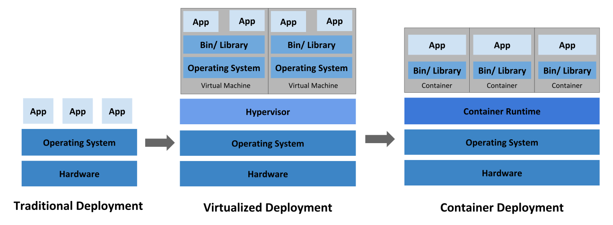

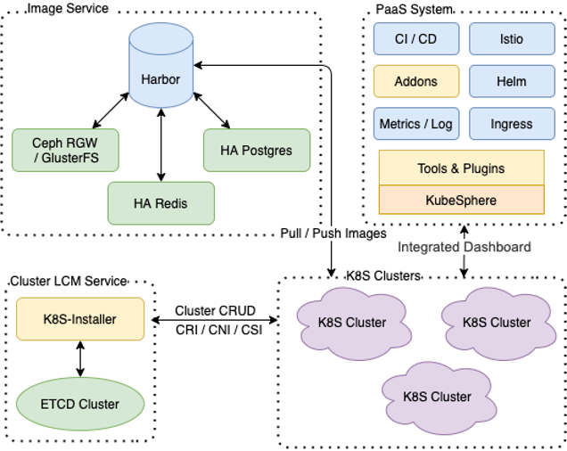

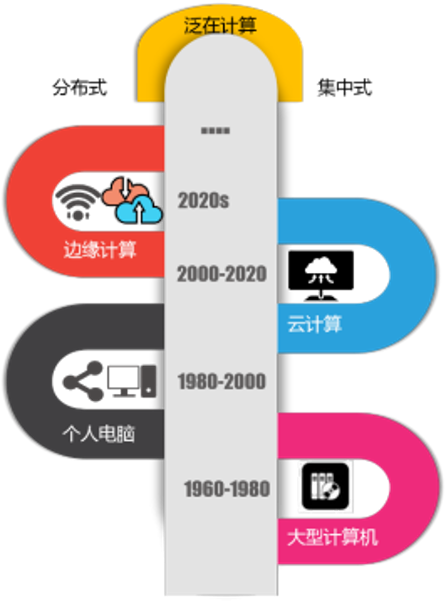

> 算力架构从集中式（大型机）→ 分布式（PC/云）→ 泛在式（云边协同）持续演进。容器与 K8S
> 是**云计算下半场**「算力统一调度、接口统一（Kubernetes API）」的关键技术栈之一。详见
> [边缘云与算力演进](https://gitee.com/wu-wen-xiang/lab-kubernetes/blob/master/doc/mec-edge-and-ai.md#12-边缘云的起源与演进)。

**Reference**

- [What is a Container?](https://www.docker.com/resources/what-container/) — Docker 官方容器概念
- [Kubernetes 是什么？](https://kubernetes.io/zh-cn/docs/concepts/overview/) — 官方概览
- [边缘云与算力演进](https://gitee.com/wu-wen-xiang/lab-kubernetes/blob/master/doc/mec-edge-and-ai.md)

### 1.2 容器 vs 虚拟机

| 维度     | 虚拟机（VM）              | 容器（Container）                        |
| -------- | ------------------------- | ---------------------------------------- |
| 隔离级别 | 硬件虚拟化，独立 Guest OS | 内核 Namespace + Cgroups，共享 Host 内核 |
| 启动速度 | 分钟级                    | 秒级                                     |
| 镜像大小 | GB 级                     | MB 级常见                                |
| 密度     | 较低                      | 较高                                     |
| 适用场景 | 不同内核/OS、强隔离合规   | 微服务、CI/CD、云原生应用                |

**原理要点**

- 一个 KVM 虚拟机对应一个 QEMU/KVM 进程；vCPU 对应宿主机线程。
- 一个容器是一组被 **Namespace** 隔离、被 **Cgroups**
  限制资源的进程组；容器内进程就是宿主机上的进程。

**何时仍需要 VM？**

- 需要与宿主机**不同内核**或**不同操作系统**
- 需要硬件级隔离（如部分合规场景）→ 可进一步考虑 Kata Containers、gVisor 等安全容器

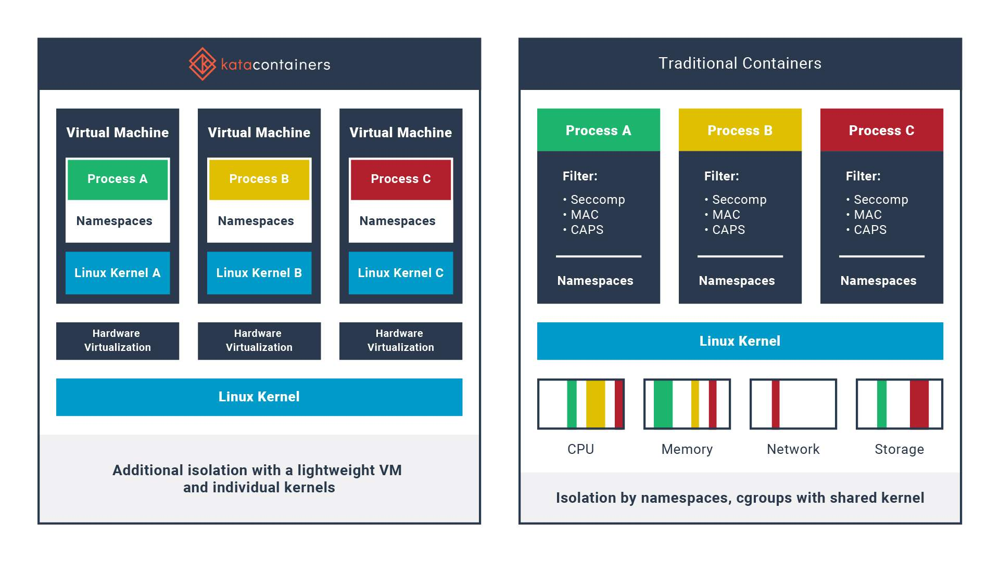

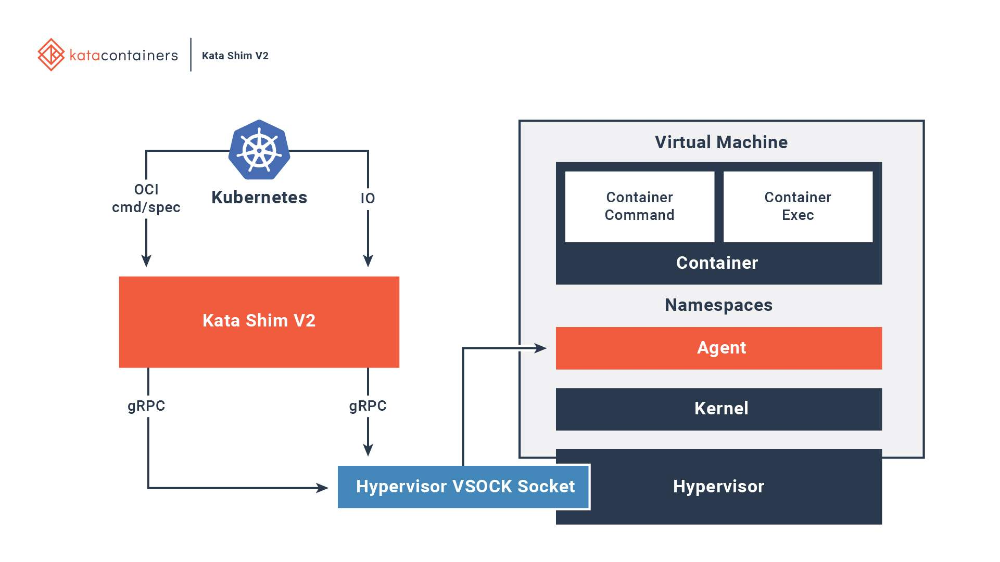

**Reference**

- [Kata Containers](https://katacontainers.io/learn/) —
  [一页纸 PDF](https://katacontainers.io/collateral/kata-containers-1pager.pdf)
- [Namespaces](https://man7.org/linux/man-pages/man7/namespaces.7.html) — Linux man page
- [Control Groups (cgroups)](https://www.kernel.org/doc/html/latest/admin-guide/cgroup-v2.html) —
  Linux 内核文档

### 1.3 Linux 容器底层：Namespace 与 Cgroups

| 机制          | 作用                                            | K8S/Docker 中的体现                             |
| ------------- | ----------------------------------------------- | ----------------------------------------------- |
| **Namespace** | 隔离 PID、Network、Mount、UTS、IPC、User 等视图 | Pod 内容器共享 Network/IPC/UTS Namespace        |
| **Cgroups**   | 限制 CPU、内存、IO 等资源                       | `resources.requests/limits` 最终由 Cgroups 落地 |

Pod 内 pause 容器与业务容器共享 net/ipc/uts namespace（可在节点上用 `/proc/<pid>/ns/` 观察）。

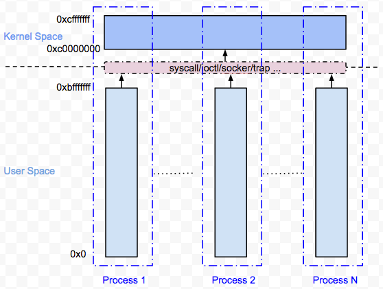

**Reference**

- [Docker overview — Namespaces](https://docs.docker.com/engine/docker-overview/#namespaces)
- [About containers — Cgroups](https://docs.docker.com/engine/containers/resource_constraints/)

### 1.4 OCI 与镜像标准

**OCI（Open Container Initiative）** 定义了两份核心规范：

| 规范             | 内容                                                 |
| ---------------- | ---------------------------------------------------- |
| **Image Spec**   | 镜像目录结构、manifest、layer 格式                   |
| **Runtime Spec** | 容器生命周期：`create` / `start` / `stop` / `delete` |

**runC** 是 OCI Runtime 的参考实现（由 Docker 捐献 libcontainer 演化而来）。

**Reference**

- [Open Container Initiative](https://opencontainers.org/)
- [OCI Runtime Spec](https://github.com/opencontainers/runtime-spec)

### 1.5 Docker 架构与核心对象

Docker 概念空间：

| 对象                  | 说明                                    |
| --------------------- | --------------------------------------- |
| **Image（镜像）**     | 只读模板，分层存储                      |
| **Container（容器）** | 镜像的运行实例                          |
| **Registry（仓库）**  | 镜像存储与分发（Docker Hub、Harbor 等） |
| **Dockerfile**        | 声明式构建镜像的脚本                    |

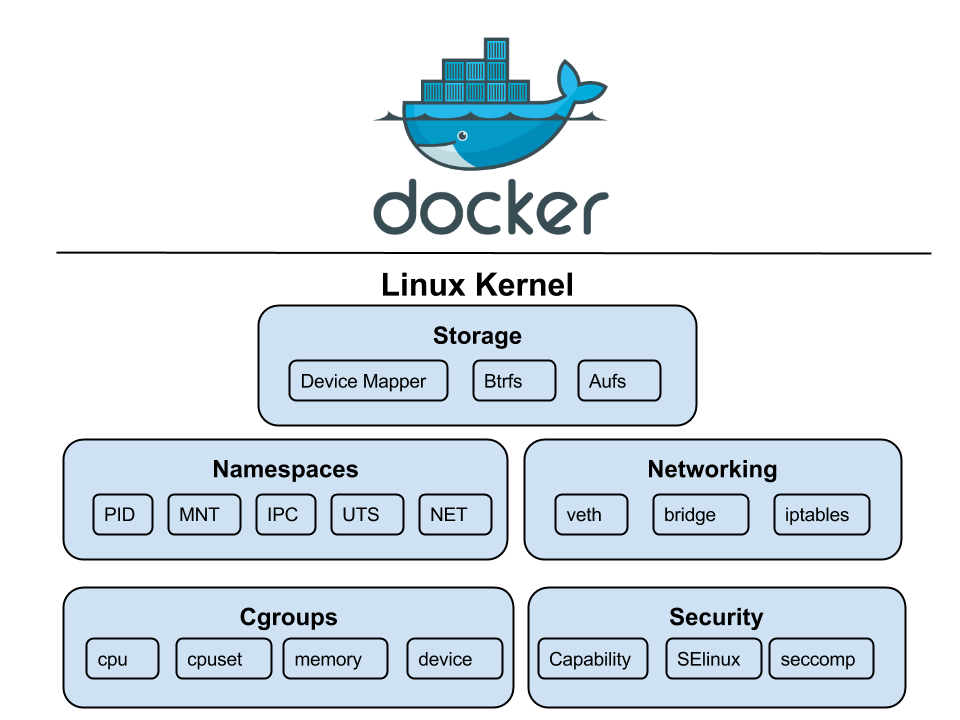

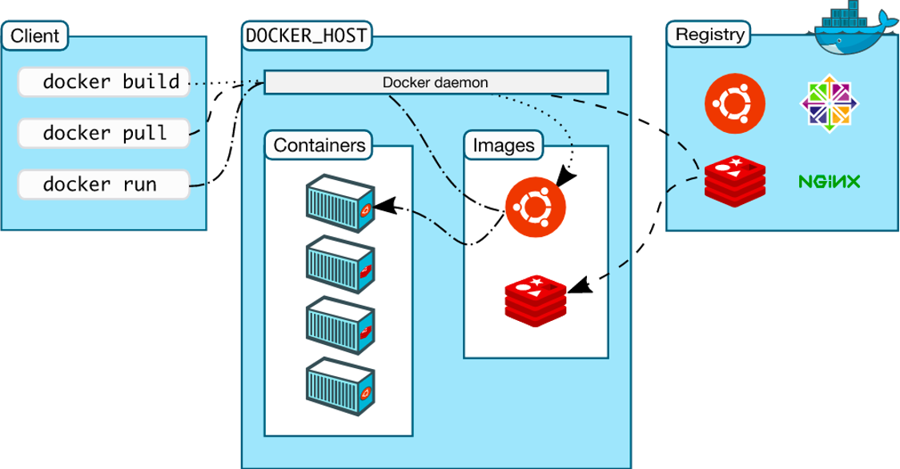

**Reference**

- [Docker overview](https://docs.docker.com/engine/docker-overview/)
- [Docker Get Started](https://docs.docker.com/get-started/)

<a id="151-镜像与交付dockerfile-最佳实践"></a>

#### 1.5.1 镜像与交付（Dockerfile 最佳实践）

容器化交付的核心：**把应用及其依赖打包成可移植、可版本化的镜像**，推送到 Registry
后在任意环境一致运行。

| 实践                 | 说明                                                                |
| -------------------- | ------------------------------------------------------------------- |
| **多阶段构建**       | 编译阶段与运行阶段分离，减小最终镜像体积                            |
| **固定基础镜像 tag** | 使用 `python:3.12-slim` 而非 `python:latest`                        |
| **非 root 运行**     | Dockerfile 中 `USER nonroot`（配合 PSS restricted）                 |
| **显式声明依赖**     | requirements.txt / go.mod 与代码一起版本管理                        |
| **配置外置**         | 不把环境相关配置 bake 进镜像；运行时注入 ConfigMap/Secret           |
| **日志写 stdout**    | 符合 [12-Factor App](https://12factor.net/logs) 与 K8S 日志采集约定 |

```dockerfile
# 多阶段构建示例
FROM golang:1.22 AS builder
WORKDIR /src
COPY . .
RUN CGO_ENABLED=0 go build -o /app

FROM gcr.io/distroless/static-debian12
COPY --from=builder /app /app
USER nonroot:nonroot
ENTRYPOINT ["/app"]
```

推送私有仓库后，K8S 侧通过 `imagePullSecrets` 拉取（见
[4.1.1](#411-私有镜像拉取imagepullsecrets重点)）。

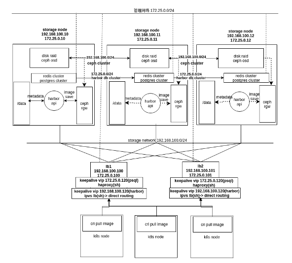

**Reference**

- [Dockerfile best practices](https://docs.docker.com/build/building/best-practices/)
- [The Twelve-Factor App](https://12factor.net/)
- [Harbor](https://goharbor.io/docs/latest/)

#### 实验：Docker Quick Start

```bash
# 安装 Docker Engine（以 Ubuntu 为例，详见官方文档）
sudo apt-get update
sudo apt-get install -y docker.io
sudo systemctl enable --now docker

# 验证
docker run hello-world

# 常用操作
docker images
docker ps -a
docker logs <container>
docker exec -it <container> /bin/bash
docker stop <container> && docker rm <container>
```

#### 实验：构建并运行示例 Web 应用

```bash
mkdir ~/demo-web && cd ~/demo-web

# 示例 app.py（Flask）
cat > app.py <<'EOF'
from flask import Flask
import os, socket
app = Flask(__name__)
@app.route("/")
def hello():
    return f"<h3>Hello {os.getenv('NAME','world')}!</h3><b>Hostname:</b> {socket.gethostname()}"
if __name__ == "__main__":
    app.run(host="0.0.0.0", port=5000)
EOF

cat > requirements.txt <<EOF
flask
EOF

cat > Dockerfile <<'EOF'
FROM registry.cn-shanghai.aliyuncs.com/99cloud-sh/python:3.12
WORKDIR /app
COPY . /app
RUN pip install --no-cache-dir -r requirements.txt
EXPOSE 5000
CMD ["python", "app.py"]
EOF

docker build -t demo-web:latest .
docker run -d -p 5001:5000 --name demo-web demo-web:latest
curl http://127.0.0.1:5001/
```

**Reference**

- [Dockerfile reference](https://docs.docker.com/reference/dockerfile/)
- [lab-openstack docker-quickstart](https://github.com/99cloud/lab-openstack/tree/master/src/docker-quickstart)
  / [Gitee 镜像](https://gitee.com/dev-99cloud/lab-openstack/tree/master/src/docker-quickstart)
- [Docker 官方入门](https://docs.docker.com/get-started/)

#### Docker 网络与存储（要点）

- **Bridge 模式**：默认；容器通过 veth pair 接入 docker0 网桥。
- **Host 模式**：容器直接使用宿主机网络栈。
- **Volume / Bind Mount**：数据持久化；K8S 中对应 PV/PVC、emptyDir 等。

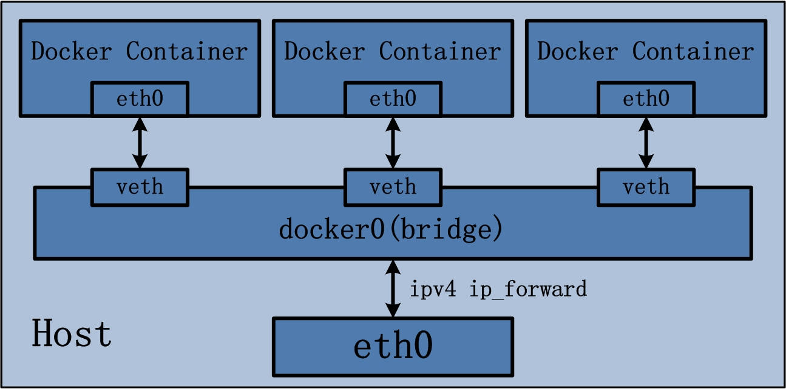

**Reference**

- [Docker network](https://docs.docker.com/engine/network/)
- [Docker storage](https://docs.docker.com/storage/)

### 1.6 从 Docker 到 containerd 生态

#### 1.6.1 K8S 为何以 containerd 为默认运行时

K8S 通过 **CRI（Container Runtime Interface）** 与底层运行时通信：

```
Orchestration API (kubelet)
        ↓ gRPC
CRI Runtime (containerd / CRI-O)
        ↓ OCI
OCI Runtime (runc / kata / gVisor)
        ↓
Linux Kernel (Namespace + Cgroups)
```

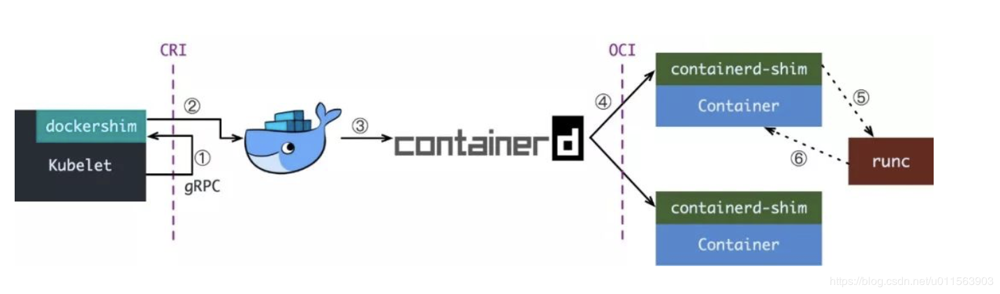

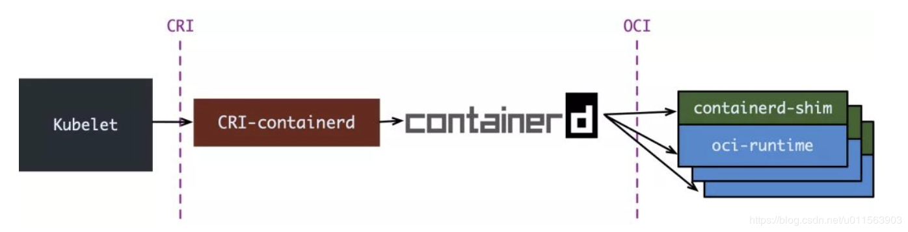

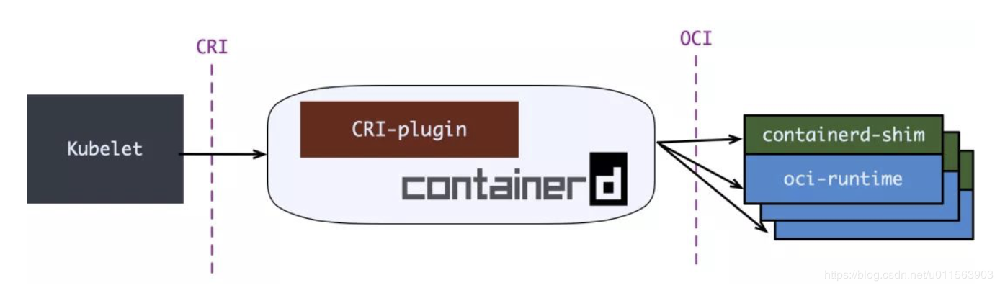

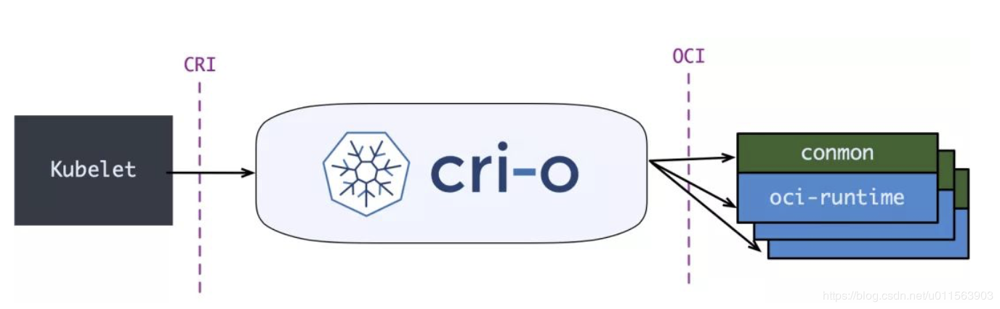

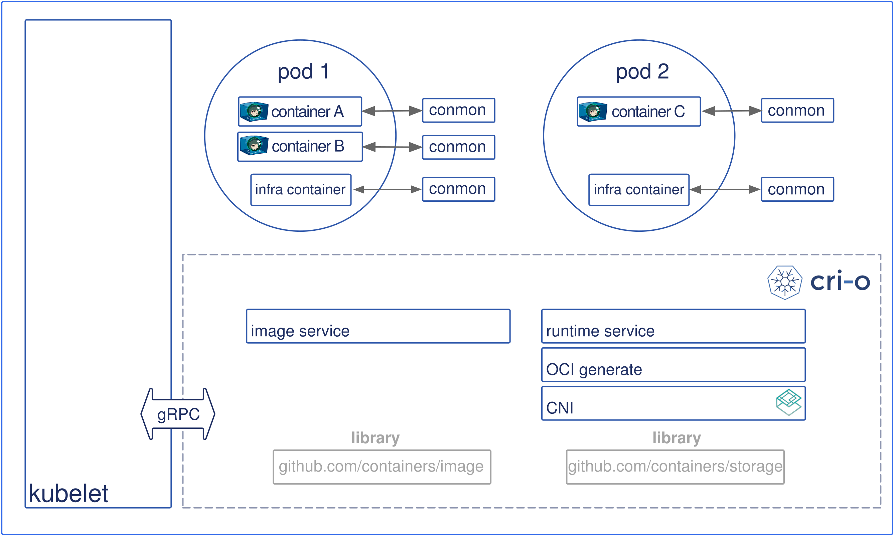

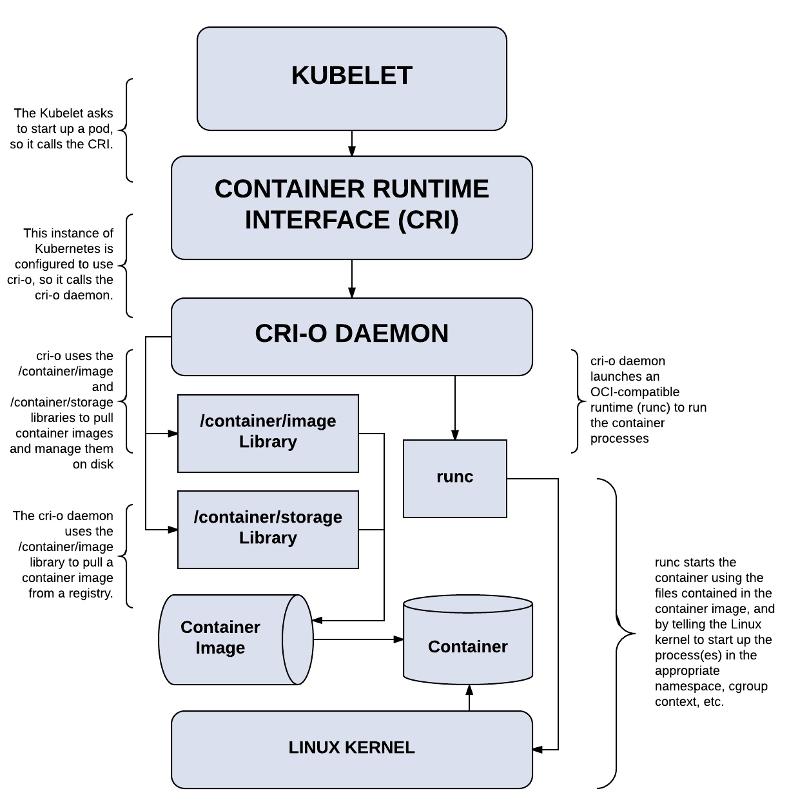

**重要变更（已过时内容剔除）**

| 内容                   | 状态               | 说明                                                   |
| ---------------------- | ------------------ | ------------------------------------------------------ |
| **dockershim**         | ❌ 已移除（1.24+） | K8S 不再内置 Docker 适配层                             |
| Docker 作为 K8S 运行时 | ❌ 不推荐          | 需额外 cri-dockerd 适配，生产应直接用 containerd/CRI-O |
| **containerd**         | ✅ 默认            | kubeadm、KubeClipper 等均默认 containerd               |

**Reference**

- [Container Runtimes](https://kubernetes.io/docs/setup/production-environment/container-runtimes/)
  — 官方运行时指南
- [CRI API](https://github.com/kubernetes/cri-api) —
  [cri-api/pkg/apis/services.go](https://github.com/kubernetes/cri-api/blob/master/pkg/apis/services.go)
- [CRI-O 官网](https://cri-o.io/)
- [kubernetes-best-practices — 容器运行时](https://gitee.com/wu-wen-xiang/lab-kubernetes/blob/master/doc/kubernetes-best-practices.md#2-容器运行时)

#### 1.6.2 containerd 生态工具对比

| 工具        | 定位                                      | 典型场景                                              |
| ----------- | ----------------------------------------- | ----------------------------------------------------- |
| **ctr**     | containerd 原生 CLI                       | 底层调试、直接操作 containerd                         |
| **nerdctl** | Docker 兼容 CLI（`nerdctl run/build/ps`） | 习惯 Docker 命令的运维/开发                           |
| **crictl**  | CRI 调试 CLI                              | **节点排障**：查 Pod/容器/镜像（与 kubelet 视角一致） |

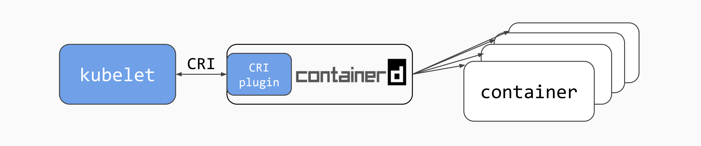

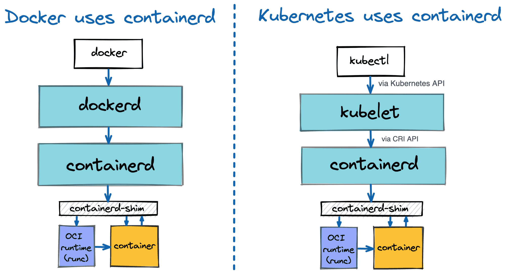

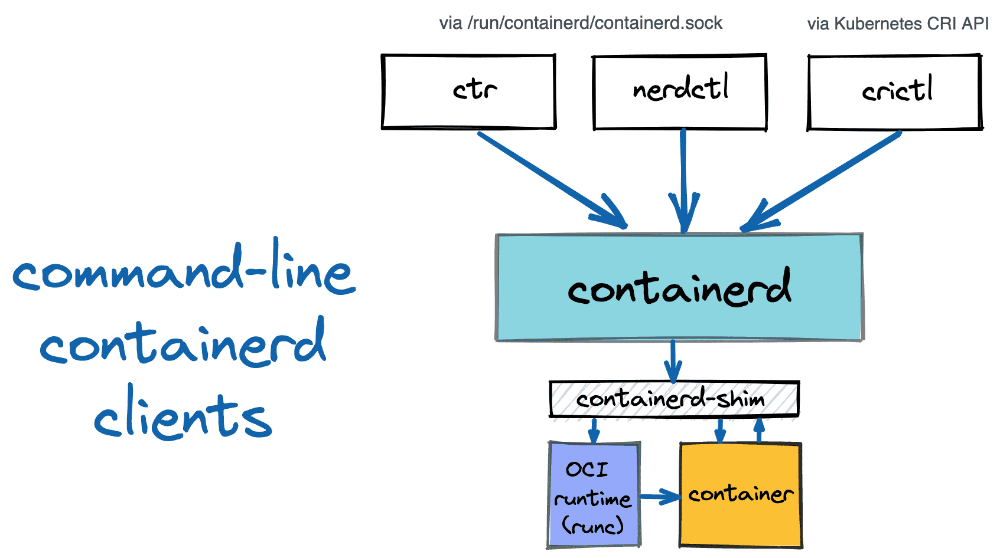

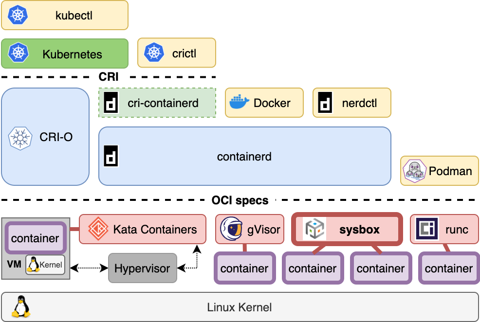

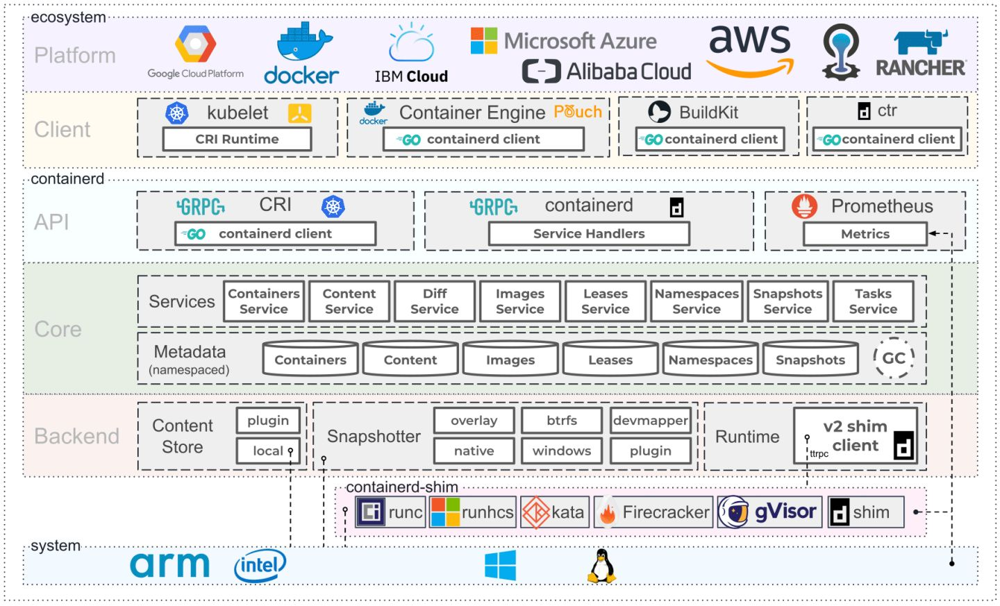

#### crictl 配置要点

节点上使用 crictl 前需指定 CRI endpoint（**不要再配置 dockershim.sock**）：

```bash
cat <<EOF | sudo tee /etc/crictl.yaml
runtime-endpoint: unix:///run/containerd/containerd.sock
image-endpoint: unix:///run/containerd/containerd.sock
timeout: 10
EOF
```

| docker 命令      | crictl 等价      |
| ---------------- | ---------------- |
| `docker ps`      | `crictl ps`      |
| `docker images`  | `crictl images`  |
| `docker logs`    | `crictl logs`    |
| `docker inspect` | `crictl inspect` |
| `docker exec`    | `crictl exec`    |

crictl 独有：`crictl pods` / `crictl inspectp` / `crictl port-forward` — 以 **Pod** 为视角排障。

```bash
# 节点上查看 K8S Pod（推荐 crictl，而非 docker ps）
crictl pods
crictl ps
crictl images
crictl inspect <container-id>

# nerdctl（需 containerd + nerdctl 安装）
nerdctl ps
nerdctl images

# ctr（containerd 原生）
ctr -n k8s.io containers list
ctr -n k8s.io images list
```

> **Note**：containerd 的 K8S 命名空间通常为 `k8s.io`。

**Reference**

- [crictl — Debugging Kubernetes nodes with crictl](https://kubernetes.io/docs/tasks/debug/debug-cluster/crictl/)
- [cri-tools 文档（含 docker/crictl 命令对照，旧版参考）](https://github.com/kubernetes-sigs/cri-tools/blob/master/docs/crictl.md)
- [nerdctl](https://github.com/containerd/nerdctl)
- [containerd](https://containerd.io/)
- [kubernetes-best-practices — Containerd 和命令行工具](https://gitee.com/wu-wen-xiang/lab-kubernetes/blob/master/doc/kubernetes-best-practices.md#22-containerd)
  /
  [命令行对比表](https://gitee.com/wu-wen-xiang/lab-kubernetes/blob/master/doc/kubernetes-best-practices.md#222-命令行对比)
- [Map crictl to Docker CLI](https://kubernetes.io/zh-cn/docs/tasks/debug/debug-cluster/crictl/#映射-crictl-到-docker-命令)

#### 实验：节点侧对照理解容器视图

```bash
# 1. 在集群中创建一个 Pod
kubectl run nginx --image=nginx:1.27 --port=80

# 2. 到 Pod 所在节点
kubectl get pod nginx -o wide
NODE=<pod-scheduled-node>

# 3. 节点上用 crictl 查看（与 kubelet 一致）
ssh $NODE
sudo crictl pods --name nginx
sudo crictl ps | grep nginx
sudo crictl inspect $(sudo crictl ps -q --name nginx | head -1) | jq .info.runtimeSpec
```

---

<a id="lesson-02-k8s-架构与首批部署"></a>

## Lesson 02：K8S 架构与首批部署

### 2.1 K8S 解决什么问题

K8S 是**容器编排平台**，核心价值：

| 能力                   | 说明                             |
| ---------------------- | -------------------------------- |
| **编排**               | 声明期望状态，自动调度到合适节点 |
| **自愈**               | 容器/Pod 异常时重建              |
| **扩缩**               | 副本数弹性调整（本课不展开 HPA） |
| **服务发现与负载均衡** | Service、DNS                     |
| **滚动发布与回滚**     | Deployment 内置策略              |
| **配置与密钥外置**     | ConfigMap、Secret                |

**云原生视角**：K8S
解决的是「业务无关的基础运维」——自动调度、自愈、扩缩、服务注册发现、配置管理。业务团队**把业务上云后只关注业务本身**。详见
[云原生基本原则](https://gitee.com/wu-wen-xiang/lab-kubernetes/blob/master/doc/cloudnative-and-mircoservice.md#112-云原生的基本原则)（API +
微服务 + 容器化）。

**与单机 Docker 的差异**：Docker 管单机容器；K8S 管**跨节点**的容器集群，并提供控制平面 API。

**Reference**

- [Why Kubernetes?](https://kubernetes.io/docs/concepts/overview/#why-you-need-kubernetes-and-what-can-it-do)
- [Production-Ready Features](https://kubernetes.io/docs/concepts/overview/#why-you-need-kubernetes-and-what-can-it-do)

### 2.2 K8S 不解决什么问题

- 用户身份体系（需对接 LDAP/OIDC 等）
- 服务网格限流熔断（Istio 等，本课不展开）
- 完整监控/日志平台（需 Prometheus、Loki 等叠加）
- 应用业务逻辑本身
- 底层 IaaS 资源供给

### 2.3 K8S 架构概览

| 组件                         | 类型             | 职责                               |
| ---------------------------- | ---------------- | ---------------------------------- |
| **kube-apiserver**           | 控制平面         | REST API 入口，唯一 etcd 写入口    |
| **etcd**                     | 控制平面         | 集群状态持久化（键值存储）         |
| **kube-scheduler**           | 控制平面         | 为 Pod 选择节点                    |
| **kube-controller-manager**  | 控制平面         | 运行各类 Controller，驱动调谐      |
| **cloud-controller-manager** | 控制平面（可选） | 对接云厂商 LB/Route 等             |
| **kubelet**                  | 工作节点         | 接收 PodSpec，通过 CRI 管理容器    |
| **kube-proxy**               | 工作节点         | 维护 Service 的 iptables/IPVS 规则 |
| **Container Runtime**        | 工作节点         | containerd / CRI-O                 |

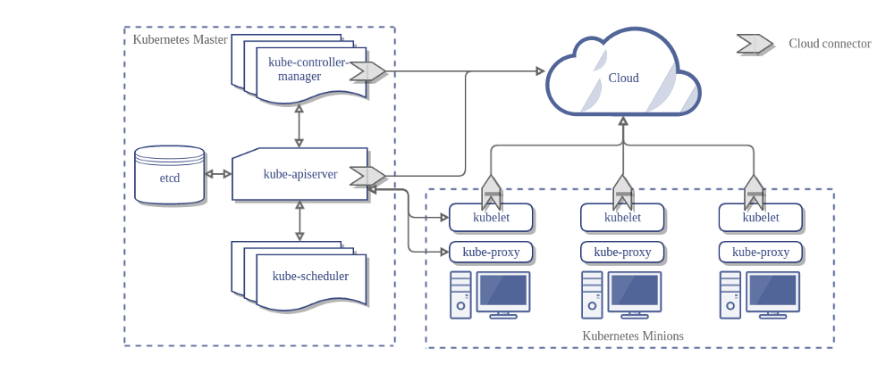

K8S 源自 Google Borg 的编排思想，但架构与 API 完全独立设计：

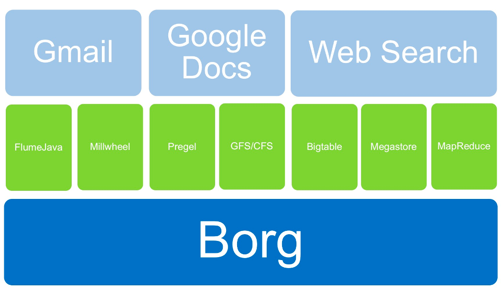

**Reference**

- [Kubernetes 组件](https://kubernetes.io/zh-cn/docs/concepts/architecture/#%E6%A6%82%E8%BF%B0)
- [Node Components](https://kubernetes.io/zh-cn/docs/concepts/architecture/#node-components)
- [OpenShift 与 K8S 关系概览](https://developers.redhat.com/learn/openshift)

### 2.4 声明式模型与 Controller 原理（重点）

#### 声明式 vs 命令式

| 方式       | 示例                               | 特点                   |
| ---------- | ---------------------------------- | ---------------------- |
| **命令式** | `kubectl run nginx --image=nginx`  | 告诉系统「做什么」     |
| **声明式** | `kubectl apply -f deployment.yaml` | 描述「期望状态是什么」 |

#### Controller 与 Reconcile（调谐）

```
用户提交 YAML（期望状态）
        ↓
  API Server 写入 etcd
        ↓
  Controller 监听变化
        ↓
  对比 期望状态 vs 实际状态
        ↓
  Reconcile：创建/更新/删除资源直到一致
```

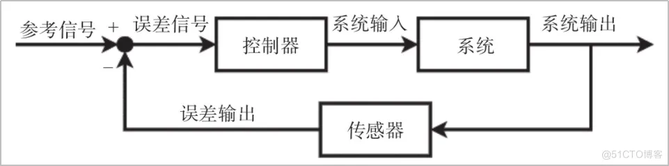

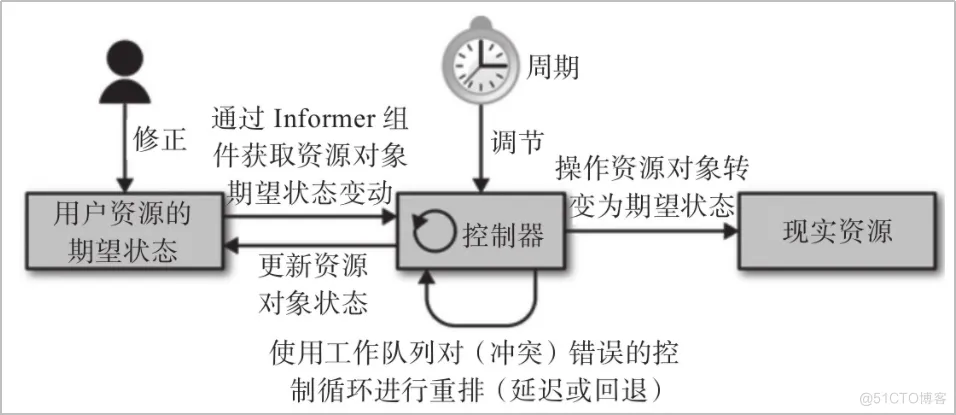

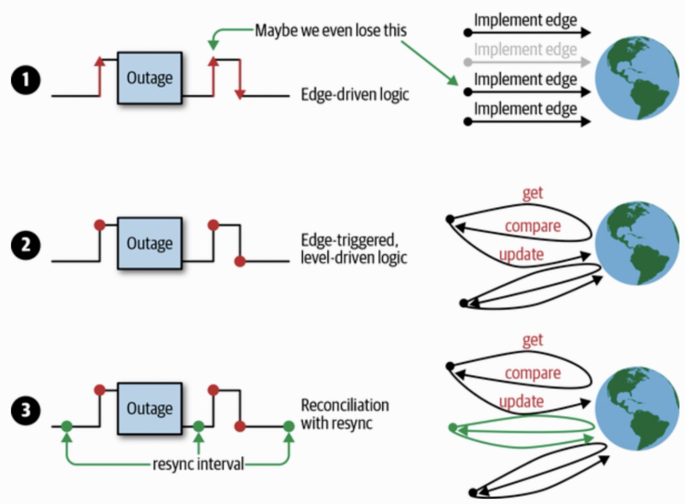

Kubernetes 的核心是**控制理论**：控制器定期（或通过 Informer **边缘触发**）比较 **Spec（期望状态）**
与 **Status（实际状态）**，驱动调谐直到误差为零。kube-controller-manager 整合了
ReplicaSet、Deployment、Node 等数十种内置控制器。

典型 Controller：

| Controller                | 调谐目标                     |
| ------------------------- | ---------------------------- |
| **Deployment Controller** | 维护指定副本数的 Pod         |
| **ReplicaSet Controller** | 确保 Pod 副本数              |
| **Service Controller**    | 维护 Endpoints/EndpointSlice |
| **Node Controller**       | 节点健康、Pod 驱逐           |

> **生产环境不要裸跑 Pod**：裸 Pod 无副本保障、无滚动更新、节点故障即丢失。

**Reference**

- [Kubernetes Controllers](https://kubernetes.io/docs/concepts/architecture/controller/)
- [Extend Kubernetes — Operator pattern](https://kubernetes.io/docs/concepts/extend-kubernetes/operator/)
- [云原生 — 基于 K8S API 的控制器原理](https://gitee.com/wu-wen-xiang/lab-kubernetes/blob/master/doc/cloudnative-and-mircoservice.md#171-基于-k8s-api-的云原生)

### 2.5 KubeClipper 快速搭建实验集群

本课使用 **KubeClipper**（基于 kubeadm 封装）快速获得实验集群，**约 10 分钟**完成，不展开 kubeadm
手工步骤。

**KubeClipper 是什么？**

- 轻量级 K8S 集群生命周期管理平台（Web 控制台 + API + **kcctl** CLI）
- 完全兼容原生 Kubernetes；封装 kubeadm 完成安装、升级、扩缩、备份等
- 对比 Sealos / KubeKey 等：具备**图形化页面**、**轻依赖**（不依赖
  Ansible）、**多集群管理**、**离线安装**

| 能力         | KubeClipper | Sealos | KubeKey |
| ------------ | ----------- | ------ | ------- |
| 图形化页面   | ✅          | ❌     | ❌      |
| 轻依赖       | ✅          | ✅     | ✅      |
| 多集群管理   | ✅          | ❌     | ❌      |
| 离线安装     | ✅          | ✅     | ✅      |
| 基于 kubeadm | ✅          | ✅     | ✅      |

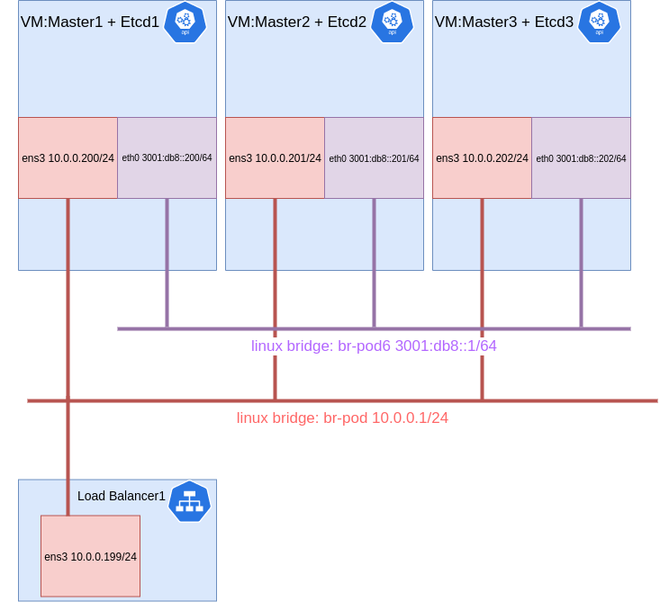

**Reference**

- [KubeClipper 官网](https://kubeclipper.io/)
- [KubeClipper Overview](https://kubeclipper.io/en/docs/overview/)
- [KubeClipper GitHub / QuickStart](https://github.com/kubeclipper/kubeclipper/blob/master/README_zh.md#quick-start)
- [kubernetes-best-practices — KubeClipper](https://gitee.com/wu-wen-xiang/lab-kubernetes/blob/master/doc/kubernetes-best-practices.md#314-kubeclipper)

#### 实验：安装 KubeClipper 并创建集群

```bash
# 1. 安装 kcctl
curl -sfLk https://oss.kubeclipper.io/get-kubeclipper.sh | KC_REGION=cn bash -

# 2. 单机 All-in-One 部署 KubeClipper（实验环境）
kcctl deploy

# 3. 浏览器访问控制台（默认 kc-server 所在节点 IP）
# http://<server-ip>

# 4. 获取节点 IP 并创建单节点集群
NODE=$(kcctl get node -o yaml | grep ipv4DefaultIP | head -1 | awk '{print $2}')
kcctl create cluster --master $NODE --name demo --untaint-master

# 5. 查看集群状态（Running 即就绪）
kcctl get cluster

# 6. 下载 kubeconfig 并使用 kubectl
# （控制台或 kcctl 获取 kubeconfig 后）
export KUBECONFIG=~/.kube/demo-config
kubectl get nodes
kubectl get pods -A
```

> **生产环境**：参考 [HA 部署文档](https://kubeclipper.io/en/docs/deployment-docs/ha-deploy/) 部署多
> Server/Agent 节点。

### 2.6 kubectl 与 YAML 基础

#### kubectl 常用命令

```bash
kubectl get nodes,pods,svc,deploy -A
kubectl describe pod <name>
kubectl logs <pod> [-c <container>] [-f]
kubectl exec -it <pod> -- /bin/sh
kubectl apply -f <file.yaml>
kubectl delete -f <file.yaml>
kubectl explain pod.spec.containers   # 内置 API 文档
```

#### K8S 资源对象通用结构

```yaml
apiVersion: <api-group>/<version>   # 如 apps/v1
kind: <ResourceKind>                # 如 Deployment
metadata:
  name: <name>
  namespace: <namespace>            # 默认 default
  labels:
    app: my-app
spec:                               # 期望状态
  ...
status:                             # 实际状态（由系统写入，用户一般不填）
  ...
```

#### YAML 语法要点

- 缩进用空格（不用 Tab）
- 列表项用 `-` 开头
- 键值对用 `key: value`；字符串含特殊字符时加引号

**Reference**

- [kubectl Quick Reference](https://kubernetes.io/docs/reference/kubectl/quick-reference/)
- [Configuration Best Practices](https://kubernetes.io/docs/concepts/configuration/overview/)

### 2.7 核心对象：Namespace、Pod、Deployment、Service

#### Namespace

逻辑隔离单元；不同 Namespace 中同名资源可共存。

```bash
kubectl create namespace dev
kubectl get ns
```

**Reference**

- [Namespaces](https://kubernetes.io/docs/concepts/overview/working-with-objects/namespaces/)

#### Pod

K8S **最小调度单位**；一个 Pod 可含一个或多个容器（共享 Network Namespace）。

```yaml
apiVersion: v1
kind: Pod
metadata:
  name: nginx
  labels:
    app: nginx
spec:
  containers:
  - name: nginx
    image: registry.cn-shanghai.aliyuncs.com/99cloud-sh/nginx-slim:0.21
    ports:
    - containerPort: 80
```

```bash
kubectl apply -f pod.yaml
kubectl get pod nginx -o wide
kubectl describe pod nginx
```

**Reference**

- [Pods](https://kubernetes.io/docs/concepts/workloads/pods/)
- [Get started with Kubernetes using Python](https://kubernetes.io/blog/2019/07/23/get-started-with-kubernetes-using-python/)
  — 示例源码 [hello-python](https://github.com/JasonHaley/hello-python) /
  [本仓库 src](https://gitee.com/dev-99cloud/training-kubernetes/tree/master/src/hello-python)

#### Deployment

管理 Pod 副本、滚动更新、回滚的 Controller。

构建机上的 `docker` 镜像与节点 `containerd`（K8S 默认命名空间 `k8s.io`）**不共享**存储。本机
`docker build` 后，需导出再导入到节点，否则 Deployment 会 `ErrImagePull` / `ImagePullBackOff`：

```bash
# 构建机：导出
docker save demo-web:latest -o demo-web-latest.tar

# 拷到节点后导入（containerd / nerdctl）
nerdctl -n k8s.io load -i demo-web-latest.tar
# 或：ctr -n k8s.io images import demo-web-latest.tar

# 确认节点可见
crictl images | grep demo-web
```

```yaml
apiVersion: apps/v1
kind: Deployment
metadata:
  name: hello-python
spec:
  replicas: 3
  selector:
    matchLabels:
      app: hello-python
  template:
    metadata:
      labels:
        app: hello-python
    spec:
      containers:
      - name: app
        image: demo-web:latest
        imagePullPolicy: IfNotPresent
        ports:
        - containerPort: 5000
        env:
        - name: NAME
          value: "Kubernetes"
        resources:
          requests:
            cpu: 100m
            memory: 128Mi
          limits:
            cpu: 500m
            memory: 256Mi
```

```bash
kubectl apply -f deployment.yaml
kubectl get deploy,pods -l app=hello-python
kubectl scale deployment hello-python --replicas=5
```

**Reference**

- [Deployments](https://kubernetes.io/docs/concepts/workloads/controllers/deployment/)
- [Resource Management for Pods and Containers](https://kubernetes.io/docs/concepts/configuration/manage-resources-containers/)

#### Service

为一组 Pod 提供稳定访问入口（ClusterIP / NodePort / LoadBalancer）。

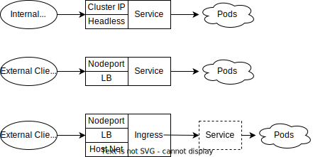

| 类型             | 说明                         | 典型场景          |
| ---------------- | ---------------------------- | ----------------- |
| **ClusterIP**    | 集群内虚拟 IP（默认）        | 集群内服务互访    |
| **NodePort**     | 在每个节点开放固定端口       | 实验/开发外部访问 |
| **LoadBalancer** | 云 LB 或 MetalLB 分配外部 IP | 生产外部访问      |

```yaml
apiVersion: v1
kind: Service
metadata:
  name: hello-python-svc
spec:
  type: NodePort
  selector:
    app: hello-python
  ports:
  - port: 80
    targetPort: 5000
    nodePort: 31000
```

**Service DNS（集群内）**

```
<service>.<namespace>.svc.cluster.local
```

```bash
kubectl run curl --image=curlimages/curl -it --rm -- \
  curl http://hello-python-svc.default.svc.cluster.local
```

> **Note**：自 K8S 1.21 起，EndpointSlice 为默认 Endpoint 机制；`Endpoints`
> 对象逐步被替代，对使用者透明。

**Reference**

- [Service](https://kubernetes.io/docs/concepts/services-networking/service/)
- [Connect Applications with Services](https://kubernetes.io/docs/tutorials/services/connect-applications-service/)
- [DNS for Services and Pods](https://kubernetes.io/docs/concepts/services-networking/dns-pod-service/)
- [EndpointSlices](https://kubernetes.io/docs/concepts/services-networking/endpoint-slices/)
- [MetalLB](https://metallb.universe.tf/) — 裸金属 LoadBalancer 实现
- [kubernetes-best-practices — 网络管理](https://gitee.com/wu-wen-xiang/lab-kubernetes/blob/master/doc/kubernetes-best-practices.md#5-网络管理)

#### 实验：完整部署 Web 应用

> 也可直接使用本仓库示例：
> [src/hello-python](https://gitee.com/dev-99cloud/training-kubernetes/tree/master/src/hello-python)
> （含 `main.py`、`Dockerfile`、`deployment.yaml`）。

```bash
# 可选：下载 hello-python 示例
wget https://gitee.com/dev-99cloud/training-kubernetes/raw/master/src/hello-python/main.py
wget https://gitee.com/dev-99cloud/training-kubernetes/raw/master/src/hello-python/requirements.txt
wget https://gitee.com/dev-99cloud/training-kubernetes/raw/master/src/hello-python/Dockerfile
wget https://gitee.com/dev-99cloud/training-kubernetes/raw/master/src/hello-python/deployment.yaml

# 1. 构建镜像并推送到可访问的 Registry（或使用 imagePullPolicy: Never + 预加载镜像）
# 2. 部署 Deployment + Service
kubectl apply -f deployment.yaml -f service.yaml

# 3. 验证
kubectl get pods -l app=hello-python -o wide
curl http://<node-ip>:31000/

# 4. 观察 EndpointSlice
kubectl get endpointslice -l kubernetes.io/service-name=hello-python-svc
```

**第 1 天收束**：运行时体系清晰；集群可用；理解「YAML + Controller」；完成首次应用上线。

---

# 第 2 天：工作负载、存储、调度与综合实践

<a id="lesson-03-工作负载存储与调度"></a>

## Lesson 03：工作负载、存储与调度

### 3.1 DaemonSet 与 StatefulSet

#### 工作负载选型

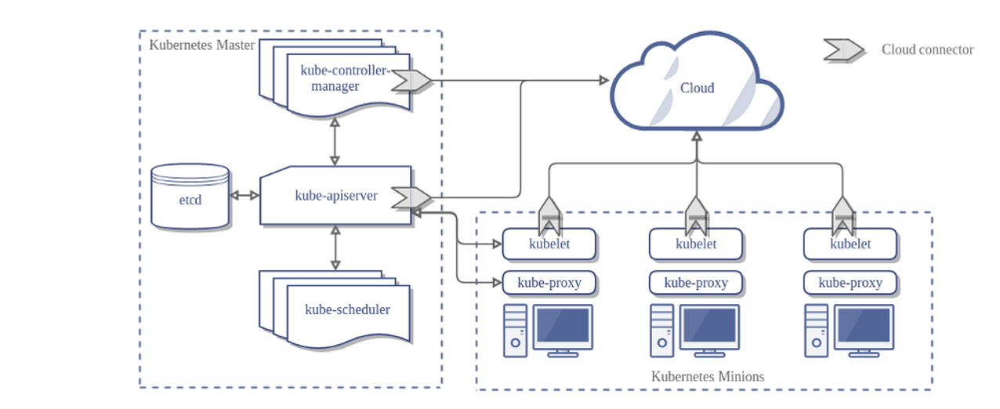

| 控制器          | 副本策略                         | 典型场景                       |
| --------------- | -------------------------------- | ------------------------------ |
| **Deployment**  | 任意副本，Pod 可替换             | 无状态 Web/API 服务            |
| **DaemonSet**   | 每个（匹配）节点一个 Pod         | 日志采集、监控 Agent、CNI 插件 |
| **StatefulSet** | 固定序号、稳定网络标识、有序启停 | 数据库、消息队列、分布式存储   |

#### DaemonSet 示例

使用 `node-exporter`（Prometheus 节点指标 Agent）。实验网若无法直连 Docker Hub，可在可出国的跳板（如
`ali-fq`）上 pull → retag → push 到 ACR 后再部署：

```bash
# 在 ali-fq（或其它可访问 docker.io 的机器）上
docker pull prom/node-exporter:v1.8.0
docker tag prom/node-exporter:v1.8.0 \
  registry.cn-shanghai.aliyuncs.com/99cloud-sh/node-exporter:v1.8.0
docker push registry.cn-shanghai.aliyuncs.com/99cloud-sh/node-exporter:v1.8.0
```

完整清单见 [src/class05/daemonset.yaml](../src/class05/daemonset.yaml)。

```yaml
apiVersion: v1
kind: Namespace
metadata:
  name: monitoring
---
apiVersion: apps/v1
kind: DaemonSet
metadata:
  name: node-exporter
  namespace: monitoring
spec:
  selector:
    matchLabels:
      app: node-exporter
  template:
    metadata:
      labels:
        app: node-exporter
    spec:
      tolerations:
      - operator: Exists   # 容忍所有污点，确保每节点都跑
      containers:
      - name: node-exporter
        image: registry.cn-shanghai.aliyuncs.com/99cloud-sh/node-exporter:v1.8.0
        ports:
        - containerPort: 9100
```

**Reference**

- [DaemonSet](https://kubernetes.io/docs/concepts/workloads/controllers/daemonset/)

#### StatefulSet 示例（要点）

- 稳定 Pod 名：`<statefulset>-0`, `<statefulset>-1`, ...
- 稳定 DNS：`<pod>.<headless-svc>.<ns>.svc.cluster.local`
- 生产需配合 **Headless Service** 与 **volumeClaimTemplates**（依赖 StorageClass/动态供给）
- **实验集群无 StorageClass 时**：先用 `emptyDir` 观察序号与有序扩缩（见
  [src/class05/statefulset.yaml](../src/class05/statefulset.yaml)）；持久化另做 3.2 PV/PVC

```yaml
apiVersion: v1
kind: Service
metadata:
  name: nginx-headless
spec:
  clusterIP: None
  selector:
    app: nginx-sts
  ports:
  - port: 80
---
apiVersion: apps/v1
kind: StatefulSet
metadata:
  name: nginx-sts
spec:
  serviceName: nginx-headless
  replicas: 3
  selector:
    matchLabels:
      app: nginx-sts
  template:
    metadata:
      labels:
        app: nginx-sts
    spec:
      containers:
      - name: nginx
        image: registry.cn-shanghai.aliyuncs.com/99cloud-sh/nginx-slim:0.21
        ports:
        - containerPort: 80
        volumeMounts:
        - name: data
          mountPath: /usr/share/nginx/html
      volumes:
      - name: data
        emptyDir: {}   # 有 StorageClass 时可改为 volumeClaimTemplates
```

**Reference**

- [StatefulSet](https://kubernetes.io/docs/concepts/workloads/controllers/statefulset/)
- [StatefulSet Basics Tutorial](https://kubernetes.io/docs/tutorials/stateful-application/basic-stateful-set/)

#### 实验：观察 Deployment vs DaemonSet vs StatefulSet 行为差异

> 清单：`src/class05/daemonset.yaml`、`src/class05/statefulset.yaml`

```bash
kubectl apply -f src/class05/daemonset.yaml
kubectl apply -f src/class05/statefulset.yaml
kubectl get ds,sts,pods -o wide
kubectl delete pod nginx-sts-0    # StatefulSet 会按同名重建
kubectl scale sts nginx-sts --replicas=5  # 有序扩缩
```

### 3.2 持久化存储：PV、PVC、StorageClass

#### 核心概念

| 对象                             | 角色                                                 |
| -------------------------------- | ---------------------------------------------------- |
| **PV（PersistentVolume）**       | 集群级存储资源（NFS、云盘、Local 等）                |
| **PVC（PersistentVolumeClaim）** | 用户对存储的申请                                     |
| **StorageClass**                 | 存储「类」；支持**动态供给（Dynamic Provisioning）** |

```
PVC 申请 storage → StorageClass 触发 Provisioner → 自动创建 PV → 绑定 Pod
```

#### 实验清单：静态 PV（hostPath）— 无 CSI 时可用

> 完整 YAML：[src/class05/pvc-demo.yaml](../src/class05/pvc-demo.yaml)。\
> `kubernetes.io/no-provisioner` **不会**自动创建卷；无 StorageClass/CSI 的实验集群请用静态 PV。

```yaml
apiVersion: v1
kind: PersistentVolume
metadata:
  name: data-pv
spec:
  capacity:
    storage: 2Gi
  accessModes: ["ReadWriteOnce"]
  persistentVolumeReclaimPolicy: Retain
  storageClassName: manual
  hostPath:
    path: /data/pvc-demo
    type: DirectoryOrCreate
---
apiVersion: v1
kind: PersistentVolumeClaim
metadata:
  name: data-pvc
spec:
  accessModes: ["ReadWriteOnce"]
  resources:
    requests:
      storage: 2Gi
  storageClassName: manual
---
apiVersion: v1
kind: Pod
metadata:
  name: app-with-pvc
spec:
  containers:
  - name: app
    image: registry.cn-shanghai.aliyuncs.com/99cloud-sh/nginx-slim:0.21
    volumeMounts:
    - name: data
      mountPath: /data
  volumes:
  - name: data
    persistentVolumeClaim:
      claimName: data-pvc
```

有 CSI 时再引入 StorageClass 动态供给（按集群实际 provisioner 替换）。

#### 实验：数据写入后 Pod 重建仍保留

```bash
# 控制面/节点上预先准备目录（hostPath）
sudo mkdir -p /data/pvc-demo && sudo chmod 777 /data/pvc-demo

kubectl apply -f src/class05/pvc-demo.yaml
kubectl exec app-with-pvc -- sh -c 'echo hello-pv > /data/test.txt'
kubectl delete pod app-with-pvc
# 重新创建 Pod 并挂载同一 PVC
kubectl apply -f src/class05/pvc-demo.yaml
kubectl exec app-with-pvc -- cat /data/test.txt   # 应输出 hello-pv
```

**Reference**

- [Persistent Volumes](https://kubernetes.io/docs/concepts/storage/persistent-volumes/)
- [Storage Classes](https://kubernetes.io/docs/concepts/storage/storage-classes/)
- [Dynamic Volume Provisioning](https://kubernetes.io/docs/concepts/storage/dynamic-provisioning/)
- [CSI（Container Storage Interface）](https://kubernetes-csi.github.io/docs/)
- [kubernetes-best-practices — 存储管理](https://gitee.com/wu-wen-xiang/lab-kubernetes/blob/master/doc/kubernetes-best-practices.md#4-存储管理)

### 3.3 调度策略入门

#### Scheduler 职责

过滤（Filter）→ 打分（Score）→ 绑定（Bind）

#### requests / limits

| 字段         | 含义                                        |
| ------------ | ------------------------------------------- |
| **requests** | 调度依据；保证的最小资源                    |
| **limits**   | 容器可用上限；超出可能被 OOMKill / Throttle |

#### nodeSelector / Node Affinity

```yaml
spec:
  affinity:
    nodeAffinity:
      requiredDuringSchedulingIgnoredDuringExecution:
        nodeSelectorTerms:
        - matchExpressions:
          - key: disktype
            operator: In
            values:
            - ssd
```

#### Taints & Tolerations

- **Taint**：节点「排斥」某些 Pod
- **Toleration**：Pod「容忍」节点 Taint

```bash
# 给节点打污点（实验：专用节点；单节点集群务必实验后去掉污点）
NODE=$(kubectl get nodes -o jsonpath='{.items[0].metadata.name}')
kubectl taint nodes "$NODE" dedicated=training:NoSchedule
# 观察：无 toleration 的 Pod 会 Pending；带 toleration 的可调度
# 清理：
# kubectl taint nodes "$NODE" dedicated=training:NoSchedule-

# Pod 侧 toleration
```

```yaml
spec:
  tolerations:
  - key: dedicated
    operator: Equal
    value: training
    effect: NoSchedule
```

#### Pod Affinity / Anti-Affinity

- **Affinity**：Pod 与 Pod 部署在一起（如应用与缓存同节点）
- **Anti-Affinity**：Pod 分散到不同节点（高可用）

```yaml
spec:
  affinity:
    podAntiAffinity:
      preferredDuringSchedulingIgnoredDuringExecution:
      - weight: 100
        podAffinityTerm:
          labelSelector:
            matchLabels:
              app: hello-python
          topologyKey: kubernetes.io/hostname
```

**Reference**

- [Assign Pods to Nodes](https://kubernetes.io/docs/tasks/configure-pod-container/assign-pods-nodes/)
- [Taints and Tolerations](https://kubernetes.io/docs/concepts/scheduling-eviction/taint-and-toleration/)
- [Assign Pods to Nodes using Node Affinity](https://kubernetes.io/docs/tasks/configure-pod-container/assign-pods-nodes-using-node-affinity/)
- [Inter-pod affinity and anti-affinity](https://kubernetes.io/docs/concepts/scheduling-eviction/assign-pod-node/#inter-pod-affinity-and-anti-affinity)
- [class-01 — K8S 调度](class-01-Kubernetes-Administration.md#lesson-05-k8s-schedule)

---

<a id="lesson-04-配置发布与运维概览"></a>

## Lesson 04：配置发布与运维概览

### 4.1 ConfigMap 与 Secret

#### ConfigMap — 非敏感配置

```yaml
apiVersion: v1
kind: ConfigMap
metadata:
  name: app-config
data:
  APP_MODE: production
  config.yaml: |
    log_level: info
    max_conn: 100
---
apiVersion: apps/v1
kind: Deployment
metadata:
  name: my-app
spec:
  replicas: 1
  selector:
    matchLabels:
      app: my-app
  template:
    metadata:
      labels:
        app: my-app
    spec:
      containers:
      - name: app
        image: demo-web:latest
        imagePullPolicy: IfNotPresent   # 实验节点预加载镜像时避免误拉 docker.io
        env:
        - name: APP_MODE
          valueFrom:
            configMapKeyRef:
              name: app-config
              key: APP_MODE
        volumeMounts:
        - name: config-vol
          mountPath: /etc/config
          readOnly: true
      volumes:
      - name: config-vol
        configMap:
          name: app-config
          items:
          - key: config.yaml
            path: config.yaml
```

#### Secret — 敏感信息

Secret 类型 `kubernetes.io/dockerconfigjson` 专用于**私有镜像仓库认证**（见 4.1.1）。

```bash
kubectl create secret generic db-secret \
  --from-literal=username=appuser \
  --from-literal=password='S3cr3t!'
```

**Reference**

- [ConfigMap](https://kubernetes.io/docs/concepts/configuration/configmap/)
- [Secret](https://kubernetes.io/docs/concepts/configuration/secret/)
- [Configure a Pod to Use a ConfigMap](https://kubernetes.io/docs/tasks/configure-pod-container/configure-pod-configmap/)

<a id="411-私有镜像拉取imagepullsecrets重点"></a>

#### 4.1.1 私有镜像拉取：imagePullSecrets（重点）

从私有 Registry 拉镜像时，kubelet 需要认证凭据。完整流程：**构建 → push 到 Registry → 创建 Secret →
Pod/SA 引用**。

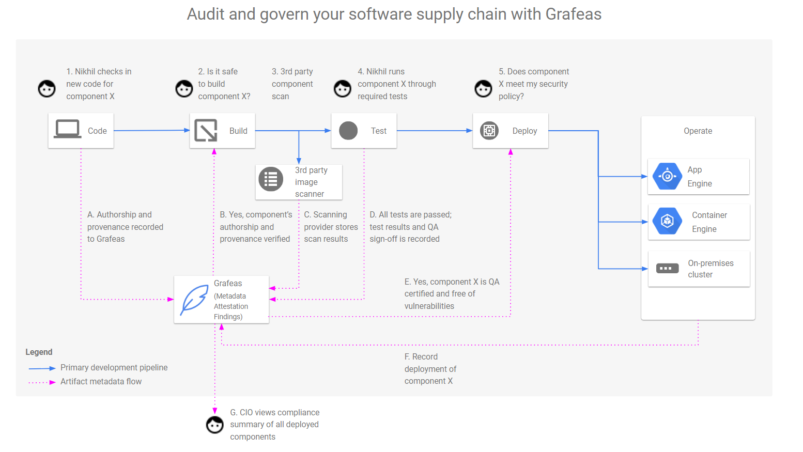

**步骤 1：创建 docker-registry Secret**

```bash
kubectl create secret docker-registry regcred \
  --docker-server=https://index.docker.io/v1/ \
  --docker-username=<USER> \
  --docker-password=<TOKEN> \
  --docker-email=<EMAIL>
```

**步骤 2：在 Pod/Deployment 中引用**

```yaml
spec:
  imagePullSecrets:
  - name: regcred
  containers:
  - name: app
    image: myregistry.example.com/myorg/myapp:v1.0.0
```

**步骤 3（推荐）：绑定到 ServiceAccount，避免每个 Pod 重复配置**

```bash
kubectl patch serviceaccount default -p \
  '{"imagePullSecrets": [{"name": "regcred"}]}'
```

此后使用该 ServiceAccount 的 Pod 会自动继承 `imagePullSecrets`。

**多 Registry 场景**

- 一个 Pod 可配置多个 `imagePullSecrets`
- 每个 Secret 可含多个 Registry 凭据；拉取时按 Registry 匹配

**K8S 1.33 新特性（了解）**

| 特性                         | 状态  | 说明                                                                              |
| ---------------------------- | ----- | --------------------------------------------------------------------------------- |
| **EnsureSecretPulledImages** | Alpha | 即使本地已有镜像，`IfNotPresent`/`Never` 策略下也强制校验凭据                     |
| **Secret-less image pulls**  | Alpha | kubelet 凭据插件可对接 SA Token/OIDC 获取短期 Registry 凭据                       |
| **containerd 2.x**           | —     | 节点侧镜像认证应优先走 K8S `imagePullSecrets`，而非 containerd config.toml 硬编码 |

**常见故障**

| 现象                              | 原因                             |
| --------------------------------- | -------------------------------- |
| `ImagePullBackOff`                | 凭据错误、镜像不存在、网络不通   |
| `FailedToRetrieveImagePullSecret` | Secret 不存在或 Namespace 不匹配 |

**Reference**

- [Pull an Image from a Private Registry](https://kubernetes.io/docs/tasks/configure-pod-container/pull-image-private-registry/)
- [Images — Using a private registry](https://kubernetes.io/docs/concepts/containers/images/#using-a-private-registry)
- [Configure Service Accounts — Add ImagePullSecrets](https://kubernetes.io/docs/tasks/configure-pod-container/configure-service-account/#add-imagepullsecrets-to-a-service-account)
- [KEP-2535: Ensure secret pulled images](https://github.com/kubernetes/enhancements/issues/2535)
- [CNCF: Smart Uses of imagePullSecrets](https://www.cncf.io/blog/2025/06/20/smart-uses-of-imagepullsecrets-in-kubernetes-cluster-with-serviceaccounts/)

### 4.2 发布策略与健康探针

#### 滚动更新与回滚

```bash
# 更新镜像
kubectl set image deployment/hello-python app=demo-web:v2

# 查看 rollout 状态
kubectl rollout status deployment/hello-python
kubectl rollout history deployment/hello-python

# 回滚
kubectl rollout undo deployment/hello-python
kubectl rollout undo deployment/hello-python --to-revision=2
```

Deployment 关键字段：

```yaml
spec:
  strategy:
    type: RollingUpdate
    rollingUpdate:
      maxSurge: 1
      maxUnavailable: 0
  minReadySeconds: 5
```

**Reference**

- [Rolling Update Deployment](https://kubernetes.io/docs/tutorials/kubernetes-basics/update/update-intro/)
- [Deployment — Rolling Update](https://kubernetes.io/docs/concepts/workloads/controllers/deployment/#rolling-update-deployment)

#### 健康探针

| 探针               | 作用                             | 失败后果                             |
| ------------------ | -------------------------------- | ------------------------------------ |
| **startupProbe**   | 慢启动应用；通过前不执行其他探针 | 重启容器                             |
| **readinessProbe** | 是否接收流量                     | 从 Service 后端（EndpointSlice）移除 |
| **livenessProbe**  | 是否存活                         | 重启容器                             |

```yaml
containers:
- name: app
  image: demo-web:latest
  ports:
  - containerPort: 5000
  startupProbe:
    httpGet:
      path: /
      port: 5000
    failureThreshold: 30
    periodSeconds: 5
  readinessProbe:
    httpGet:
      path: /
      port: 5000
    initialDelaySeconds: 5
    periodSeconds: 10
  livenessProbe:
    httpGet:
      path: /
      port: 5000
    initialDelaySeconds: 15
    periodSeconds: 20
```

#### 原生 Sidecar 容器（K8S 1.33 Stable）

Sidecar（日志/代理/监控 Agent）在 1.33 成为稳定特性：在 `initContainers` 中设置
`restartPolicy: Always`。

实验网若无法直连 Docker Hub，同样经跳板同步到 ACR：

```bash
docker pull fluent/fluent-bit:3.0
docker tag fluent/fluent-bit:3.0 \
  registry.cn-shanghai.aliyuncs.com/99cloud-sh/fluent-bit:3.0
docker push registry.cn-shanghai.aliyuncs.com/99cloud-sh/fluent-bit:3.0
```

```yaml
spec:
  initContainers:
  - name: log-shipper
    image: registry.cn-shanghai.aliyuncs.com/99cloud-sh/fluent-bit:3.0
    restartPolicy: Always    # Sidecar：与应用容器并行运行
  containers:
  - name: app
    image: demo-web:latest
    imagePullPolicy: IfNotPresent
```

**Reference**

- [Configure Liveness, Readiness and Startup Probes](https://kubernetes.io/docs/tasks/configure-pod-container/configure-liveness-readiness-startup-probes/)
- [Sidecar Containers](https://kubernetes.io/docs/concepts/workloads/pods/sidecar-containers/) —
  **v1.33 stable**

### 4.3 常见排障思路

#### 通用排查流程

```
kubectl get <resource>
        ↓ 异常
kubectl describe <resource>     # 看 Events
        ↓
kubectl logs <pod> [-c <container>] [--previous]
        ↓ 仍不清楚
kubectl exec -it <pod> -- sh    # 进容器
        ↓ 节点/运行时问题
节点：crictl / journalctl -u kubelet
```

#### 典型现象与排查路径

| 现象                 | 可能原因                          | 排查命令                                                      |
| -------------------- | --------------------------------- | ------------------------------------------------------------- |
| **Pod Pending**      | 资源不足、污点、亲和性不满足      | `kubectl describe pod` → Events                               |
| **CrashLoopBackOff** | 应用启动失败、探针误杀            | `kubectl logs --previous`                                     |
| **ImagePullBackOff** | 镜像名错误、无凭据                | `describe pod` → Failed pull；检查 imagePullSecrets           |
| **Service 不可达**   | selector 不匹配、readiness 未通过 | `kubectl get endpointslices`；`kubectl get pod --show-labels` |
| **节点 NotReady**    | kubelet/CNI/磁盘压力              | `kubectl describe node`；节点 `systemctl status kubelet`      |

#### 节点侧调试

```bash
# 查看 kubelet 日志
journalctl -u kubelet -f

# CRI 视角
sudo crictl pods
sudo crictl ps -a
sudo crictl logs <container-id>

# 进入 Pod 网络命名空间抓包（高级）
PID=$(sudo crictl inspect -o go-template --template '{{.info.pid}}' <cid>)
sudo nsenter -t $PID -n tcpdump -i eth0 -nn port 80
```

**Reference**

- [Troubleshooting Applications](https://kubernetes.io/docs/tasks/debug/debug-application/)
- [Troubleshooting Clusters](https://kubernetes.io/docs/tasks/debug/debug-cluster/)
- [Debug Running Pods](https://kubernetes.io/docs/tasks/debug/debug-application/debug-running-pod/)

### 4.4 K8S 扩展生态概览（不展开实现）

#### 扩展机制全景

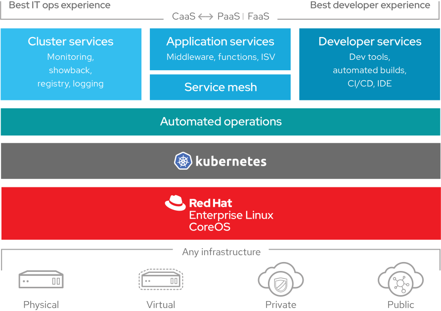

```
Kubernetes 核心 API
        ↓
  ┌─────┴─────┬─────────────┬──────────────┐
  CRD      Operator    Ingress Ctrl    CSI Driver
  自定义资源   领域控制器    七层路由         存储插件
```

| 扩展                   | 说明                          | 举例                           |
| ---------------------- | ----------------------------- | ------------------------------ |
| **CRD**                | 扩展 API 类型                 | PrometheusRule、Certificate    |
| **Operator**           | CRD + Controller 封装运维逻辑 | mysql-operator、redis-operator |
| **Ingress Controller** | 实现 Ingress/Gateway 资源     | ingress-nginx、Traefik         |
| **CSI**                | 存储插件标准                  | 云盘 CSI、NFS CSI              |
| **CNI**                | 网络插件                      | Calico、Cilium、Flannel        |
| **Device Plugin**      | 硬件资源（GPU 等）            | nvidia-device-plugin           |

#### Gateway API（了解，替代 Ingress 的方向）

- **Ingress**：单一资源，注解驱动，功能有限
- **Gateway API**：角色分离（GatewayClass/Gateway/HTTPRoute），表达能力更强；生产级网关本课不展开

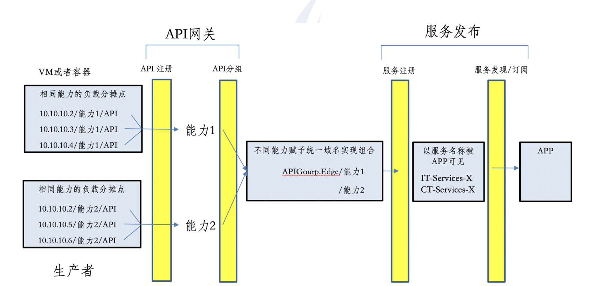

**Reference**

- [Extend Kubernetes — Custom Resources](https://kubernetes.io/docs/concepts/extend-kubernetes/api-extension/custom-resources/)
- [Operator pattern](https://kubernetes.io/docs/concepts/extend-kubernetes/operator/)
- [Ingress Controllers](https://kubernetes.io/docs/concepts/services-networking/ingress-controllers/)
- [Gateway API](https://gateway-api.sigs.k8s.io/)

<a id="45-运维与可观测性概览"></a>

### 4.5 运维与可观测性概览

#### 4.5.1 可观测性三板斧

| 维度                | 说明           | K8S 常见方案                 |
| ------------------- | -------------- | ---------------------------- |
| **Metrics（指标）** | 数值型时序数据 | Prometheus + Grafana         |
| **Logs（日志）**    | 文本事件流     | Loki / ELK / EFK             |
| **Traces（链路）**  | 请求跨服务路径 | Jaeger / Tempo（本课不展开） |

与研发侧衔接：

- 应用暴露 `/metrics` 或依赖 Exporter
- 日志写 **stdout/stderr**（容器最佳实践），由平台采集

#### 4.5.2 Prometheus 监控（概览 + 轻量 Demo）

**Prometheus 定位**：Pull 模型时序数据库 + 告警规则引擎。Exporter 暴露 `/metrics`，Prometheus 定期
scrape。

```
Pod/Node ──metrics──▶ Exporter / cAdvisor / kube-state-metrics
                              ▲
                              │ pull
                         Prometheus ──▶ Grafana / Alertmanager
```

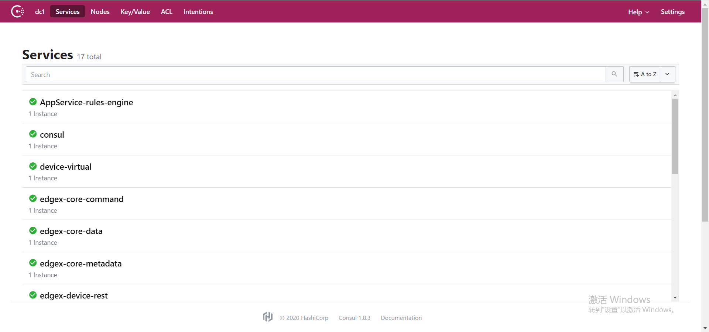

K8S 生态关键组件：

| 组件                    | 作用                                    |
| ----------------------- | --------------------------------------- |
| **cAdvisor**            | 节点/容器资源指标（kubelet 内置）       |
| **kube-state-metrics**  | K8S 对象状态指标（Deployment/Pod 数等） |
| **metrics-server**      | 资源用量 API（`kubectl top`）           |
| **Prometheus Operator** | 以 CRD 管理 Prometheus 实例（概念）     |

```bash
# 1) 安装 metrics-server（官方 manifest）
kubectl apply -f https://github.com/kubernetes-sigs/metrics-server/releases/latest/download/components.yaml

# 2) 实验网常见问题：
#    - registry.k8s.io 拉镜像超时 → 换国内镜像
#    - kubelet 证书校验失败 → 增加 --kubelet-insecure-tls
# 可用清单补丁：src/class05/metrics-server-patch.yaml
kubectl -n kube-system set image deploy/metrics-server \
  metrics-server=registry.cn-hangzhou.aliyuncs.com/google_containers/metrics-server:v0.7.1
kubectl -n kube-system patch deploy metrics-server --type='json' -p='[
  {"op":"add","path":"/spec/template/spec/containers/0/args/-","value":"--kubelet-insecure-tls"},
  {"op":"add","path":"/spec/template/spec/containers/0/args/-","value":"--kubelet-preferred-address-types=InternalIP,Hostname"}
]'

# 3) 验证 metrics-server（首次可能需等 15~30s 出数）
kubectl rollout status -n kube-system deploy/metrics-server
kubectl top nodes
kubectl top pods -A
```

> **区分**：`metrics-server` 供 `kubectl top`；**Prometheus** 是时序库，负责长期存储、PromQL
> 查询与告警。

#### 实验：部署 Prometheus 并抓取 node-exporter

前置：3.1 已部署 `node-exporter` DaemonSet。镜像经跳板同步到 ACR（与 node-exporter 相同流程）：

```bash
# 在 ali-fq 上
docker pull prom/prometheus:v2.54.1
docker tag prom/prometheus:v2.54.1 \
  registry.cn-shanghai.aliyuncs.com/99cloud-sh/prometheus:v2.54.1
docker push registry.cn-shanghai.aliyuncs.com/99cloud-sh/prometheus:v2.54.1
```

```bash
# 部署（含 node-exporter Service + Prometheus Deployment/NodePort）
kubectl apply -f src/class05/prometheus.yaml
kubectl rollout status -n monitoring deploy/prometheus --timeout=120s
kubectl get pods,svc -n monitoring
```

**验证 Prometheus 部署成功**

```bash
# 1) 健康检查
kubectl exec -n monitoring deploy/prometheus -- wget -qO- http://127.0.0.1:9090/-/healthy
kubectl exec -n monitoring deploy/prometheus -- wget -qO- http://127.0.0.1:9090/-/ready

# 2) Targets 均为 UP（刚启动可等 ~30s）
kubectl exec -n monitoring deploy/prometheus -- wget -qO- \
  'http://127.0.0.1:9090/api/v1/targets' | python3 -c "
import sys,json
for t in json.load(sys.stdin)['data']['activeTargets']:
    print(t['labels'].get('job'), t['health'])
"

# 3) PromQL：up 指标应为 1
kubectl exec -n monitoring deploy/prometheus -- wget -qO- \
  'http://127.0.0.1:9090/api/v1/query?query=up' | python3 -c "
import sys,json
for r in json.load(sys.stdin)['data']['result']:
    print(r['metric'].get('job'), r['value'][1])
"

# 4) 能查到 node-exporter 指标
kubectl exec -n monitoring deploy/prometheus -- wget -qO- \
  'http://127.0.0.1:9090/api/v1/query?query=node_cpu_seconds_total' | python3 -c "
import sys,json
print('samples', len(json.load(sys.stdin)['data']['result']))
"

# 5) 浏览器 / curl（NodePort 30090，用节点 IP）
NODEIP=$(kubectl get nodes -o jsonpath='{.items[0].status.addresses[?(@.type=="InternalIP")].address}')
curl http://${NODEIP}:30090/-/healthy
# UI: http://${NODEIP}:30090 → Status → Targets → node-exporter = UP
# PromQL 示例: up{job="node-exporter"}
```

**告警思路（示例规则概念）**

```yaml
# PrometheusRule 示例（需 Prometheus Operator 或等价配置）
groups:
- name: pod-alerts
  rules:
  - alert: PodCrashLooping
    expr: rate(kube_pod_container_status_restarts_total[15m]) > 0
    for: 5m
    labels:
      severity: warning
    annotations:
      summary: "Pod {{ $labels.pod }} 频繁重启"
```

**Reference**

- [Prometheus](https://prometheus.io/docs/introduction/overview/)
- [kube-state-metrics](https://github.com/kubernetes/kube-state-metrics)
- [metrics-server](https://github.com/kubernetes-sigs/metrics-server)
- [Prometheus Operator](https://prometheus-operator.dev/)

#### 4.5.3 日志收集方案（概念对比）

| 方案           | 组件                                        | 特点                                 |
| -------------- | ------------------------------------------- | ------------------------------------ |
| **EFK/ELK**    | Fluent Bit/Fluentd → Elasticsearch → Kibana | 检索能力强；存储成本较高             |
| **Loki 栈**    | Promtail/Fluent Bit → Loki → Grafana        | 与 Prometheus 标签模型一致；成本较低 |
| **云厂商日志** | 托管采集 + 存储                             | 运维简单；厂商绑定                   |

> **本课实验栈**：`Fluent Bit`（DaemonSet 采集）→ `Loki`（单实例存储）→ LogQL 查询验证。\
> 未部署 Grafana / Elasticsearch（生产可再接 Grafana 做日志大盘）。

容器日志路径约定：

- 默认：`/var/log/pods/<namespace>_<pod>_<uid>/<container>/`
- 应用应写 stdout/stderr，避免写容器内本地文件

#### 实验：部署 Loki（最简单实例）

镜像经跳板同步到 ACR：

```bash
# 在 ali-fq 上
docker pull grafana/loki:3.0.0
docker tag grafana/loki:3.0.0 registry.cn-shanghai.aliyuncs.com/99cloud-sh/loki:3.0.0
docker push registry.cn-shanghai.aliyuncs.com/99cloud-sh/loki:3.0.0
```

```bash
kubectl apply -f src/class05/loki.yaml
kubectl rollout status -n monitoring deploy/loki --timeout=120s
kubectl get pods,svc -n monitoring -l app=loki
```

**验证 Loki 部署成功**

```bash
# 1) Ready
kubectl exec -n monitoring deploy/loki -- wget -qO- http://127.0.0.1:3100/ready

# 2) NodePort（用节点 IP）
NODEIP=$(kubectl get nodes -o jsonpath='{.items[0].status.addresses[?(@.type=="InternalIP")].address}')
curl http://${NODEIP}:30100/ready

# 3) 已有 label（Fluent Bit 推送后才有数据；见下一节）
kubectl exec -n monitoring deploy/loki -- wget -qO- http://127.0.0.1:3100/loki/api/v1/labels
```

#### 实验：Fluent Bit → Loki

`src/class05/fluent-bit.yaml` 已配置 OUTPUT 指向 `loki.monitoring.svc:3100`。更新 ConfigMap 后需重启
DaemonSet：

```bash
kubectl apply -f src/class05/fluent-bit.yaml
kubectl rollout restart -n monitoring ds/fluent-bit
kubectl rollout status -n monitoring ds/fluent-bit --timeout=120s
kubectl get pods -n monitoring -l app=fluent-bit -o wide
```

**验证日志进入 Loki**

```bash
NODEIP=$(kubectl get nodes -o jsonpath='{.items[0].status.addresses[?(@.type=="InternalIP")].address}')

# 1) 产生应用访问日志
curl http://${NODEIP}:31000/
sleep 5

# 2) Loki 已有 label（auto_kubernetes_labels 会把 Pod label 提升为 Loki label）
kubectl exec -n monitoring deploy/loki -- wget -qO- \
  http://127.0.0.1:3100/loki/api/v1/label/app/values
# 期望含 hello-python

# 3) LogQL 查询 hello-python 日志
kubectl exec -n monitoring deploy/loki -- wget -qO- \
  'http://127.0.0.1:3100/loki/api/v1/query_range?query=%7Bapp%3D%22hello-python%22%7D&limit=5' \
  | python3 -m json.tool | head -40
# 期望看到 "GET / HTTP/1.1" 200

# 4) 过滤关键字（LogQL）
kubectl exec -n monitoring deploy/loki -- wget -qO- \
  'http://127.0.0.1:3100/loki/api/v1/query_range?query=%7Bapp%3D%22hello-python%22%7D%20%7C%3D%20%22GET%20%2F%20HTTP%22&limit=3' \
  | python3 -m json.tool | grep -E 'GET / HTTP|status'

# 5) 与 kubectl logs 对照
POD=$(kubectl get pod -l app=hello-python -o jsonpath='{.items[0].metadata.name}')
kubectl logs "$POD" --tail=3
```

> **说明**：本 Demo 使用 Pod label `app` 作为 Loki 查询维度（`{app="hello-python"}`），与 Prometheus
> 标签模型一致；生产可再接 Grafana 数据源 `http://loki.monitoring.svc:3100`。

#### 实验：对照三层日志视图（无 Loki 时也可用）

```bash
POD=$(kubectl get pod -l app=hello-python -o jsonpath='{.items[0].metadata.name}')

# 1) API：kubectl logs
kubectl logs "$POD" --tail=20

# 2) 节点文件：与 kubectl logs 同源
sudo ls /var/log/pods/default_${POD}_*/app/
sudo tail -5 /var/log/pods/default_${POD}_*/app/*.log

# 3) CRI：crictl（需在节点执行；注意不是 docker）
sudo crictl ps --name app
CID=$(sudo crictl ps --name app -q | head -1)
sudo crictl logs --tail 5 "$CID"

# 可选：kubelet 组件日志
# journalctl -u kubelet -n 50 --no-pager
```

**Reference**

- [Logging Architecture](https://kubernetes.io/docs/concepts/cluster-administration/logging/)
- [Fluent Bit](https://fluentbit.io/)
- [Grafana Loki](https://grafana.com/docs/loki/latest/)

#### 4.5.4 生产级部署要点清单

| 维度           | 要点                                                        |
| -------------- | ----------------------------------------------------------- |
| **控制面**     | 多副本、etcd 定期备份、API Server 高可用                    |
| **工作节点**   | 合理 requests/limits；节点/Pod 反亲和                       |
| **应用发布**   | 滚动更新 + 探针 + 回滚预案；镜像版本 pin（不用 `:latest`）  |
| **配置与密钥** | ConfigMap/Secret 外置；私有镜像配置 imagePullSecrets        |
| **安全基线**   | **Pod Security Standards**（替代已移除的 PSP）；最小权限 SA |
| **存储**       | 有状态服务用 StatefulSet + 备份策略；PV 数据保护            |
| **入口**       | Ingress / LoadBalancer 选型；多环境 Namespace 隔离          |
| **交付形态**   | 裸集群 / 托管 K8S（EKS/ACK/CCE）/ KubeClipper 运维平台      |

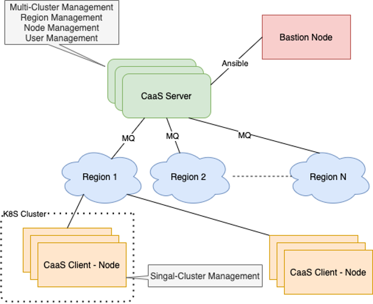

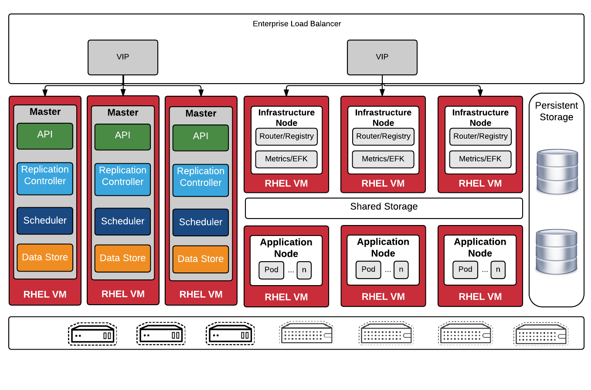

| 交付方式              | 适用           | 本课定位                       |
| --------------------- | -------------- | ------------------------------ |
| **实验集群**          | 学习、PoC      | KubeClipper 快速搭建           |
| **裸集群 + 运维平台** | 私有化、信创   | KubeClipper / 自建             |
| **托管 K8S**          | 公有云、省运维 | ACK / EKS / CCE 等             |
| **轻量发行版**        | 边缘 / CI      | K3s（见 class-03，本课不展开） |

**4C 安全模型（Code / Container / Cluster / Cloud）**

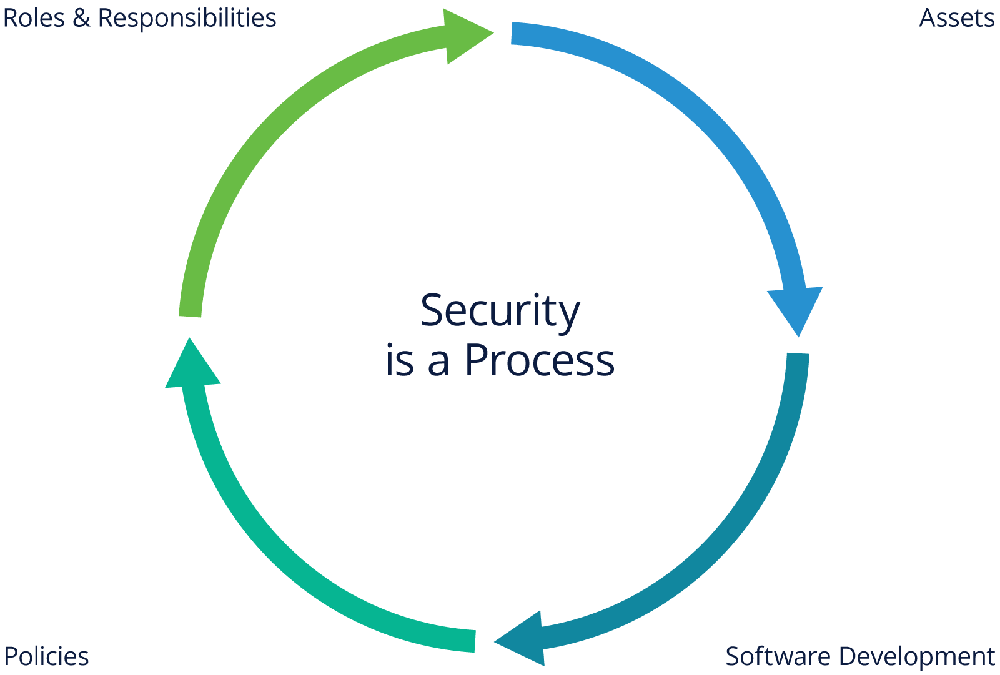

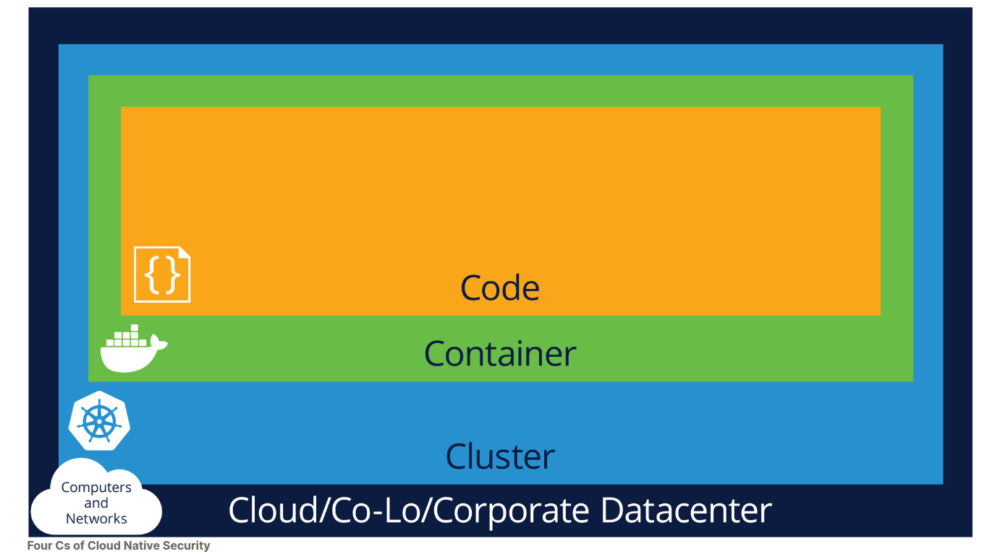

生产环境安全是持续过程：从镜像供应链（Harbor 扫描、固定 tag）、运行时（PSS
baseline/restricted）、集群（RBAC 概览、etcd 备份）到云平台（网络隔离）逐层加固。详见
[class-04 安全纲要](class-04-Kubernetes-Security-Specialist.md)。

**Pod Security Standards（PSS）— 替代 PSP**

自 1.25 起 PSP 已移除；使用内置 **Pod Security Admission**：

```bash
# 为 Namespace 设置 baseline 策略（示例）
kubectl label namespace dev \
  pod-security.kubernetes.io/enforce=baseline \
  pod-security.kubernetes.io/warn=restricted \
  pod-security.kubernetes.io/audit=restricted
```

| 级别           | 说明                          |
| -------------- | ----------------------------- |
| **privileged** | 无限制                        |
| **baseline**   | 阻止已知特权升级              |
| **restricted** | 最严格；符合 Pod 安全最佳实践 |

**Reference**

- [Pod Security Standards](https://kubernetes.io/docs/concepts/security/pod-security-standards/)
- [Pod Security Admission](https://kubernetes.io/docs/concepts/security/pod-security-admission/)
- [Backup etcd](https://kubernetes.io/docs/tasks/administer-cluster/configure-upgrade-etcd/#backing-up-an-etcd-cluster)
- [kubernetes-best-practices — 安全相关](https://gitee.com/wu-wen-xiang/lab-kubernetes/blob/master/doc/kubernetes-best-practices.md#6-安全相关)
- [class-04 — Kubernetes 安全](class-04-Kubernetes-Security-Specialist.md)

#### 4.5.5 AIOps 与智能运维（概览）

> 边缘与云协同场景下，AIOps 可结合 Prometheus 指标 + 日志平台 + K8S Events 作为 LLM
> 上下文，辅助告警根因分析与 Runbook 检索。参见
> [边缘智算与运维](https://gitee.com/wu-wen-xiang/lab-kubernetes/blob/master/doc/mec-edge-and-ai.md)。

**典型适用场景**

| 场景                 | 说明                           |
| -------------------- | ------------------------------ |
| 告警聚合与根因解释   | 将多条 Prometheus 告警关联分析 |
| 日志/事件摘要        | 从大量 Pod 日志中提取关键异常  |
| Runbook / 知识库问答 | 运维文档、故障手册智能检索     |
| 变更影响分析         | 结合发布记录与指标波动         |

**边界与原则**

- ✅ 适宜：信息整理、模式识别、排查建议、文档生成
- ❌ 不宜：未经人工复核的**自动修复**（尤其生产环境 exec/删除/扩缩）
- 数据衔接：Prometheus 指标 + 日志平台 + K8S Events 作为 LLM 上下文

**可选 Demo 思路**

```text
输入：kubectl describe pod 的 Events + 容器 logs 片段
输出：大模型解读「镜像拉取失败 → 检查 imagePullSecrets / 镜像 tag」
```

### 4.6 综合 Demo：完整发布闭环

> 清单：[src/class05/](../src/class05/)（`configmap.yaml` / `deployment-v2.yaml` /
> `service.yaml`）。\
> 实验网 Docker Hub 常超时：若节点已有 `demo-web:v2`，跳过构建/推送，并用
> `imagePullPolicy: IfNotPresent`。访问 NodePort 请用**节点 IP**（`127.0.0.1` 可能不通）。

```bash
# === 1. 构建镜像（可选；镜像已预加载可跳过）===
# docker build -t demo-web:v2 .
# 若需 Registry：tag + push；否则保留本地 tag，部署时 IfNotPresent

# === 2. 创建拉取凭据（有私有 Registry 时）===
# kubectl create secret docker-registry regcred \
#   --docker-server=registry.example.com \
#   --docker-username=<user> --docker-password=<pass>
# kubectl patch sa default -p '{"imagePullSecrets":[{"name":"regcred"}]}'

# === 3. 声明式部署（含 ConfigMap + 探针）===
kubectl apply -f src/class05/configmap.yaml \
  -f src/class05/deployment-v2.yaml \
  -f src/class05/service.yaml
kubectl rollout status deployment/hello-python

# === 4. 访问验证 ===
NODEIP=$(kubectl get nodes -o jsonpath='{.items[0].status.addresses[?(@.type=="InternalIP")].address}')
curl http://${NODEIP}:31000/   # 期望 Hello TrainingK8S

# === 5. 滚动更新 ===
kubectl set image deployment/hello-python app=demo-web:latest
kubectl rollout status deployment/hello-python

# === 6. 回滚 ===
kubectl rollout undo deployment/hello-python
kubectl rollout status deployment/hello-python

# === 7. 节点侧对照 ===
sudo crictl ps --name app
CID=$(sudo crictl ps --name app -q | head -1)
sudo crictl logs --tail 20 "$CID"
```

### 4.7 研发场景收束：何时引入 K8S

| 适合引入 K8S                    | 暂不必引入                       |
| ------------------------------- | -------------------------------- |
| 多服务、需弹性扩缩              | 单体小工具、访问量极低           |
| 多环境（dev/test/prod）一致交付 | 团队无运维能力、无学习预算       |
| 需滚动发布、自愈                | 强依赖本地 GUI/桌面应用          |
| 已有容器化应用                  | 应用无法容器化（极少数遗留系统） |

实验环境容器化、工具服务上云是常见第一步；**不必为了「云原生」而云原生**。

---

## 附录 A：kubectl 速查

```bash
# 资源查看
kubectl get all -n <ns>
kubectl api-resources
kubectl explain deployment.spec

# 调试
kubectl describe <type> <name>
kubectl logs -f <pod> -c <container>
kubectl exec -it <pod> -- sh
kubectl port-forward svc/<name> 8080:80

# 发布
kubectl apply -f .
kubectl diff -f .
kubectl rollout status deploy/<name>
kubectl rollout undo deploy/<name>

# 节点
kubectl cordon <node>
kubectl drain <node> --ignore-daemonsets --delete-emptydir-data
kubectl uncordon <node>
```

---

## 附录 B：版本变更速查（过时 → 现行）

### Kubernetes 1.33+ 值得了解的新特性

| 特性                         | 状态                            | 与本课关系                                                           |
| ---------------------------- | ------------------------------- | -------------------------------------------------------------------- |
| **Sidecar Containers**       | Stable (1.33)                   | 日志/代理 Sidecar 用 `initContainers` + `restartPolicy: Always`      |
| **EnsureSecretPulledImages** | Alpha                           | 私有镜像在 `IfNotPresent` 时也强制校验凭据                           |
| **Secret-less image pulls**  | Alpha                           | SA Token/OIDC 短期 Registry 凭据                                     |
| **EndpointSlice 默认**       | GA                              | Service 后端发现机制；`Endpoints` 逐步弃用                           |
| **Pod Security Admission**   | GA                              | 替代 PSP；Namespace 标签 enforce/warn/audit                          |
| **User Namespaces**          | Beta（1.33 起默认开启特性门控） | Pod 设置 `hostUsers: false` 可 opt-in；需 containerd 2.0+ 等节点条件 |
| **containerd 2.x**           | 运行时                          | 镜像认证优先走 K8S `imagePullSecrets`                                |

**Reference**

- [Kubernetes v1.33: Octarine](https://kubernetes.io/blog/2025/04/23/kubernetes-v1-33-release/)
- [Kubernetes Enhancements (KEPs)](https://github.com/kubernetes/enhancements)

### 过时 → 现行对照

| 过时内容                                    | 现行替代                                 | 说明                    |
| ------------------------------------------- | ---------------------------------------- | ----------------------- |
| dockershim                                  | containerd / CRI-O                       | 1.24+ 已移除            |
| Pod Security Policy (PSP)                   | Pod Security Standards + Admission       | 1.25+ 已移除            |
| `kubectl run` 自动创建 Deployment           | 显式 YAML 或 `kubectl create deployment` | 行为已变更              |
| Endpoints（默认）                           | EndpointSlice                            | 对用户基本透明          |
| 节点 `docker ps` 查 Pod                     | `crictl ps`                              | 与 kubelet 视角一致     |
| containerd config.toml 硬编码 registry auth | K8S imagePullSecrets                     | containerd 2.x 推荐做法 |
| Ingress 注解堆砌                            | Gateway API（演进方向）                  | 本课仅概览              |

---

## 附录 C：Reference 汇总

### 官方文档

| 主题                    | 链接                                                                                                                               |
| ----------------------- | ---------------------------------------------------------------------------------------------------------------------------------- |
| Kubernetes 文档（中文） | [https://kubernetes.io/zh-cn/docs/home/](https://kubernetes.io/zh-cn/docs/home/)                                                   |
| 概念 — 工作负载         | [https://kubernetes.io/docs/concepts/workloads/](https://kubernetes.io/docs/concepts/workloads/)                                   |
| 概念 — 存储             | [https://kubernetes.io/docs/concepts/storage/](https://kubernetes.io/docs/concepts/storage/)                                       |
| 概念 — 调度             | [https://kubernetes.io/docs/concepts/scheduling-eviction/](https://kubernetes.io/docs/concepts/scheduling-eviction/)               |
| 概念 — 安全             | [https://kubernetes.io/docs/concepts/security/](https://kubernetes.io/docs/concepts/security/)                                     |
| Tasks — 配置 Pod        | [https://kubernetes.io/docs/tasks/configure-pod-container/](https://kubernetes.io/docs/tasks/configure-pod-container/)             |
| Release Notes           | [https://kubernetes.io/releases/](https://kubernetes.io/releases/)                                                                 |
| v1.33 发布说明          | [https://kubernetes.io/blog/2025/04/23/kubernetes-v1-33-release/](https://kubernetes.io/blog/2025/04/23/kubernetes-v1-33-release/) |

### 容器与运行时

| 主题        | 链接                                                                                         |
| ----------- | -------------------------------------------------------------------------------------------- |
| Docker 文档 | [https://docs.docker.com/](https://docs.docker.com/)                                         |
| containerd  | [https://containerd.io/](https://containerd.io/)                                             |
| nerdctl     | [https://github.com/containerd/nerdctl](https://github.com/containerd/nerdctl)               |
| crictl      | [https://github.com/kubernetes-sigs/cri-tools](https://github.com/kubernetes-sigs/cri-tools) |
| OCI         | [https://opencontainers.org/](https://opencontainers.org/)                                   |

### 集群管理

| 主题        | 链接                                                                                                                                             |
| ----------- | ------------------------------------------------------------------------------------------------------------------------------------------------ |
| KubeClipper | [https://kubeclipper.io/](https://kubeclipper.io/)                                                                                               |
| kubeadm     | [https://kubernetes.io/docs/setup/production-environment/tools/kubeadm/](https://kubernetes.io/docs/setup/production-environment/tools/kubeadm/) |

### 可观测与安全

| 主题                     | 链接                                                                                                                           |
| ------------------------ | ------------------------------------------------------------------------------------------------------------------------------ |
| Prometheus               | [https://prometheus.io/docs/](https://prometheus.io/docs/)                                                                     |
| Grafana Loki             | [https://grafana.com/docs/loki/latest/](https://grafana.com/docs/loki/latest/)                                                 |
| CNCF Security Whitepaper | [https://www.cncf.io/reports/cloud-native-security-whitepaper/](https://www.cncf.io/reports/cloud-native-security-whitepaper/) |
| CIS Kubernetes Benchmark | [https://www.cisecurity.org/benchmark/kubernetes](https://www.cisecurity.org/benchmark/kubernetes)                             |

### 本仓库相关课程

| 课程                      | 链接                                                                                     |
| ------------------------- | ---------------------------------------------------------------------------------------- |
| Kubernetes-Administration | [class-01-Kubernetes-Administration.md](class-01-Kubernetes-Administration.md)           |
| Kubernetes-Development    | [class-02-Kubernetes-Development.md](class-02-Kubernetes-Development.md)                 |
| 边缘容器云解决方案        | [class-03-Kubernetes-Edge-Solutions.md](class-03-Kubernetes-Edge-Solutions.md)           |
| Kubernetes 安全           | [class-04-Kubernetes-Security-Specialist.md](class-04-Kubernetes-Security-Specialist.md) |

---

<a id="附录-d自测题与巩固问答"></a>

## 附录 D：自测题与巩固问答

> 学员：先**闭卷自测**，再对照 [参考答案要点](#d-参考答案要点)。\
> 建议：每章做完对应 Lesson 实验后再做题；错题回到正文对应小节复习。

### D.1 Lesson 01 — 容器与运行时

**选择题**

1. 容器与虚拟机相比，最典型的优势是？\
   A. 可运行不同操作系统内核\
   B. 进程级隔离、镜像小、启动快\
   C. 完全不需要宿主机内核\
   D. 天然支持硬件虚拟化

2. Linux 容器隔离主要靠？\
   A. Namespace + Cgroups\
   B. iptables alone\
   C. SELinux alone\
   D. LVM

3. K8S 节点上查「与 `kubectl get po -A` 一致的容器列表」，应优先用？\
   A. `docker ps`\
   B. `crictl ps`\
   C. `systemctl list-units`\
   D. `kubectl docker`

4. 构建机 `docker build` 的镜像，节点 kubelet 能直接拉取的前提是？\
   A. 自动同步，无需操作\
   B. 推送到 Registry，或 `docker save` + 节点 `nerdctl -n k8s.io load`\
   C. 复制到 `/var/lib/docker`\
   D. 重启 kubelet

5. Dockerfile 中 `COPY` 与 `ADD` 推荐优先用？\
   A. ADD（功能更多，可以把一个 tar 包自动解压到镜像某目录）\
   B. COPY（语义更清晰）\
   C. 都可以，无区别\
   D. RUN

**判断题**（对 / 错）

6. 容器里 PID 1 进程退出，整个容器就退出。
7. `docker run -d` 启动的容器，停止后数据卷里的数据一定丢失。
8. containerd 通过 CRI 插件实现了 CRI 接口，kubelet 通过 CRI 调用它管理 Pod。
9. 实验环境无法访问 Docker Hub 时，可以经跳板机 pull → push 到 ACR 再在集群使用。
10. `EXPOSE` 指令会自动在宿主机打开端口。

**简答题**

11. 为什么 K8S 不再内置 dockershim？
12. 写出查看容器日志的两种命令（宿主机 docker/nerdctl 视角 + K8S API 视角各一种）。
13. 镜像分层（Layer）有什么好处？
14. 什么是「镜像 tag」？生产环境为什么不建议用 `:latest`？

**场景题**

15. 同事在笔记本 `docker build -t demo-web:latest .` 成功，但 K8S Deployment 报
    `ImagePullBackOff`，可能原因有哪些？排查顺序？
16. 应用监听 `127.0.0.1:5000`，打成容器后在 K8S 里 Service 无法访问，为什么？

---

### D.2 Lesson 02 — K8S 架构与首批部署

**选择题**

1. K8S 的「声明式」是指？\
   A. 每次手写具体操作步骤\
   B. 描述期望状态，由控制器调谐\
   C. 只能使用 Helm\
   D. 必须用 Python SDK

2. Pod 处于 `CrashLoopBackOff`，第一步最应看？\
   A. `kubectl get nodes`\
   B. `kubectl logs <pod> [--previous]`\
   C. `kubectl delete pod`\
   D. 重启集群

3. Service `type: NodePort` 的 `nodePort` 范围默认是？\
   A. 1–1024\
   B. 30000–32767\
   C. 8080–8888\
   D. 任意端口

4. Deployment 的 `replicas: 3` 表示？\
   A. 3 个节点各跑一个\
   B. 期望 3 个匹配 label 的 Pod 副本\
   C. 滚动更新分 3 批\
   D. 保留 3 个历史版本

5. `kubectl apply` 与 `kubectl create` 的主要区别？\
   A. apply 可重复执行、幂等更新\
   B. create 更快\
   C. apply 只能创建\
   D. 无区别

**判断题**

6. 删除 Pod 后，Deployment 会自动创建新 Pod 维持副本数。
7. `curl http://127.0.0.1:<nodePort>` 在节点本机一定能访问 NodePort Service。
8. Controller 通过「观察当前状态 → 对比期望状态 → 执行差异」循环工作。
9. `kubectl describe pod` 的 Events 对排障很有帮助。
10. Namespace 是集群内的逻辑隔离，不同 Namespace 的 Service DNS 名不会冲突。

**简答题**

11. 画出或描述：用户 `kubectl apply` 一个 Deployment 后，到 Pod Running 的简要链路。
12. ClusterIP、NodePort、LoadBalancer 各适合什么场景？
13. Service 的 `selector` 与 Pod `labels` 不匹配会导致什么现象？

**场景题**

14. `kubectl get pods` 显示 Running，但 `curl <node-ip>:31000` 连接失败，列出至少 4 条排查路径。
15. 如何用 `kubectl scale` 和 `kubectl rollout` 分别完成「改副本数」和「改镜像版本」？

---

### D.3 Lesson 03 — 工作负载、存储与调度

**选择题**

1. 每个节点跑一个监控 Agent，应选？\
   A. Deployment\
   B. DaemonSet\
   C. StatefulSet\
   D. Job

2. StatefulSet Pod 名 `nginx-sts-2` 删除后重建，新 Pod 名是？\
   A. 随机名\
   B. `nginx-sts-2`\
   C. `nginx-sts-0`\
   D. `nginx-sts-3`

3. Headless Service（`clusterIP: None`）主要用于？\
   A. 对外暴露\
   B. StatefulSet 稳定 DNS\
   C. 负载均衡到云 LB\
   D. 禁用 DNS

4. PVC `Pending` 常见原因？\
   A. 没有匹配的 PV / StorageClass 无法供给\
   B. Pod 太多\
   C. 镜像拉取慢\
   D. 探针失败

5. `kubectl taint nodes <node> key=value:NoSchedule` 的效果？\
   A. 节点关机\
   B. 无 toleration 的 Pod 无法调度到该节点\
   C. 删除节点上所有 Pod\
   D. 节点变 NotReady

**判断题**

6. DaemonSet 会给集群每个（匹配）节点创建一个 Pod。
7. `emptyDir` 卷在 Pod 删除后数据仍保留在节点。
8. `requests` 影响调度，`limits` 是容器可用资源上限。
9. 单节点实验集群打污点后忘记去掉，可能导致所有新 Pod Pending。
10. hostPath PV 适合生产多节点共享存储。

**简答题**

11. Deployment、DaemonSet、StatefulSet 各举一个典型业务例子。
12. 静态 PV + PVC 绑定流程与动态供给有何不同？
13. 解释 Taint 与 Toleration 的关系。
14. Pod Anti-Affinity 解决什么问题？

**场景题**

15. 实验集群无 StorageClass，如何演示「Pod 重建后数据仍在」？
16. 扩缩 StatefulSet 从 3 到 5，Pod 启动顺序有什么特点？

---

### D.4 Lesson 04 — 配置、发布、可观测与排障

**选择题**

1. 数据库密码应放？\
   A. ConfigMap\
   B. Secret\
   C. Deployment annotations\
   D. Dockerfile ENV 明文

2. `readinessProbe` 失败时？\
   A. 立即删除 Pod\
   B. 从 Service 后端摘除，不接收流量\
   C. 重启节点\
   D. 无影响

3. `metrics-server` 的主要用途？\
   A. 长期存储 Prometheus 指标\
   B. 支撑 `kubectl top`\
   C. 收集应用日志\
   D. 替代 kubelet

4. Prometheus 抓取 node-exporter 属于？\
   A. Push 模型\
   B. Pull 模型\
   C. 日志流\
   D. Trace

5. Fluent Bit → Loki 属于可观测性哪一维？\
   A. Metrics\
   B. Logs\
   C. Traces\
   D. Events only

**判断题**

6. `kubectl rollout undo` 可回滚 Deployment 到上一版本。
7. `imagePullSecrets` 可绑定到 ServiceAccount，Pod 自动继承。
8. Loki 查询常用 LogQL，如 `{app="hello-python"}`。
9. `kubectl logs` 与节点 `/var/log/pods` 下的文件内容同源。
10. AIOps 适合自动在生产环境执行 `kubectl delete` 而无人工复核。

**简答题**

11. startup / readiness / liveness 三种探针分别解决什么问题？
12. 滚动更新中 `maxUnavailable: 0` 的含义？
13. 列出 Metrics / Logs / Traces 在本课实验环境中的对应组件。
14. Pod Pending、ImagePullBackOff、CrashLoopBackOff 各先查什么？

**场景题**

15. Prometheus Target 显示 `node-exporter` DOWN，可能原因与修复步骤？
16. Fluent Bit 改 ConfigMap 后 Loki 查不到新日志，应检查什么？
17. 把 `kubectl describe pod` Events + `kubectl logs` 片段交给 AI 分析时，提示词应包含哪些信息？

---

### D.5 综合辨析（易混淆）

| 编号 | 题目                                                     | 考察点         |
| ---- | -------------------------------------------------------- | -------------- |
| 1    | metrics-server vs Prometheus vs node-exporter 各干什么？ | 可观测组件分工 |
| 2    | docker vs crictl vs kubectl logs 看到的日志一样吗？      | 运行时视角     |
| 3    | ConfigMap 更新后，已运行 Pod 里的 env 会自动变吗？       | 配置热更新     |
| 4    | Service 与 Ingress 的区别（本课粒度）                    | 网络入口       |
| 5    | 何时用 Job/CronJob 而非 Deployment？                     | 工作负载选型   |
| 6    | `IfNotPresent` 与 `Always` 拉镜像策略差异                | 镜像策略       |
| 7    | PSP 被什么替代？baseline 与 restricted 区别？            | 安全基线       |
| 8    | Sidecar（1.33）与普通 container 的差异                   | 新特性         |
| 9    | 实验网 NodePort 为什么要用节点 IP 而不是 127.0.0.1？     | 网络实践       |
| 10   | 为什么说「不必为了云原生而云原生」？                     | 架构判断       |

---

<a id="d-参考答案要点"></a>

### D.6 参考答案要点

<details>
<summary>点击展开（讲师备课用；学员建议先自测）</summary>

**D.1**：1-B 2-A 3-B 4-B 5-B | 6-对 7-错（卷可保留）8-对 9-对 10-错\
11-精简 CRI 路径、减少中间层维护成本\
12-例：`docker logs` / `kubectl logs`\
13-复用层、加快构建与分发\
14-tag 标识版本；latest 不可追溯、易漂移\
15-镜像未在节点/Registry；imagePullPolicy；名不对；先 describe pod → events\
16-容器内 127.0.0.1 仅容器自身；应监听 0.0.0.0

**D.2**：1-B 2-B 3-B 4-B 5-A | 6-对 7-错（部分 CNI/环境本机不通）8-对 9-对 10-对\
14-endpoints、selector、readiness、targetPort、防火墙、用节点 IP\
15-scale 改副本；set image + rollout 改版本

**D.3**：1-B 2-B 3-B 4-A 5-B | 6-对 7-错 8-对 9-对 10-错\
15-hostPath 静态 PV；先写文件再删 Pod 再验证

**D.4**：1-B 2-B 3-B 4-B 5-B | 6-对 7-对 8-对 9-对 10-错\
13-metrics-server/Prometheus/node-exporter；Fluent Bit/Loki；Trace 本课未展开\
15-无 Service、网络、exporter 未起、Prometheus 配置错、等 scrape 间隔\
16-`kubectl rollout restart ds/fluent-bit`；OUTPUT 配置；Loki 是否 ready

</details>

---

<a id="附录-e实操清单与知识点串联"></a>

## 附录 E：实操清单与知识点串联

> 实验环境：`lab-k8s21`（单节点、containerd、KubeClipper）。清单在 `src/class05/`。\
> 每项含：**目标 → 命令要点 → 验证标准 → 对应章节**。

### E.1 第 1 天实操路线

| 序号 | 实操名称           | 目标                     | 关键命令 / 文件                                | 验证标准                            | 章节  |
| ---- | ------------------ | ------------------------ | ---------------------------------------------- | ----------------------------------- | ----- |
| E1-1 | Docker 跑通        | 理解镜像与容器生命周期   | `docker run` / `docker ps` / `docker logs`     | 能访问容器端口并看到日志            | 1.5   |
| E1-2 | 构建 demo-web      | 掌握 Dockerfile 基本结构 | `docker build -t demo-web:latest .`            | `docker run -p 5000:5000` 可访问    | 1.5.1 |
| E1-3 | 镜像进节点         | 理解构建机与节点镜像隔离 | `docker save` + `nerdctl -n k8s.io load`       | `crictl images \| grep demo-web`    | 2.7   |
| E1-4 | 节点容器视角       | 会用 crictl 对照 K8S     | `crictl ps` / `crictl logs` / `crictl inspect` | 能对应到 kubectl 中的 Pod           | 1.6   |
| E1-5 | 首个 Pod           | 理解最小调度单位         | `kubectl apply -f pod.yaml`                    | Pod Running；describe 无异常 Events | 2.7   |
| E1-6 | Deployment+Service | 完成首次应用上线         | `deployment.yaml` + `service.yaml`             | NodePort 用**节点 IP** 可 curl      | 2.7   |
| E1-7 | 观察 EndpointSlice | 理解 Service 后端        | `kubectl get endpointslice`                    | 后端 IP 与 Pod IP 一致              | 2.7   |

### E.2 第 2 天实操路线

| 序号  | 实操名称          | 目标                | 关键命令 / 文件                                  | 验证标准                                  | 章节  |
| ----- | ----------------- | ------------------- | ------------------------------------------------ | ----------------------------------------- | ----- |
| E2-1  | DaemonSet         | 每节点一个 Agent    | `src/class05/daemonset.yaml`                     | `kubectl get ds -n monitoring` READY=1    | 3.1   |
| E2-2  | StatefulSet 行为  | 稳定序号与有序扩缩  | `statefulset.yaml`；delete pod；scale            | 重建同名；0→1→2 顺序                      | 3.1   |
| E2-3  | PV/PVC 持久化     | 数据跨 Pod 生命周期 | `pvc-demo.yaml` + hostPath 准备                  | 重建后 `cat /data/test.txt` 仍为 hello-pv | 3.2   |
| E2-4  | 污点与容忍        | 理解调度排斥        | `kubectl taint` + 两个对比 Pod                   | 无 toleration Pending；实验后 untaint     | 3.3   |
| E2-5  | ConfigMap 注入    | 非敏感配置外置      | `configmap.yaml` + Deployment env/volume         | 容器内能读到配置                          | 4.1   |
| E2-6  | 滚动更新与回滚    | 发布闭环            | `set image` / `rollout status` / `rollout undo`  | 版本切换可访问；可回滚                    | 4.2   |
| E2-7  | 健康探针          | 理解三种探针        | `deployment-v2.yaml` 含探针                      | 故意改错端口观察 readiness 行为（可选）   | 4.2   |
| E2-8  | metrics-server    | `kubectl top`       | 官方 manifest + `metrics-server-patch.yaml`      | `kubectl top nodes` 有数据                | 4.5.2 |
| E2-9  | Prometheus        | Pull 抓取 exporter  | `prometheus.yaml`                                | Targets UP；`up{job="node-exporter"}==1`  | 4.5.2 |
| E2-10 | Loki + Fluent Bit | 日志采集与查询      | `loki.yaml` + `fluent-bit.yaml`                  | LogQL `{app="hello-python"}` 有访问日志   | 4.5.3 |
| E2-11 | 三层日志对照      | 建立排障直觉        | `kubectl logs` / `/var/log/pods` / `crictl logs` | 三条路径看到同源日志                      | 4.5.3 |
| E2-12 | 综合发布闭环      | 串讲全流程          | `configmap` + `deployment-v2` + `service`        | build/save/load → apply → curl → 回滚     | 4.6   |

### E.3 排障专项实操（建议 2 人一组）

| 场景 | 讲师/AI 注入故障            | 学员任务              | 预期恢复手段                       |
| ---- | --------------------------- | --------------------- | ---------------------------------- |
| F-1  | 改错 Deployment 镜像名      | 定位 ImagePullBackOff | describe → 修正 image 或 load 镜像 |
| F-2  | Service selector 写错 label | Service 不通          | 对比 pod labels 与 svc selector    |
| F-3  | 去掉 readinessProbe 的 port | Pod Running 但无流量  | get endpoints；修探针              |
| F-4  | 节点打污点未清理            | 新 Pod 全 Pending     | describe pod；taint -              |
| F-5  | Fluent Bit 未 restart       | Loki 无新日志         | rollout restart ds                 |
| F-6  | curl 127.0.0.1:nodePort     | 「Service 坏了」误判  | 改用节点 IP                        |

### E.4 知识点串联图（自检用）

```text
镜像构建(docker build)
    → 进节点(save/load 或 push Registry)
        → Deployment(副本+滚动更新+探针)
            → Service(稳定入口+NodePort)
                → 可观测(metrics-server / Prometheus / Loki)
                    → 排障(describe → logs → crictl → 节点)
```

完成 E.1–E.2 全部打勾，即覆盖课程收获 Checklist 中的实操项。

---

<a id="附录-fai-idecursor--trae辅助开发与运维实践"></a>

## 附录 F：AI IDE（Cursor / Trae）辅助开发与运维实践

> 适用 **Cursor**、**Trae IDE** 等带 AI 对话 / Agent 能力的编辑器。\
> 原则：**AI 提速，人做校验**——所有 YAML、命令、镜像名需在实验环境实测。

### F.1 使用原则（学员必读）

| 原则           | 说明                                                    |
| -------------- | ------------------------------------------------------- |
| **小步提交**   | 一次只改一个文件或一类问题，便于回滚                    |
| **贴全上下文** | 报错信息、YAML、`describe` Events、日志片段一并给 AI    |
| **指定环境**   | 写明 K8S 版本、运行时 containerd、单节点、镜像源 ACR 等 |
| **要求可验证** | 让 AI 给出「预期输出」和「验证命令」，你亲自跑一遍      |
| **不盲信删除** | 生产/实验集群上 `delete`、`drain`、`--force` 需人工确认 |
| **敏感信息**   | 密码、Token、kubeconfig 打码；不要贴进公开对话          |

### F.2 通用 Prompt 模板

```text
【环境】K8S 1.36，单节点 lab-k8s21，containerd，镜像仓库 registry.cn-shanghai.aliyuncs.com/99cloud-sh/
【目标】（一句话）
【现状】（贴 yaml / 报错 / kubectl get 输出）
【约束】尽量小改动；给出验证命令；中文解释
```

### F.3 场景示例与推荐步骤

#### F.3.1 新项目容器化（Python Web 为例）

**目标**：把 `app.py` + `requirements.txt` 变成可在 K8S 跑的镜像与 YAML。

**推荐步骤**

1. 在 IDE 打开项目根目录，选中 `app.py`、`requirements.txt`
2. Prompt 示例：

```text
请为 Flask 应用生成 Dockerfile（python:3.9-slim 或 ACR 可拉取基础镜像）、
.dockerignore、以及最小 Deployment+NodePort Service YAML。
应用监听 0.0.0.0:5000。镜像名 demo-web:v1，imagePullPolicy: IfNotPresent。
给出 docker build、docker save、nerdctl -n k8s.io load 和 kubectl apply 验证步骤。
```

3. 人工检查：是否监听 `0.0.0.0`、是否多阶段构建不必要复杂、资源 requests/limits 是否合理
4. 在节点执行 AI 给出的验证命令；失败则把**完整报错**贴回 AI 迭代

#### F.3.2 旧项目分析与容器化改造

**目标**：读懂遗留仓库，判断能否容器化、缺什么。

**推荐步骤**

1. `@` 引用整个项目目录（或关键：`pom.xml` / `package.json` / `config.ini` / 启动脚本）
2. Prompt 示例：

```text
分析该 Java/Python 项目的启动方式、依赖外部服务（MySQL/Redis）、配置文件位置、
是否写死 IP/路径。输出：① 容器化阻塞点 ② 建议 Dockerfile 结构 ③ 需改为环境变量的配置项
④ 是否适合上 K8S（单副本可否）。不要一次改太多文件。
```

3. 让 AI 输出「改造清单」表格，你按项逐项确认后再让它写 Dockerfile
4. 对有状态依赖（本地文件数据库）明确问：「无状态化需要改什么？」

#### F.3.3 编写 / 修改 K8S YAML

**Prompt 示例**

```text
基于现有 deployment.yaml，增加 readiness/liveness HTTP 探针（path=/ port=5000），
滚动策略 maxUnavailable=0。保持原有 labels 与镜像不变。只输出 diff 说明和完整文件。
```

**最佳实践**

- 用 `kubectl apply --dry-run=client -o yaml` 或 `kubectl diff -f` 验证
- 让 AI 解释每个新增字段「失败时会发生什么」

#### F.3.4 运维：滚动发布与回滚

**Prompt 示例**

```text
hello-python Deployment 3 副本，要把镜像从 demo-web:v1 升到 v2，要求零中断偏好。
请给出 kubectl set image、rollout status、出问题时的 rollout undo 命令序列，
并说明如何确认 Endpoint 仍健康。
```

#### F.3.5 排错：Pod / Service / 镜像

**Prompt 示例（高效）**

```text
【现象】Pod ImagePullBackOff
【Events】（粘贴 kubectl describe pod 最后 20 行）
【节点镜像】crictl images | grep demo
【问题】根因是什么？给最小修复步骤，不要重装集群。
```

**推荐信息采集脚本（复制给 AI）**

```bash
kubectl get pod <name> -o wide
kubectl describe pod <name> | tail -30
kubectl logs <name> --previous 2>&1 | tail -30
kubectl get svc,endpointslices -l app=<app>
crictl images | grep -i <image>
```

#### F.3.6 可观测性：Prometheus / Loki 排障

**Prompt 示例**

```text
Prometheus target node-exporter 显示 DOWN，lab 单节点，node-exporter 在 monitoring namespace。
已用 ACR 镜像。请列出检查 Service、Endpoints、Prometheus scrape_config、网络的最短路径。
```

```text
Fluent Bit 已改 OUTPUT 为 Loki，但 LogQL {app="hello-python"} 无结果。
请给排查清单：ConfigMap 是否生效、ds 是否 restart、Loki /ready、label 名称等。
```

#### F.3.7 日志 / 指标 / 事件交给 AI 做「运维解读」

**Prompt 示例（本课 4.5.5 AIOps 思路落地）**

```text
以下是 Pod Events 和容器日志片段。请用中文：① 现象概括 ② 最可能根因（Top 3）
③ 建议执行的 kubectl 命令（按顺序）④ 哪些操作需要人工确认后再做。
不要建议直接删除生产 Namespace。
```

### F.4 Cursor vs Trae 使用差异（简要）

| 能力               | Cursor                          | Trae IDE                  |
| ------------------ | ------------------------------- | ------------------------- |
| 代码库索引 `@文件` | 强，适合改 Dockerfile/YAML      | 支持，用法类似            |
| 终端命令执行       | Agent 可代跑（需确认）          | 远程/SSH 场景常见         |
| SSH 远程节点       | 可配 Remote SSH 后 `@` 远端项目 | 常用于连 lab 服务器       |
| 适合本课的场景     | 改仓库内 `src/class05` 清单     | 在 lab 节点上排障、拉日志 |

**远程 lab 建议工作流**

1. IDE SSH 连 `lab-k8s21`
2. 打开 `/root/class05-repo` 或本仓库 `training-kubernetes`
3. 终端执行 kubectl；把输出贴回 AI 或让 Agent 读 terminal
4. 改 YAML 后 `kubectl apply` → 立即跑文档「验证」小节命令

### F.5 反模式（避免）

| 反模式                      | 后果             | 应改为                          |
| --------------------------- | ---------------- | ------------------------------- |
| 「帮我部署一整套生产 K8S」  | 过度复杂、难排错 | 按附录 E 逐项来                 |
| 不贴报错让 AI 猜            | 浪费轮次         | 贴 Events + logs                |
| AI 生成 YAML 直接上生产     | 安全风险         | 先 dry-run / 实验集群           |
| 用 `docker ps` 判断 K8S Pod | 视角错误         | `kubectl get pod` + `crictl ps` |
| 让 AI 自动 exec 删数据      | 误删 PVC/NS      | 人工确认破坏性命令              |

### F.6 课后练习：用 AI 完成一次「迷你闭环」

1. 用 AI 为 `demo-web` 增加环境变量 `VERSION=v3` 并更新 ConfigMap 引用
2. 自己执行：build/save/load → apply → curl 确认输出变化
3. 故意改错 `targetPort`，用 AI 协助从 Service 不通恢复到正常
4. 写 5 句话总结：哪些步骤 AI 帮了大忙，哪些必须自己判断（AI 写草案、人做核对；AI
   读报错、人跑验证；凡是 delete / taint / 生产变更，先停一下）

---

_文档版本与实验环境同步：Prometheus `src/class05/prometheus.yaml`、Loki
`src/class05/loki.yaml`、Fluent Bit `src/class05/fluent-bit.yaml`。_
